# CUDA: Massiv paralleles Rechnen macht Freude

CUDA ermöglicht es, die enorme Rechenleistung moderner Grafikkarten für allgemeine Berechnungen zu nutzen - nicht nur für Grafik.

## Einführung
### Hardware
Vergleich CPU vs. GPU

| Eigenschaft | CPU (Intel Core Ultra 7 265) | GPU (NVIDIA GeForce RTX 5080) |
|-------------|------------------------------|-------------------------------|
| Kerne (oder Äquivalent) | **20** | **10.752** (!)|
| Basis-/Boost-Taktfrequenz | 2,4 GHz / 5,3 GHz | 2,3 GHz / 2,6 GHz |
| Transistoren | 17,8 Milliarden | 45,6 Milliarden |
| Typische Leistungsaufnahme | 65 W | 360 W |
| Theoretische F32-Spitzenleistung | 1,7 TFLOPS | 56,3 TFLOPS |
| Nachhaltige F32-Leistung | ~0,3 TFLOPS | ~40 TFLOPS |
| Typischer Arbeitsspeicher | 32-128 GB | 16 GB |
| Typische Kosten | 400 USD | 1.000 USD |


> **TFLOPS** = Billionen Gleitkomma-Operationen pro Sekunde (Tera Floating Point Operations Per Second)
> **F32** = 32-Bit Gleitkommazahlen (single precision)

### Latenz vs. Durchsatz

#### Latenz-orientiertes Design (CPU)
Die Zeit minimieren, die für eine **einzelne** Aufgabe benötigt wird.


**Merkmale:**
- **Wenige leistungsstarke ALUs:** Reduzieren die Latenz einzelner Operationen
- **Große Caches:** Wandeln langsame Speicherzugriffe in schnelle Cache-Zugriffe um
- **Komplexe Steuerlogik:** Branch Prediction (Sprungvorhersage) für reduzierte Latenz

#### Durchsatz-orientiertes Design (GPU)
Die **Anzahl** der Aufgaben maximieren, die in einer bestimmten Zeit erledigt werden können.


**Merkmale:**
- **Viele kleine ALUs:** Hohe Latenz, stark pipelined, aber hoher Durchsatz
- **Kleine Caches:** Optimiert für Speicherdurchsatz, nicht für Latenz
- **Einfache Steuerlogik:** Keine Branch Prediction

Die GPU opfert bewusst die Geschwindigkeit einzelner Operationen zugunsten der Fähigkeit, *massiv viele* Operationen gleichzeitig auszuführen. Das funktioniert gut, wenn alle Threads dieselbe Operation auf unterschiedlichen Daten ausführen.

| Aspekt | CPU | GPU |
|--------|------------------|-----------|
| Einzelne Aufgabe |  Schnell | Langsamer |
| Viele gleichartige Aufgaben | Begrenzt | effizient |
| Beispiel | Komplexe Entscheidungslogik | Millionen Pixel berechnen |

### Wie die GPU einsetzen?
CPU für sequentielle Teile (wo Latenz wichtig ist)
 - CPUs können für sequentiellen Code über **100x schneller** sein als GPUs.

GPU für hochparallele Teile (wo Durchsatz wichtig ist)
 - GPUs können für hochparallelen Code über **100x schneller** sein als CPUs.

Daher ganz klar, beide zusammen nutzen → Heterogenes paralleles Rechnen

**Typischer Ablauf:**
1. Die **meisten Codezeilen** werden auf der CPU ausgeführt
2. **Rechenintensive Kernel** werden auf der GPU ausgeführt

Praxisbeispiele:
**Gut für GPU:**
- Bildverarbeitung (jedes Pixel unabhängig)
- Matrixmultiplikation
- Deep Learning (Training & Inferenz)

**Schlecht für GPU:**
- Stark verzweigte Algorithmen (viele if/else)
- Rekursive Algorithmen
- Code mit vielen Abhängigkeiten zwischen Berechnungen
- Kleine Datenmengen (Overhead überwiegt)

### CUDA - Compute Unified Device Architecture

Cuda ist eine **parallele Rechenplattform** und ein **Programmiermodell** von NVIDIA. Es ermöglicht die Nutzung von NVIDIA-GPUs für **allgemeine Berechnungen** (GPGPU = General Purpose GPU).

Cuda bietet:

- Erweiterungen für **C/C++**
- **Compiler** (nvcc)
- **Debugging-Tools** (cuda-gdb, Nsight)
- **Bibliotheken** (cuBLAS, cuDNN, cuFFT, ...)
- **Performance-Analyse-Tools** (Nsight Compute, nvprof)

Ist aber leider nur auf **NVIDIA-GPUs** verfügbar :(


Als Alternativen gibt es noch **OpenCL** - offener Standard, läuft auf AMD, Intel, NVIDIA und **Vulkan** - primär für Grafik, aber auch Compute-Shader möglich.

## Datenparalleles Rechnen

Das Kernkonzept ist simple, dieselbe Operation auf vielen Datenelementen ausführen. 

### Arten von Parallelität

#### Task-Parallelität (Aufgabenparallelität)

**Verschiedene** Operationen werden auf denselben Daten ausgeführt.


**Eigenschaften:**
- Üblicherweise nur eine begrenzte Anzahl von Tasks
- Weniger Potenzial für Parallelisierung
- Typisch für CPU-Programmierung

#### Daten-Parallelität

**Dieselbe** Operation wird auf verschiedenen Datenelementen ausgeführt


**Eigenschaften:**
- Potenziell **massive** Parallelität möglich
- **Besser geeignet für GPUs**
- Skaliert mit der Datenmenge


### Beispiel - Graustufen-Konvertierung eines Bildes


Die Berechnung ist für jeden Pixel gleich.
```
Grau = 0.3 × Rot + 0.6 × Grün + 0.1 × Blau
```
- Jedes Pixel kann **unabhängig** berechnet werden
- Keine Abhängigkeiten zwischen Pixeln
- Millionen von identischen Operationen
- Ein 4K-Bild (3840×2160) = 8.294.400 parallele Berechnungen!

→ Gefundenes Fressen für die GPU.


### Beispiel - Vektoraddition


```cpp
void vector_add(float* x, float* y, float* z, int N) {
    for (int i = 0; i < N; i++) {
        z[i] = x[i] + y[i];
    }
}
```
Diese sequentielle Version **O(N)** Zeitkomplexität _(hell no)_. Und das, obwohl jede Iteration nicht von der vorherigen abhängt, daher gut geeignet für Parallelisierung.  

#### Optimierung mit CPU: Chunk-basiert

1. Vektor in **Chunks** (Abschnitte) aufteilen
2. Jeder Core verarbeitet **einen Chunk**
3. Parallelität = Anzahl der Kerne (z.B. 4-20)

```cpp
// Code für CPU mit 4 Threads
#pragma omp parallel for
for (int i = 0; i < N; i++) {
    z[i] = x[i] + y[i];
}
```

```
Vektor mit N Elementen, 4 CPU-Kerne:
Core 0:  [████████████████]  Elemente 0 bis N/4-1
Core 1:  [████████████████]  Elemente N/4 bis N/2-1
Core 2:  [████████████████]  Elemente N/2 bis 3N/4-1
Core 3:  [████████████████]  Elemente 3N/4 bis N-1
```

#### Optimierung mit GPU: Thread pro Element

1. **So viele Threads wie möglich** starten
2. **Ein Thread pro Vektorelement** zuweisen
3. Parallelität = Anzahl der Elemente (z.B. Millionen)


Der GPU-Ansatz mag verschwenderisch erscheinen - warum einen ganzen Thread für nur eine Addition? Die Antwort liegt in der GPU-Architektur.Bei der GPU-Programmierung ist es gängige Praxis, dass die Anzahl der Threads die Anzahl der Cores übersteigt. Mehr dazu später.

## CUDA Systemorganisation

### Die zwei Speicher


| Begriff | Bedeutung |
|---------|-----------|
| **Host** | Die CPU |
| **Device** | Die GPU |
| **Host Memory** | RAM des Computers (z.B. DDR5) |
| **Device Memory** | VRAM der Grafikkarte (z.B. GDDR7) |

- GPU kann **NICHT** direkt auf Host-Speicher zugreifen
- CPU kann **NICHT** direkt auf Device-Speicher zugreifen
- Daten müssen **EXPLIZIT** kopiert werden

Der Bottleneck besteht in der Datenübertragung zwischen Host- und Devicememory (meist via PCI Express.)

| Verbindung | Bandbreite |
|------------|------------|
| CPU ↔ RAM | ~50-100 GB/s |
| GPU ↔ VRAM | ~500-1000 GB/s |
| CPU ↔ GPU (PCIe 4.0 x16) | ~32 GB/s |


| Schritt | Funktion | Beschreibung |
|---------|----------|--------------|
| ① | `cudaMalloc` | GPU-Speicher allokieren |
| ② | `cudaMemcpy` | Daten von CPU → GPU kopieren |
| ③ | Kernel Launch | Berechnung auf GPU ausführen |
| ④ | `cudaMemcpy` | Ergebnisse von GPU → CPU kopieren |
| ⑤ | `cudaFree` | GPU-Speicher freigeben |

Dieser Ablauf ist ein sehr zentrales Muster für die CUDA-Programmierung.

### Speicherverwaltungsfunktionen

**Speicher allokieren und freigeben**

```cpp
// Speicher auf der GPU reservieren
cudaError_t cudaMalloc(void** devPtr, size_t size);

// Speicher auf der GPU freigeben
cudaError_t cudaFree(void* devPtr);
```

**Speicher kopieren**
```cpp
cudaError_t cudaMemcpy(void* dst, const void* src, size_t count, cudaMemcpyKind kind);
```
- `dst` - Zieladresse
- `src` - Quelladresse  
- `count` - Anzahl Bytes
- `kind` - Richtung der Kopie

**`cudaMemcpyKind`**:
- `cudaMemcpyHostToDevice`: CPU → GPU
- `cudaMemcpyDeviceToHost` : CPU ← GPU
- `cudaMemcpyDeviceToDevice`: GPU → GPU
- `cudaMemcpyHostToHost`: CPU → CPU

Alle CUDA-Funktionen geben `cudaError_t` zurück:
```cpp
cudaError_t err = cudaMalloc(&d_ptr, size);
if (err != cudaSuccess) {
    printf("Fehler: %s\n", cudaGetErrorString(err));
}
```

#### Beispiel Speicherverwaltung für Vektoraddition

```cpp
void vector_add(float* x, float* y, float* z, int N) {
    
    // Schritt 1: GPU-Speicher allokieren
    float *d_x, *d_y, *d_z;                    // d_ = device pointer
    cudaMalloc(&d_x, N * sizeof(float));       // Platz für x
    cudaMalloc(&d_y, N * sizeof(float));       // Platz für y
    cudaMalloc(&d_z, N * sizeof(float));       // Platz für z (Ergebnis)
    
    // Schritt 2: Eingabedaten zur GPU kopieren
    cudaMemcpy(d_x, x, N * sizeof(float), cudaMemcpyHostToDevice);
    cudaMemcpy(d_y, y, N * sizeof(float), cudaMemcpyHostToDevice);
    // Hinweis: d_z muss nicht kopiert werden (nur Ausgabe)
    
    // Schritt 3: Berechnung auf GPU ausführen
    // (Kernel-Launch kommt später)
    
    // Schritt 4: Ergebnisse zurück zur CPU kopieren
    cudaMemcpy(z, d_z, N * sizeof(float), cudaMemcpyDeviceToHost);
    
    // Schritt 5: GPU-Speicher freigeben
    cudaFree(d_x);
    cudaFree(d_y);
    cudaFree(d_z);
}
```

## CUDA Kernel und Threads

Ein **Kernel** ist eine Funktion, die auf der GPU ausgeführt wird. Das Besondere: Der Kernel-Code wird von **vielen Threads gleichzeitig** ausgeführt. Die Cuda Runtime startet ein **Grid** von Threads. Alle Threads eines Grids führen die selbe Kernel Funktion aus. Innerhalb eines Grids sind die Threads nochmal in Blöcke unterteilt. 

```
                            Grid 
        ┌─────────────────────────────────────────┐
        │                                         │
        │   ┌─────────┐  ┌─────────┐  ┌─────────┐ │
        │   │ Block 0 │  │ Block 1 │  │ Block 2 │ │
        │   │┌─┬─┬─┬─┐│  │┌─┬─┬─┬─┐│  │┌─┬─┬─┬─┐│ │
        │   ││T│T│T│T││  ││T│T│T│T││  ││T│T│T│T││ │
        │   │└─┴─┴─┴─┘│  │└─┴─┴─┴─┘│  │└─┴─┴─┴─┘│ │
        │   └─────────┘  └─────────┘  └─────────┘ │
        │                                         │
        └─────────────────────────────────────────┘
        
Grid = Sammlung von Blöcken
Block = Gruppe von Threads
```

**Gründe für die Hierachie**
| Grund | Erklärung |
|-------|-----------|
| **Ressourcenbeschränkung** | GPU kann nur begrenzt viele Threads gleichzeitig verwalten. Es gibt aber fast keine Limitierung bei der Anzahl der Blöcke. |
| **Skalierbarkeit** | Stärkere GPUs können mehr Blöcke parallel ausführen (Transparente Skalierbarkeit) |
| **Kooperation** | Threads innerhalb eines Blocks können über Shared Memory kommunizieren und sich synchronisieren. |
| **Abstraktion** | Natürliche Abbildung für mehrdimensionale Probleme (Bilder, Matrizen, 3D-Volumen). |

### Beispiel Grid-Organisation für Vektoraddition

Remember: Ein GPU-Thread pro Vektorelement. Ein Array von GPU-Threads wird als **Grid** bezeichnet.


Die blauen Gruppierungen sind die Blöcke.


Typische Block-Größen sind 128, 256 oder 512 Threads. Die Wahl der Block-Größe beeinflusst die Performance - mehr dazu später.

### Thread-Identifikation

Jeder Thread hat Zugriff auf spezielle Variablen, um sich selbst zu identifizieren:

| Variable | Bedeutung | Typ |
|----------|-----------|-----|
| `blockIdx` | Index des Blocks im Grid | `dim3` |
| `blockDim` | Anzahl Threads pro Block | `dim3` |
| `threadIdx` | Index des Threads im Block | `dim3` |
| `gridDim` | Anzahl Blöcke im Grid | `dim3` |

Die Formel für den globalen Index
```cpp
int i = blockIdx.x * blockDim.x + threadIdx.x;
```
```
Grid mit 3 Blöcken mit 4 Threads:

Block 0              Block 1              Block 2
┌──┬──┬──┬──┐       ┌──┬──┬──┬──┐       ┌──┬──┬──┬──┐
│ 0│ 1│ 2│ 3│       │ 0│ 1│ 2│ 3│       │ 0│ 1│ 2│ 3│   ← threadIdx.x
└──┴──┴──┴──┘       └──┴──┴──┴──┘       └──┴──┴──┴──┘
│ 0│ 1│ 2│ 3│       │ 4│ 5│ 6│ 7│       │ 8│ 9│10│11│   ← globaler Index i
blockIdx.x = 0       blockIdx.x = 1     blockIdx.x = 2
blockDim.x = 4       blockDim.x = 4     blockDim.x = 4

Beispiel für Thread mit threadIdx.x = 2 in Block 1:
i = blockIdx.x * blockDim.x + threadIdx.x
i = 1          * 4          + 2
i = 6  ✓
```
Hier nochmal gezeichnet:


Begreift man dieses Konzept, kann man die hierarchische Thread-Organisation in einen flachen Array-Index abbilden.

### Kernel

Ein **Kernel** ist eine C/C++-Funktion, die auf der GPU ausgeführt wird.

CUDA unterscheidet zwischen verschiedenen Funktionstypen
- Host-Funktionen (normales C/C++)
- Device-Funktionen (laufen auf GPU)

Kernel-Funktionen sind eine spezielle Art von Funktionen, welche vom Host gestartet werden können.

Mit verschienden Keywords kann man bestimmen, wo die Funktionen laufen und wo sie ausgeführt werden.

| Qualifier | Aufrufbar von | Ausgeführt auf | Ausgeführt durch |
|-----------|---------------|----------------|------------------|
| `__global__` | Host | Device | Neues Grid von Device-Threads |
| `__host__` | Host | Host | Aufrufender Host-Thread |
| `__device__` | Device | Device | Aufrufender Device-Thread |

`__host__` ist der Standard und kann weggelassen werden.

`__host__` und `__device__` können kombiniert werden:
```cpp
__host__ __device__ float square(float x) {
    return x * x;
}
```

Diese Funktion wird **zweimal kompiliert** - einmal für CPU, einmal für GPU - und kann von beiden aufgerufen werden.

Einfache Beispiel:
| Qualifier | Typischer Einsatz |
|-----------|-------------------|
| `__global__` | Einstiegspunkt für GPU-Berechnung (der eigentliche Kernel) |
| `__device__` | Hilfsfunktionen, die nur von der GPU aufgerufen werden |
| `__host__ __device__` | Utility-Funktionen wie `min()`, `max()`, mathematische Operationen |

#### Beispiel Vektoradditions-Kernel

```cpp
__global__
void vec_add_kernel(float* x, float* y, float* z, int N) {
    // Globalen Index berechnen
    int i = blockIdx.x * blockDim.x + threadIdx.x;
    
    // Addition durchführen
    z[i] = x[i] + y[i];
}
```

- `blockIdx`, `blockDim`, `threadIdx` sind **automatisch verfügbar** in jedem Kernel
- Sie müssen nicht deklariert oder initialisiert werden
- i ist eine automatic (local) Variable, d.h. jeder Thread hat seine eigene Kopie.

### Starten eines CUDA Kernels

```cpp
kernel_function<<<>>>>(arguments);
```

Die spezielle Launch-Syntax `<<<>>>>` erwartet sogenannte **Execution Configuration Parameter**. Die Syntax erwartet mindestens 2 Parameter:

- 1. Argument → Anzahl der Blöcke im Grid
- 2. Argument → Anzahl der Threads pro Block

```cpp
// Beispiel: 100 Blöcke mit je 256 Threads = 25.600 Threads total
mySweetLittleKernel<<<100, 256>>>(arg1, arg2);
```

#### Beispiel: Vektoraddition starten

```cpp
const unsigned int numThreadsPerBlock = 256;
const unsigned int numBlocks = N / numThreadsPerBlock;
vec_add_kernel<<<numBlocks, numThreadsPerBlock>>>(d_x, d_y, d_z, N);
```
Folgendes ist zu beachten:
- Kernel muss mit __global__ qualifiziert sein
- Pointer-Argumente müssen auf Device-Speicher zeigen (`d_x`, `d_y`, `d_z` - nicht `x`, `y`, `z`!)
- Kernel können keinen Wert zurückgeben (immer void)
- Host-Pointer an Kernel übergeben = Crash
- Kernel Aufrufe sind asynchron (Warten möglich mit `cudaDeviceSynchronize()`)

#### Beispiel Thread-Grid für Vektoraddition


| N (Vektorgröße) | Threads/Block | Anzahl Blöcke | Total Threads |
|-----------------|---------------|---------------|---------------|
| 1.024 | 128 | 8 | 1.024 |
| 2.048 | 512 | 4 | 2.048 |
| 2.000.000 | 256 | 7.813 | 2.000.128 |

Für die korrektie Dimensionierung der Anzahl der Blöcke darf man nicht einfach `N / numThreadsPerBlock` rechnen.

```
N = 2.000.000
numThreadsPerBlock = 256

numBlocks = N / numThreadsPerBlock
          = 2.000.000 / 256
          = 7.812,5
          → 7.812 (Integer-Division!)

Tatsächliche Threads = 7.812 × 256 = 1.999.872

Problem: 128 Elemente werden nicht berechnet (Alarm!)
```

Mit folgender Formel kann man alle `N` Elemente in einem Thread ausführen.
```cpp
numBlocks = (N + numThreadsPerBlock - 1) / numThreadsPerBlock;
```


Da wir nun auch überschüssige Threads erstellen können (`i >= N`) müssen wir einen zusätzlichen Boundary-Check im Kernel einbauen.

```cpp
__global__
void vec_add_kernel(float* x, float* y, float* z, int N) {
    int i = blockIdx.x * blockDim.x + threadIdx.x;
    
    // Boundary Check: Nur gültige Indizes verarbeiten
    if (i < N) {
        z[i] = x[i] + y[i];
    }
    // Threads mit i >= N tun einfach nichts
}
```

### Kompilieren von CUDA Code


Der nvcc-Compiler ist mehr als nur ein Compiler - er ist ein **Compiler-Treiber**, der:
1. Den Quellcode analysiert und aufteilt
2. Verschiedene Compiler für verschiedene Teile aufruft
3. Alles zusammenfügt

Das ermöglicht es auch, Host- und Device-Code in derselben Datei zu schreiben, was die Entwicklung sehr bequem macht.

## Mehrdimensionale Grids und Daten

Bisher haben wir nur 1D-Grids betrachtet (eine Reihe von Blöcken, eine Reihe von Threads). Aber viele Probleme sind von Natur aus mehrdimensional.

```
1D-Problem:          Vektor        [x₀, x₁, x₂, x₃, ..., xₙ]

2D-Problem:          Bild/Matrix   ┌───┬───┬───┬───┐
                                   │   │   │   │   │
                                   ├───┼───┼───┼───┤
                                   │   │   │   │   │
                                   └───┴───┴───┴───┘

3D-Problem:          Volumen       Ein Würfel aus Datenpunkten
                     (z.B. CT-Scan, Simulation)
```

- Bildverarbeitung (2D grids und Blöcke) Graustufen, Blur, Edge Detection, Filter 
- Matrix Operatonen (2D grids und Blöcke) Matrixmultiplikation, Transposition, LU-Zerlegung
- 3D Simulationen (3D grids und Blöcke) Fluid Dynamics, CT/MRI, Wetter-Simulation
- Machine learning (2D und 3D grids und Blöcke) Convolution, Pooling, Batch Normalization 

CUDA unterstützt bis zu **3 Dimensionen** für Grids und Blöcke, um solche Probleme natürlich abzubilden.

Grids und Blöcke sind tatsächlich **3-dimensional**:
```
                            GRID
              ┌──────────────────────────────────┐
             ╱│                                 ╱│
            ╱ │                                ╱ │
           ╱  │                               ╱  │
          ╱   │                              ╱   │
         ┌──────────────────────────────────┐    │
         │    │                             │    │ gridDim.z
         │    │                             │    │
         │    │     ┌─────┐ ┌─────┐         │    │
         │    │     │Block│ │Block│ ...     │    │  
         │    │     └─────┘ └─────┘         │    │
         │    │     ┌─────┐ ┌─────┐         │    │
         │    └ ─ ─ │Block│ │Block│ ─ ─ ─ ─ │ ─ ─┘
         │   ╱      └─────┘ └─────┘         │   ╱
         │  ╱                               │  ╱ gridDim.y
         │ ╱                                │ ╱
         │╱         gridDim.x               │╱
         └──────────────────────────────────┘
```
**Für Blöcke:**
| Variable | Beschreibung |
|----------|--------------|
| `blockDim.x` | Threads in X-Richtung |
| `blockDim.y` | Threads in Y-Richtung |
| `blockDim.z` | Threads in Z-Richtung |

**Für Grids:**
| Variable | Beschreibung |
|----------|--------------|
| `gridDim.x` | Blöcke in X-Richtung |
| `gridDim.y` | Blöcke in Y-Richtung |
| `gridDim.z` | Blöcke in Z-Richtung |

**Für Thread-Identifikation:**
| Variable | Beschreibung |
|----------|--------------|
| `threadIdx.x`, `.y`, `.z` | Position des Threads im Block |
| `blockIdx.x`, `.y`, `.z` | Position des Blocks im Grid |

Um mehrdimensionale Konfigurationen anzugeben, verwendet man `dim3`.

```c
dim3 dimGrid(32, 32, 1);    // 32 × 32 × 1 = 1.024 Blöcke im Grid
dim3 dimBlock(128, 8, 1);   // 128 × 8 × 1 = 1.024 Threads pro Block

some_2d_kernel<<<dimGrid, dimBlock>>>(...);
```
Für 1D-Kernel an man auch den Shortcut via `unsigend int` wählen.

```cpp
vec_add_kernel<<<numBlocks, numThreadsPerBlock>>>
```

Hardware-Limits sind Geräteabhängig, aber bei moderner Hardware ist man in diesem Bereich unterwegs:

| Dimension | Maximum |
|-----------|---------|
| `gridDim.x` | 2³¹ - 1 (ca. 2 Milliarden) |
| `gridDim.y` | 65.535 |
| `gridDim.z` | 65.535 |
| **Threads pro Block** | **1.024** (total, nicht pro Dimension!) |

```cpp
dim3 dimGrid(32, 32, 1);  // 32 x 32 = 1024 blocks in the grid
dim3 dimBlock(128, 8, 1); // 128 x 8 = 1024 threads per block

some_2d_kernel<<<dimGrid, dimBlock>>>(...);
```

### Beispiel eines mehrdimensionalen Grids


```cpp
dim3 gridDim(2, 2);     // 2×2 Blöcke
dim3 blockDim(4, 2, 2); // 4×2×2 = 16 Threads pro Block
kernel<<<gridDim, blockDim>>>(...);
```

### Beispiel - 2D Grid für Bildverarbeitung

```cpp
// Threads pro Block: 32 × 32 = 1024 (Maximum)
dim3 numThreadsPerBlock(32, 32);

// Anzahl Blöcke: Aufrunden für beide Dimensionen
dim3 numBlocks(
    ceil(width / (float)numThreadsPerBlock.x),   // Blöcke in X
    ceil(height / (float)numThreadsPerBlock.y)   // Blöcke in Y
);

// Kernel starten
grayscale<<<numBlocks, numThreadsPerBlock>>>( ...);
```


**Mehrdimensionale Thread-Indizierung**


Globale Indexierung
```cpp
// Globale Spalte (X-Koordinate)
unsigned int col = blockIdx.x * blockDim.x + threadIdx.x;

// Globale Zeile (Y-Koordinate)
unsigned int row = blockIdx.y * blockDim.y + threadIdx.y;
```

**2D-Kernelcode für Graustufen-Umwandlug**

```cpp
__global__
void grayscale_kernel(unsigned char* red, 
                      unsigned char* green, 
                      unsigned char* blue,
                      unsigned char* gray,
                      unsigned int width, 
                      unsigned int height) {
    
    // Schritt 1: Globale 2D-Position berechnen
    unsigned int col = blockIdx.x * blockDim.x + threadIdx.x;
    unsigned int row = blockIdx.y * blockDim.y + threadIdx.y;
    
    // Schritt 2: Boundary Check (für beide Dimensionen)
    if (row < height && col < width) {
        
        // Schritt 3: 2D-Koordinaten → 1D-Index (Linearisierung)
        unsigned int i = row * width + col;
        
        // Schritt 4: Graustufen-Berechnung
        gray[i] = red[i] * 3/10 + green[i] * 6/10 + blue[i] * 1/10;
    }
}
```

Ein komplettes Beispiel samt Host-Code gibt's [hier](grayscale_kernel.cu).

### Beispiel Matrixmultiplikation
Sehr analog dazu kann man auch eine Matrix-Multiplikation implementieren.


Ein gängiges Pattern für 2D-Kernels ist

1. Indizes berechnen
2. Boundary Check
3. Linearisieren
4. Arbeit machen

```cpp
__global__
void mat_mul_kernel(float* A, float* B, float* C, unsigned int N) {
  unsigned int row = blockIdx.y * blockDim.y + threadIdx.y;
  unsigned int col = blockIdx.x * blockDim.x + threadIdx.x;

  if (row < N && col < N) {
    float value = 0.0f;
    for (unsigned int k = 0; k < N; k++) {
      value += A[row * N + k] * B[k * N + col];
    }
    C[row * N + col] = value;
  }
}
```

Diese naive Version ist korrekt, aber ineffizient. 

## Cuda Compute Architecture und Scheduling

Eine GPU besteht aus mehreren **Streaming Multiprocessors (SMs)**. Jeder SM enthält:
- Mehrere CUDA-Kerne (die eigentlichen Recheneinheiten)
- Steuereinheiten (Control Units)
- Verschiedene Speichertypen (Register, Shared Memory, Caches)

Die genaue Anzahl der Komponenten variiert je nach GPU-Modell.

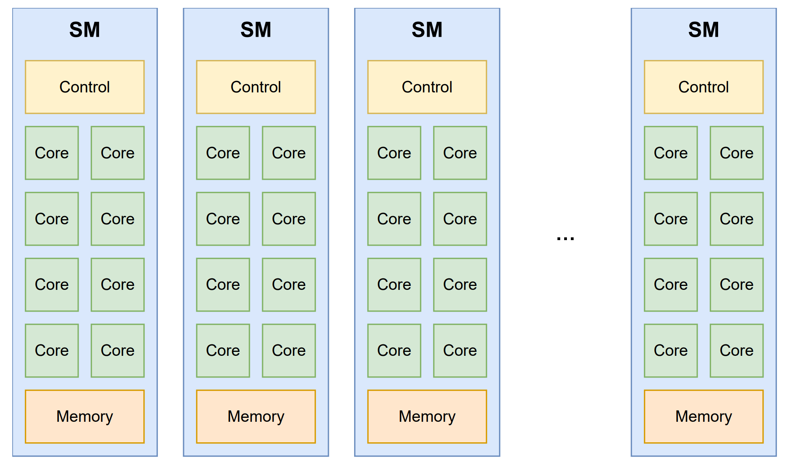

### Thread-Block-Scheduling

- Ein **Block** wird immer auf einem einzelnen SM ausgeführt (alle Threads des Blocks laufen auf demselben SM)
- Threads benötigen Ressourcen (Register, Speicher, ...)
- Daher kann ein SM nur eine begrenzte Anzahl von Threads und Blocks gleichzeitig verarbeiten
- Übrige Blocks warten in einer Warteschlange

**Kooperation innerhalb eines Blocks:**
- Threads eines Blocks können über Barrieren synchronisieren (`__syncthreads()`)
- Threads eines Blocks können über Shared Memory kommunizieren

**Wichtige Einschränkungen:**
- Es gibt keine Garantie, welcher SM einen Block wann bearbeitet
- Kommunikation zwischen verschiedenen Blocks ist nicht möglich

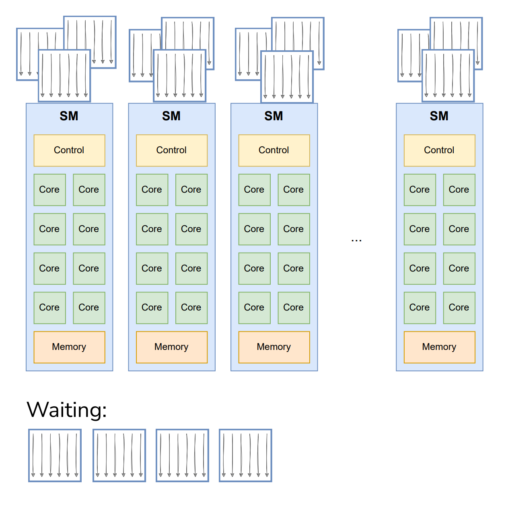


### Transparente Skalierbarkeit
Da Blocks auf beliebigen SMs ausgeführt werden können, ermöglicht dies **unterschiedliche Grade paralleler Ausführung** je nach Hardware-Fähigkeiten.

**Beispiel:**
- Ein Kernel mit 8 Blocks
- Auf einer GPU mit 2 SMs: Blocks werden in 4 Wellen ausgeführt
- Auf einer GPU mit 4 SMs: Blocks werden in 2 Wellen ausgeführt

**Vorteil:** Derselbe Code läuft ohne Modifikation auf verschiedenen GPUs - daher "transparente" Skalierbarkeit.


### Thread-Scheduling (Warps)

- Thread-Scheduling wird in Hardware implementiert (sehr effizient)
- Threads werden in **Warps** gruppiert (typischerweise 32 Threads pro Warp)
- Ein Warp ist die kleinste Scheduling-Einheit auf einem SM

**Rechenbeispiel:**
- 6 Blocks mit je 256 Threads
- Warps pro Block: 256 / 32 = 8 Warps
- Gesamtzahl: 6 × 8 = 48 Warps

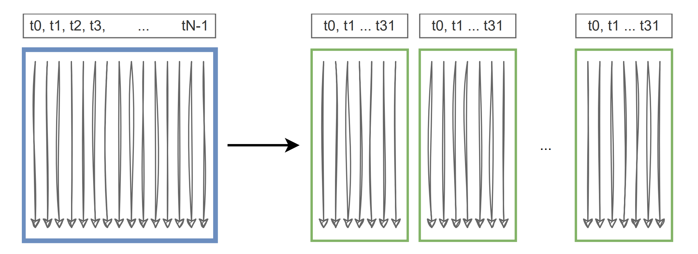

### Warp-Ausführung


Alle Threads in einem Warp werden im **SIMD-Verfahren** ausgeführt (Single Instruction Multiple Data):
- Alle 32 Threads führen gleichzeitig dieselbe Instruktion aus
- Nur die Daten sind unterschiedlich

**Vorteile:**
- Minimiert den Overhead für Steuerlogik
- Eine Instruction-Fetch- und Decode-Einheit versorgt alle Threads eines Warps

**Implementierung:**
- Ein SM gruppiert seine Kerne in **Processing Blocks**
- Alle Kerne eines Processing Blocks teilen sich die Instruktions-Fetch- und Decode-Einheiten
- Threads desselben Warps werden demselben Processing Block zugewiesen

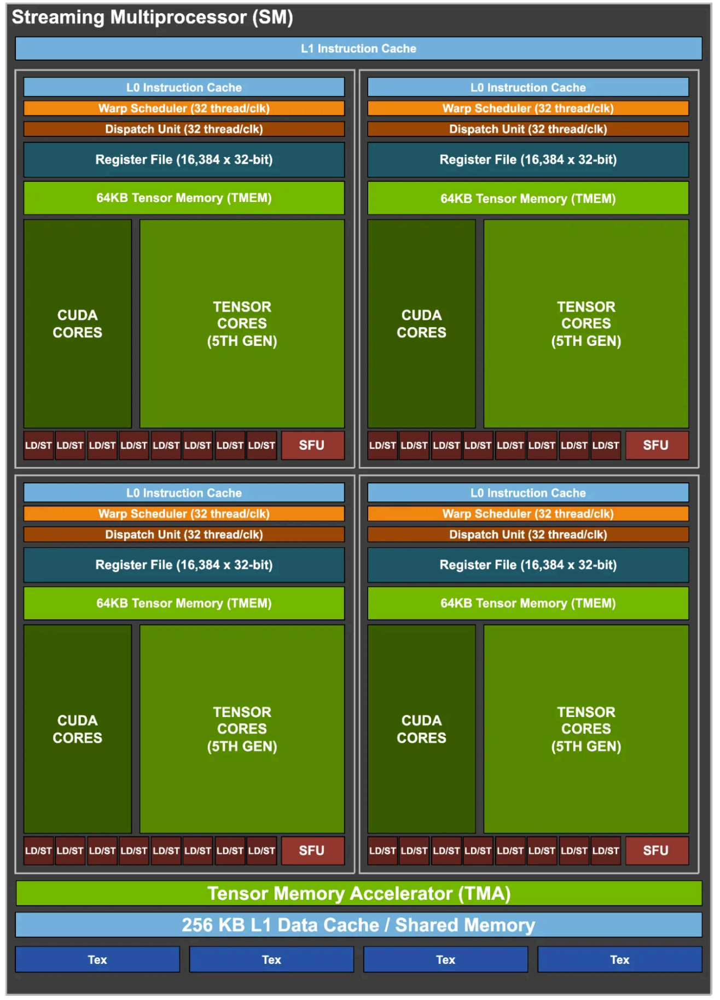


### Control Divergence

**Problem:** Da alle Threads eines Warps dieselbe Instruktion ausführen, entstehen Probleme wenn verschiedene Threads unterschiedliche Ausführungspfade nehmen.

Bei **Control Divergence**:
- Der Warp durchläuft nacheinander jeden einzigartigen Ausführungspfad
- Threads, die nicht auf dem aktuellen Pfad sind, werden deaktiviert (inaktiv)

**Warp-Effizienz (SIMD-Effizienz):**  
Der Prozentsatz der zu einem Zeitpunkt aktiven Threads/Kerne.

→ Niedrige Warp-Effizienz führt zu schlechter Performance!

**Ergänzende Erklärung:**  
Im schlimmsten Fall (jeder Thread nimmt einen anderen Pfad) werden die 32 Threads nacheinander statt parallel ausgeführt - die GPU verhält sich dann wie ein Single-Thread-Prozessor. Dies ist einer der wichtigsten Unterschiede zur CPU-Programmierung, wo Branches "kostenlos" sind.

#### Control Divergence - Beispiel Verzweigung

```cpp
if (threadIdx.x < 24) {
    A  // Threads 0-23 aktiv, Threads 24-31 inaktiv
} else {
    B  // Threads 24-31 aktiv, Threads 0-23 inaktiv
}
C      // Alle Threads wieder aktiv
```
**Ablauf:**
1. Erst führen Threads 0-23 den Code `A` aus (Threads 24-31 warten)
2. Dann führen Threads 24-31 den Code `B` aus (Threads 0-23 warten)
3. Danach führen alle Threads `C` aus

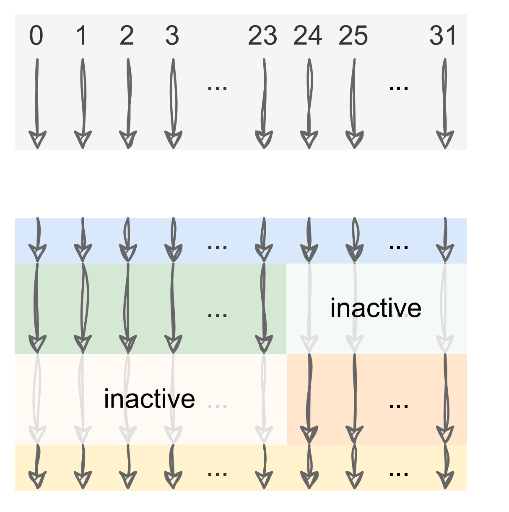

#### Control Divergence - Beispiel Schleife

```cpp
N = a[threadIdx.x];
for (i = 0; i < N; i++) {
    A
}
```

Wenn die Werte in `a[]` für verschiedene Threads unterschiedlich sind (z.B. 8, 6, 7, 4, 5, 6, 8, 7, ...), dann:
- Der Warp führt so viele Iterationen aus wie das Maximum aller N-Werte
- Threads, die früher fertig werden, sind in späteren Iterationen inaktiv

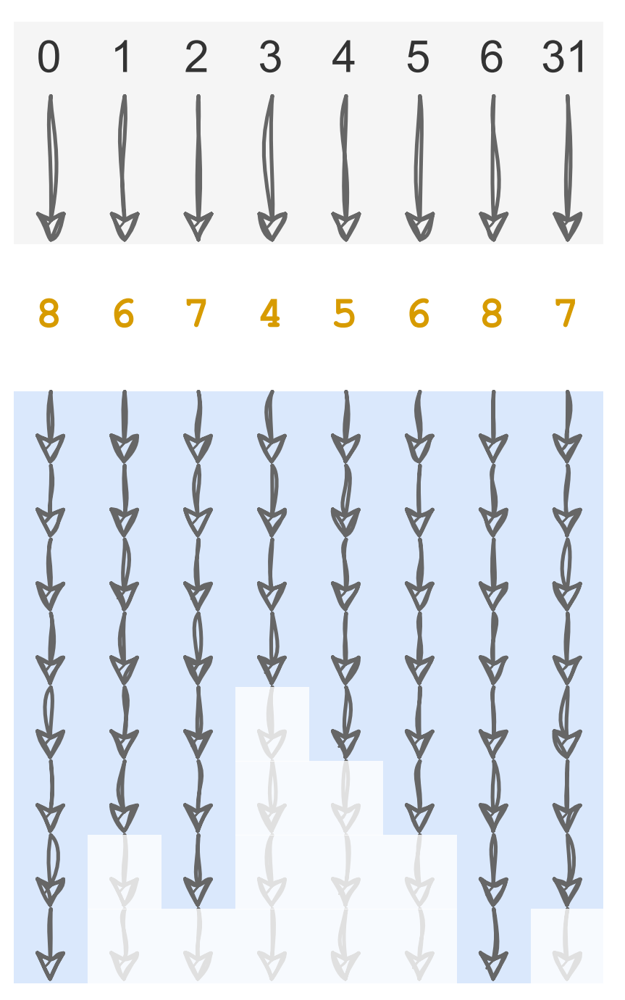

### Warp-Scheduling und Latency Tolerance

**Beobachtung:** Normalerweise sind einem SM viel mehr Warps/Threads zugewiesen als gleichzeitig ausgeführt werden können.

**Warum?**  
Um lange Latenzzeiten zu "verstecken" (z.B. Speicherzugriffe).

**Funktionsweise:**
- Wenn ein Warp auf eine Operation mit langer Latenz wartet, kann der SM sofort zu einem anderen bereiten Warp wechseln
- Der Hardware-Kontextwechsel ist **instant** (Zero-Overhead Thread Scheduling)

Dies nennt man **Latency Tolerance** (u.a. auch Latency Hiding).

**Ziel:** Die Ausführungseinheiten des SMs sollen zu jeder Zeit beschäftigt sein.

**Voraussetzung:** Genügend Warps müssen verfügbar sein, um bei Wartezeiten wechseln zu können.

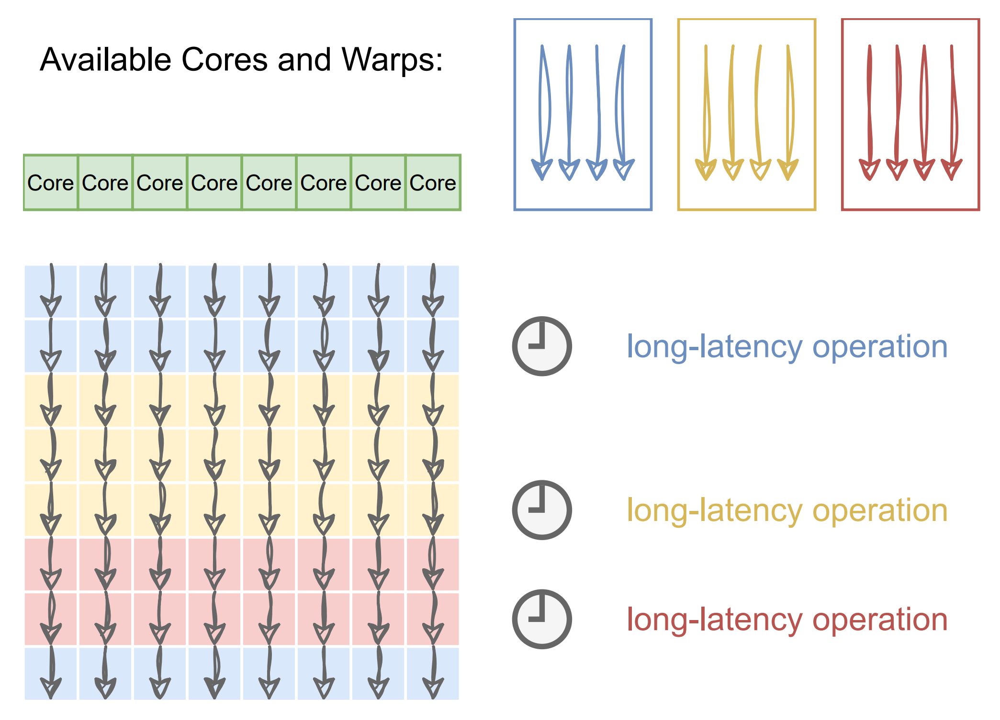

### Occupancy (Belegung)

**Definition:**  
Occupancy = Verhältnis von aktiven Warps/Threads auf einem SM zum Maximum

**Ziel:** Occupancy maximieren, um Latency Hiding zu verbessern.

**Occupancy hängt ab von:**
- Anzahl Threads pro Block (zu wenige Threads = niedrige Occupancy)
- Anzahl Blocks pro SM (zu wenige Blocks = weniger Scheduling-Möglichkeiten)

**Hardware-Limits:**
- Anzahl verwendeter Register pro Thread (mehr Register → weniger Threads möglich)
- Menge des Shared Memory pro Block (mehr Shared Memory → weniger Blocks möglich)
- Maximale Anzahl von Warps/Threads/Blocks pro SM

Die tatsächlichen Hardware-Fähigkeiten variieren zwischen GPU-Modellen.

> Occupancy ist ein Balanceakt: Man möchte viele Threads, aber jeder Thread benötigt Ressourcen. Wenn ein Kernel 64 Register pro Thread verwendet und der SM nur 64K Register hat, können maximal 1024 Threads gleichzeitig aktiv sein - selbst wenn das theoretische Maximum höher liegt.

GPUs unterscheiden sich in vielen Aspekten (Anzahl SMs, Kerne pro SM, Speichergrößen, ...).

Jede GPU hat eine spezifische **Compute Capability Version** (z.B. 7.0, 8.6, 9.0, 12.0), die ihre Features und Fähigkeiten angibt.

```cpp
cudaDeviceProp devProp;
cudaGetDeviceProperties(&devProp, 0); // 0 = erste GPU
int maxThreadsPerBlock = devProp.maxThreadsPerBlock;
int maxThreadsPerSM = devProp.maxThreadsPerMultiProcessor;
int maxBlocksPerSM = devProp.maxBlocksPerMultiProcessor;
```

#### Occupancy-Beispiel

**Gegeben:** RTX 50xx GPU mit Compute Capability 12.0
- Max Threads/Block: 1024
- Max Threads/SM: 1536
- Max Blocks/SM: 32

**Frage:** Wie viele Threads/Block sollten wir wählen, um Occupancy zu maximieren?

| Threads/Block | Blocks/SM | Aktive Threads/SM | Occupancy |
|---------------|-----------|-------------------|-----------|
| 100 |  `floor(1536/100) = 15` | 15 × 100 = 1500 | 97.6% |
| 1024 | `floor(1536/1024) = 1` | 1 × 1024 = 1024 | 66.7% |
| 32 |   `floor(1536/32) = 48` → **begrenzt auf 32** | 32 × 32 = 1024 | 66.7% |
| 256 |  `floor(1536/256) = 6` | 6 × 256 = 1536 | **100%** |
| 128 |  `floor(1536/128) = 12` | 12 × 128 = 1536 | **100%** |
| 512 |  `floor(1536/512) = 3` | 3 × 512 = 1536 | **100%** |

**Berechnung erklärt:**
- Bei 32 Threads/Block würden mathematisch 48 Blocks passen, aber das Maximum ist 32 Blocks/SM
- Bei 256, 128 oder 512 Threads/Block erreichen wir exakt das Maximum von 1536 Threads

**Wichtig:** Occupancy ist nicht der einzige Performance-Faktor.

**Chatty sagt:**  
Hohe Occupancy garantiert keine hohe Performance. Andere Faktoren wie Memory Coalescing, Control Divergence, und Arithmetic Intensity spielen ebenfalls eine große Rolle. Es kann sogar sein, dass niedrigere Occupancy zu besserer Performance führt, wenn dadurch mehr Register pro Thread verfügbar sind und Spilling in den langsamen globalen Speicher vermieden wird.

## Speicherarchitektur und Datenlokalität

### Performance-Engpässe: Speicher vs. Compute Power

Speicheroperationen (Laden/Speichern) sind auf der GPU **viel langsamer** als arithmetische Operationen.

**Typische Latenzen:**
- Globaler Speicherzugriff: ~400-600 Taktzyklen
- Gleitkomma-Addition: ~10 Taktzyklen
→ **Speicherbandbreite und -latenz** sind oft die Hauptengpässe in GPU-Anwendungen.

### Performance-Grenzen (Compute-Bound vs. Memory-Bound)

Eine Anwendung kann sein:
- **Compute-bound:** Performance wird durch Rechenleistung (FLOPS) begrenzt
- **Memory-bound:** Performance wird durch Speicherbandbreite begrenzt

**Arithmetic Intensity (auch gennant Computational Intensity):**  
Das Verhältnis von Rechenoperationen zu Speicherzugriffen (FLOPS/Bytes) ist die entscheidende Metrik.

**Berechnung der Untergrenze:**  
Um nicht memory-bound zu sein, muss gelten:
```
Benötigtes Verhältnis (OP/Byte) = Peak FLOPS / Peak Bandbreite (Bytes/s)
```

| GPU | Peak F32 (TFlops) | Peak Bandbreite (GB/s) | Benötigtes Verhältnis (OP/Byte) |
|-----|-------------------|------------------------|--------------------------------|
| RTX 3080 | 29.77 | 760.3 | 39 |
| RTX 4080 | 48.74 | 716.8 | 68 |
| H100 | 67 | 3,350 | 20 |
| RTX 5080 | 56.28 | 960 | 59 |

**Chatty meint:**
Diese Zahlen bedeuten: Auf einer RTX 4080 müssen pro geladenem Byte mindestens 68 Rechenoperationen durchgeführt werden, um die volle Rechenleistung auszunutzen. Das ist eine sehr hohe Anforderung! Die H100 ist hier "gutmütiger" wegen ihrer enormen Speicherbandbreite.

#### Beispiel: Vektoraddition

```cpp
__global__ void add_vectors(float* a, float* b, float* c, int N) {
    int i = blockIdx.x * blockDim.x + threadIdx.x;
    if (i < N) {
        c[i] = a[i] + b[i];
    }
}
```

- 1 Fließkomma-Addition (der Vergleich wird ignoriert)
- 2 Speicher-Lesezugriffe (`a[i]`, `b[i]`) + 1 Speicher-Schreibzugriff (`c[i]`)
- Jeder float = 4 Bytes → 3 × 4 = 12 Bytes Speicherverkehr

**Arithmetic Intensity:**
```
1 FLOP / 12 Bytes = 0.0833 OP/Byte
```

**Fazit:** Vektoraddition ist auf **allen modernen GPUs memory-bound**.

→ Hier kann man nichts optimieren - das Problem hat inhärent zu wenig Rechenaufwand pro Datenmenge.

#### Beispiel: Matrixmultiplikation

```cpp
__global__ void matrix_multiplication(
    float* A, float* B, float* C, int N)
{
    int row = blockIdx.y * blockDim.y + threadIdx.y;
    int col = blockIdx.x * blockDim.x + threadIdx.x;

    if (row < N && col < N) {
        float sum = 0.0f;
        for (int k = 0; k < N; k++) {
            sum += A[row * N + k] * B[k * N + col];
        }
        C[row * N + col] = sum;
    }
}
```

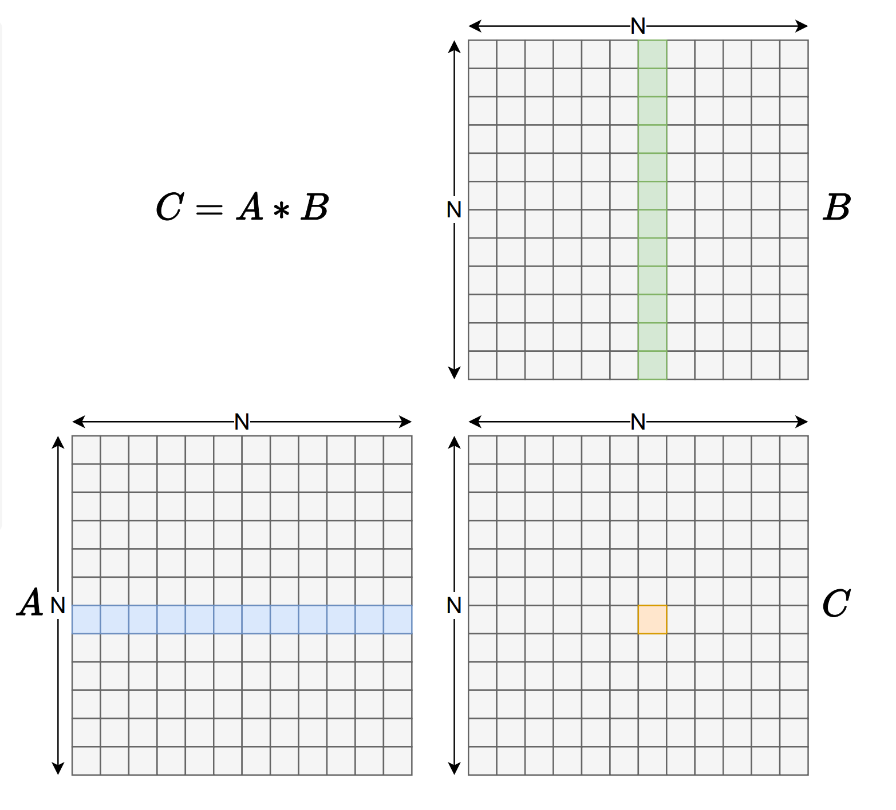

- Jeder Thread berechnet ein Element von `C`
- Dafür wird eine komplette Zeile von `A` und eine komplette Spalte von `B` benötigt
- Innere Schleife: `N` Multiplikationen und `N` Additionen

##### Matrixmultiplikation - Bottleneck-Analyse

**Naive Betrachtung (pro Schleifeniteratation):**
- 1 Addition + 1 Multiplikation = 2 FLOPS
- 2 Speicher-Lesezugriffe (A und B) = 8 Bytes
- → 2 FLOPS / 8 Bytes = **0.25 OP/Byte** → memory-bound

Man kann Datenwiederverwendung verbessern.

**Theoretische Betrachtung (für NxN-Matrizen):**
- Gesamte Datenmenge: 2 Matrizen × N² × 4 Bytes = 8N² Bytes
- Gesamte Operationen: N² Elemente × (N Additionen + N Multiplikationen) = 2N³ FLOPS
- **Theoretische arithmetic Intensity:** 2N³ / 8N² = **N/4 OP/Byte**

Das ist der entscheidende Unterschied zur Vektoraddition: Bei der Matrixmultiplikation wächst das Verhältnis von Rechenaufwand zu Datenmenge mit `N`.

- **Links:** Jedes Element von `A` wird `N`-mal verwendet - für die Berechnung einer kompletten Zeile von `C`. 
- **Rechts:** Jedes Element von B wird N-mal verwendet - für die Berechnung einer kompletten Spalte von C.

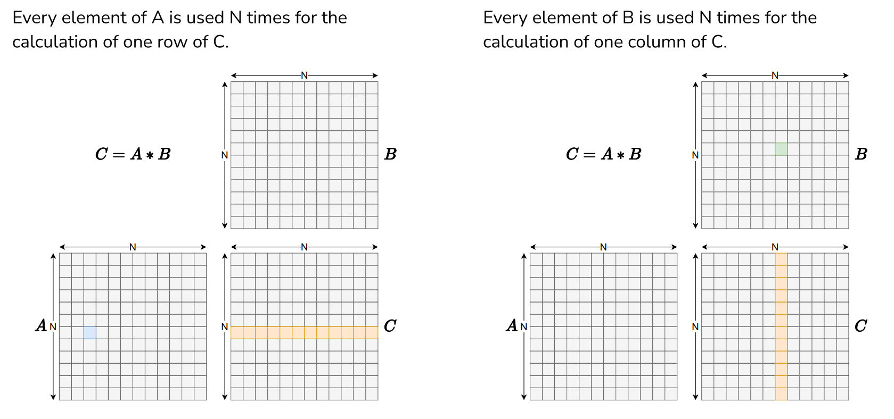

Wenn man es schafft, jedes Element nur einmal aus dem globalen Speicher zu laden und dann N-mal aus einem schnelleren Speicher (z.B. Shared Memory) zu lesen, kann man die Speicherbandbreite um den Faktor N reduzieren. Das ist die Grundidee des **Tiling** (noice).


### Speicherarchitektur einer GPU
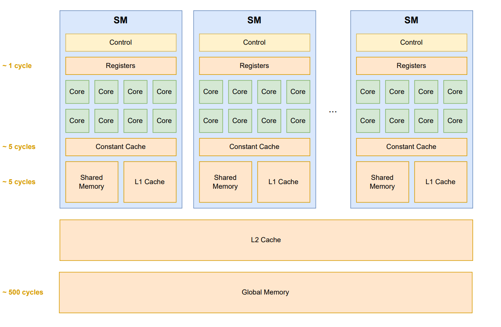

Die Latenzunterschiede sind groß: Register sind ~500× schneller als globaler Speicher. Das erklärt, warum die Nutzung von Shared Memory so wichtig ist - es ist fast so schnell wie Register, aber für alle Threads eines Blocks gemeinsam zugänglich.

### Speicherhierarchie in CUDA

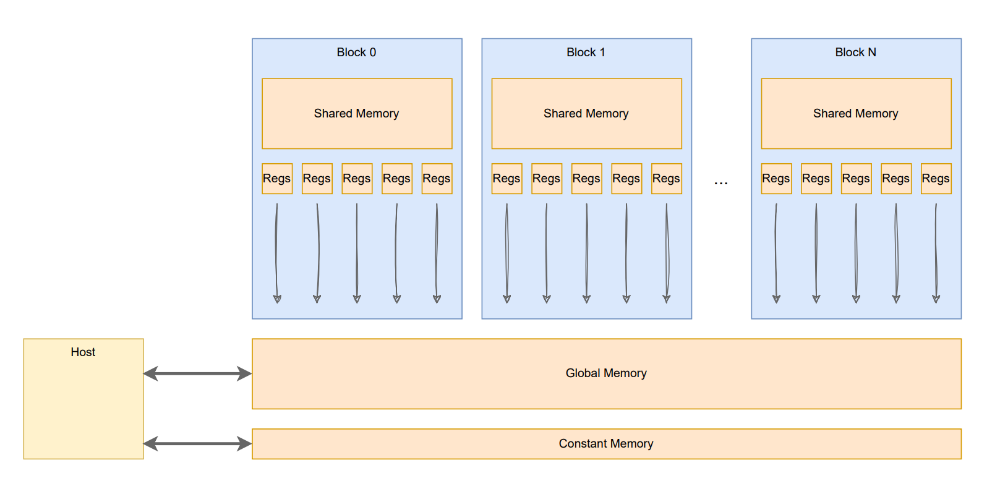

**Sichtbarkeit:**
- **Register:** Nur für den einzelnen Thread sichtbar
- **Shared Memory:** Für alle Threads eines Blocks sichtbar
- **Global/Constant Memory:** Für alle Threads aller Blocks sichtbar
- **Host Memory:** Muss explizit zur GPU transferiert werden

Diese Hierarchie bestimmt, wie Threads kommunizieren können:
- Innerhalb eines Threads: über Register (am schnellsten)
- Innerhalb eines Blocks: über Shared Memory (schnell, benötigt Synchronisation)
- Zwischen Blocks: nur über Global Memory (langsam, keine direkte Synchronisation möglich)

### CUDA Speicher-Deklarations-Qualifier

| Deklaration | Speichertyp | Sichtbarkeit | Lebensdauer | Zugriffsgeschwindigkeit |
|-------------|-------------|--------------|-------------|------------------------|
| `int localVar;` | Register | Thread | Thread | Am schnellsten |
| `int localArray[N];` | Global Memory* | Thread | Thread | Langsam |
| `__device__ int globalVar;` | Global Memory | Grid | Anwendung | Langsam |
| `__device__ __shared__ int sharedVar;` | Shared Memory | Block | Block | Schnell |
| `__device__ __constant__ int constVar;` | Constant Memory | Grid | Anwendung | Schnell (gecacht) |

```cpp
__global__ void example_kernel() {
    // Register - schnellster Zugriff, nur für diesen Thread
    int localVar = 5;
    float temp = 3.14f;
    
    // Lokales Array - kann in Global Memory landen wenn zu groß (heißt dann Local Memory)
    int localArray[10];  // Vorsicht bei großen Arrays
    
    // Shared Memory - für alle Threads im Block sichtbar
    __shared__ float sharedData[256];
    
    // Zugriff auf globale/konstante Variablen (außerhalb definiert)
    // globalVar, constVar
}

// Globale Variable - existiert für die gesamte Anwendung
__device__ int globalCounter;

// Konstante Variable - schnell lesbar, nicht schreibbar vom Device
__constant__ float constMatrix[16];
```

## Tiling und Optimierungsstrategien

### Datenwiederverwendung bei der Matrixmultiplikation

Einige Threads im selben Block verwenden dieselben Eingabedaten.

**Grundidee des Tilings:**
1. Lade Daten, die von mehreren Threads verwendet werden, in den Shared Memory
2. Threads lesen Daten aus dem Shared Memory statt aus dem Global Memory

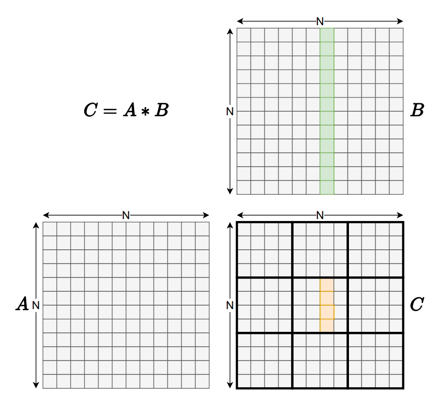

- Alle Threads, die Elemente in derselben Zeile von C berechnen, brauchen dieselbe Zeile von A
- Alle Threads, die Elemente in derselben Spalte von C berechnen, brauchen dieselbe Spalte von B

#### Tiled Matrixmultiplikation

**Schritt 1:** Lade das erste Tile jeder Eingabematrix in den Shared Memory.
Jeder Thread lädt genau ein Element. Das nutzt die Parallelität optimal aus.

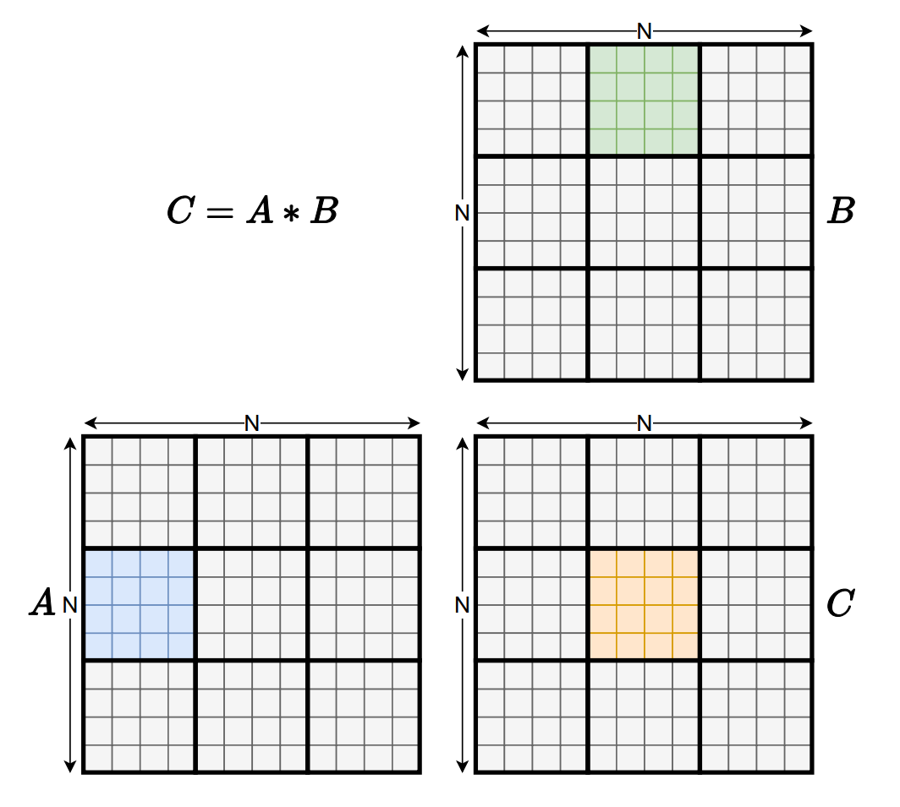

**Schritt 2:** Jeder Thread berechnet seine partielle Summe aus dem Tile im Shared Memory.

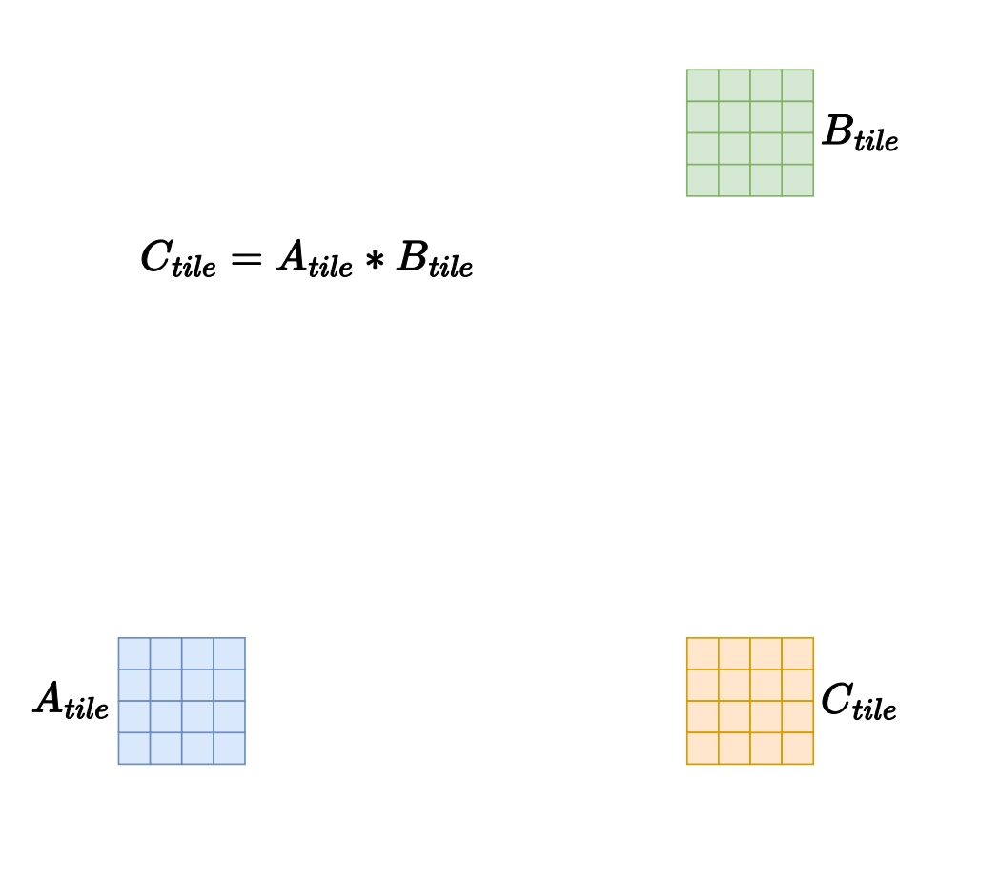

Jeder Thread berechnet hier nur einen Teil des finalen Ergebnisses - nämlich den Beitrag dieses einen Tiles. Die Schleife iteriert über die Tile-Breite (z.B. 16), nicht über die gesamte Matrixbreite N. Das ist viel schneller, weil alle Zugriffe auf Shared Memory gehen.

**Nach Schritt 2:** Synchronisation
Warte, bis alle Threads Schritt 2 abgeschlossen haben.
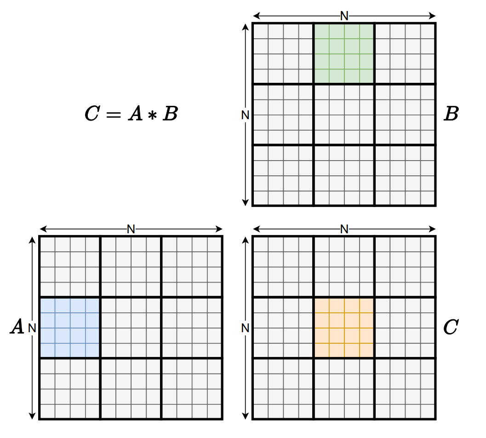


#### Tiled Matrixmultiplikation - Iteration
Wiederhole Schritte 1 und 2 für das nächste Tile.


1. Lade Tile 0 von A und B → berechne partiellen Beitrag → synchronisiere
2. Lade Tile 1 von A und B → berechne partiellen Beitrag → synchronisiere
3. ... (N/T Iterationen)
4. Schreibe finale Summe nach C


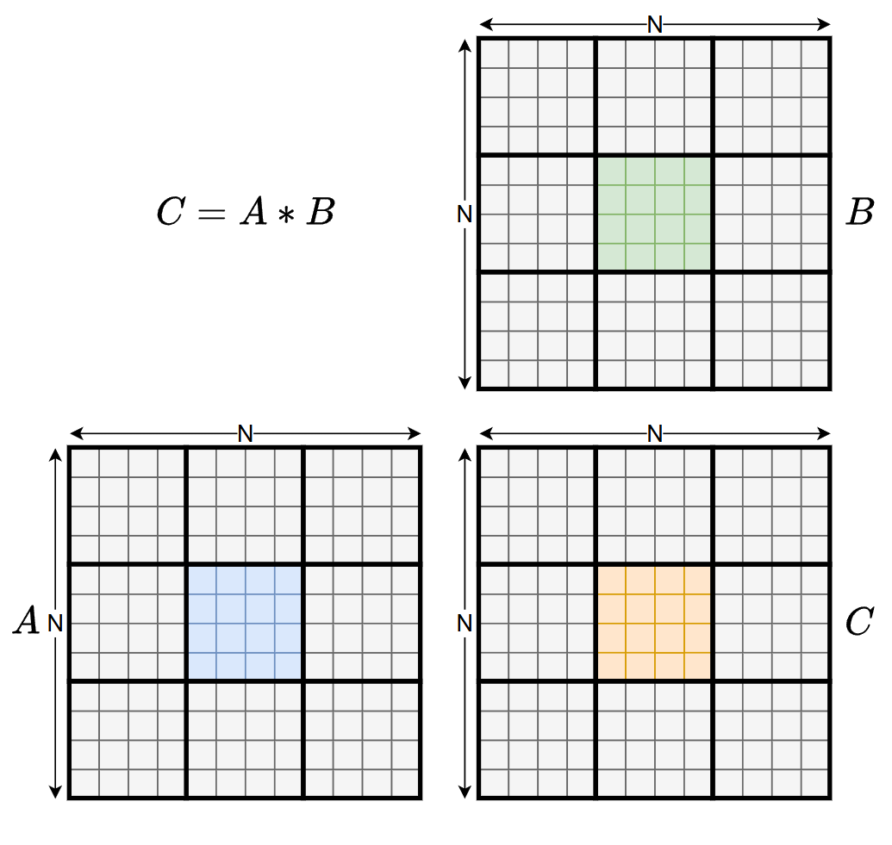

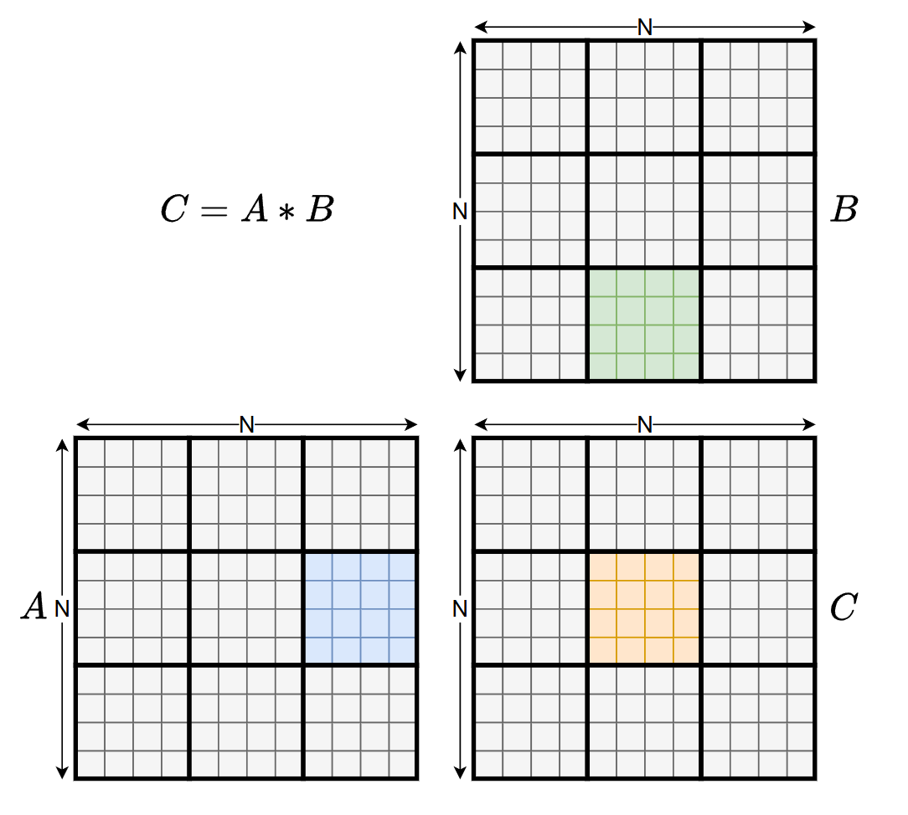

```cpp
constexpr int N = 1024, T = 16;  // Matrixgröße und Tile-Größe

__global__ void tiled_matmul(const float* A, const float* B, float* C) {
    // Shared Memory für die Tiles
    __shared__ float A_s[T][T];
    __shared__ float B_s[T][T];
    
    // Globale Position dieses Threads im Ergebnis
    int row = blockIdx.y * blockDim.y + threadIdx.y;
    int col = blockIdx.x * blockDim.x + threadIdx.x;
    
    float sum = 0.0f;

    // Iteriere über alle Tiles
    for (int tile = 0; tile < N / T; tile++) {  // tile = Phase
        
        // 1. Lade Tile in Shared Memory
        //    Jeder Thread lädt ein Element von A und ein Element von B
        A_s[threadIdx.y][threadIdx.x] = A[row * N + tile * T + threadIdx.x];
        B_s[threadIdx.y][threadIdx.x] = B[(tile * T + threadIdx.y) * N + col];
        
        __syncthreads();  // Warte bis alle geladen haben

        // 2. Berechne partiellen Beitrag aus diesem Tile
        for (int i = 0; i < T; i++) {
            sum += A_s[threadIdx.y][i] * B_s[i][threadIdx.x];
        }
        
        __syncthreads();  // Warte bis alle berechnet haben
    }

    // Schreibe Ergebnis
    C[row * N + col] = sum;
}
```

**Chatty sagt:**

**Laden von A:**
```cuda
A_s[threadIdx.y][threadIdx.x] = A[row * N + tile * T + threadIdx.x];
```
- `row * N`: Springe zur richtigen Zeile
- `tile * T`: Verschiebung zum aktuellen Tile
- `threadIdx.x`: Position innerhalb des Tiles

**Laden von B:**
```cuda
B_s[threadIdx.y][threadIdx.x] = B[(tile * T + threadIdx.y) * N + col];
```
- `tile * T + threadIdx.y`: Zeile innerhalb des Tiles
- `* N`: Zeilenlänge
- `col`: Spalte bleibt konstant für alle Tiles

**Ergänzende Erklärung:**  
Ein häufiger Fehler ist, die Indizes für A und B zu verwechseln:
- Für A läuft das Tile horizontal (entlang der Zeile)
- Für B läuft das Tile vertikal (entlang der Spalte)

Daher ist die Indexierung unterschiedlich, obwohl beide Male ein TxT Tile geladen wird.

### Arithmetic Intensity für Tiled Matrixmultiplikation

**(für NxN Matrizen mit TxT Tiles)**

**Global Memory Traffic pro Block (Bytes):**
- Jede Iteration: T×T Elemente von A + T×T Elemente von B
- Elemente sind 4 Bytes (float)
- Anzahl Iterationen: N / T
- **Bytes pro Block = 2 × T² × 4 × (N/T) = 8NT Bytes**

**FLOPS pro Block:**
- Jedes der T² Elemente berechnet ein Skalarprodukt der Länge N
- Das sind N Multiplikationen + N Additionen pro Element
- **FLOPS pro Block = T² × 2N = 2NT² FLOPS**

**Arithmetische Intensität pro Block:**
```
(2NT² FLOPS) / (8NT Bytes) = T/4 OP/Byte
```

Die Tile-Größe T erhöht die Arithmetic Intensity linear

| Tile-Größe T | Arithmetische Intensität (OP/Byte) |
|--------------|-----------------------------------|
| 1 | 0.25 |
| 2 | 0.5 |
| 4 | 1.0 |
| 8 | 2.0 |
| 16 | 4.0 |
| 32 | 8.0 |

Vergleiche mit der naiven Version (0.25 OP/Byte): Mit T=32 erreichen wir 8 OP/Byte - eine **32-fache Verbesserung**
Aber selbst 8 OP/Byte ist noch weit unter den ~60 OP/Byte, die moderne GPUs für Compute-Bound-Betrieb benötigen :(

### Tiling-Optimierung - Überlegungen

**Beschränkungen der Tile-Größe T:**

1. **Maximale Threads pro Block:**
   - Tile T×T benötigt T² Threads
   - Bei T=32: 1024 Threads (Maximum auf den meisten GPUs)
   - Bei T=64: 4096 Threads (zu viel)

2. **Verfügbarer Shared Memory:**
   - Zwei Tiles: 2 × T² × 4 Bytes
   - Bei T=32: 2 × 1024 × 4 = 8 KB
   - Bei T=64: 2 × 4096 × 4 = 32 KB
   - Maximum pro Block: 48-100 KB (je nach GPU)

3. **Trade-off mit Occupancy:**
   - Größere Tiles → mehr Shared Memory pro Block
   - Mehr Shared Memory pro Block → weniger Blocks pro SM
   - Weniger Blocks pro SM → geringere Occupancy
   - Geringere Occupancy → weniger Möglichkeiten für Latency Hiding

**Optimale Tile-Größe balanciert:**
- Erhöhte arithmetic Intensity (größer = besser)
- Erhaltene Occupancy (kleiner = besser)

Falls Shared Memory zur Laufzeit alloziert werden soll:
```cpp
// Im Kernel
extern __shared__ float A_s[];  // Größe wird extern festgelegt

// Beim Kernel-Aufruf
int sharedMemSize = 2 * T * T * sizeof(float);
tiled_matmul<<<gridDim, blockDim, sharedMemSize>>>(A, B, C);
//                                      ↑
//                      Dritter Parameter = Shared Memory Größe
```

### Häufige Optimierungsstrategien

| Optimierung | Vorteile für Rechenleistung | Vorteile für Speicherperformance | Strategien |
|-------------|----------------------------|----------------------------------|------------|
| **Occupancy maximieren** | Mehr Arbeit zum Verstecken von Latenz | Mehr parallele Speicherzugriffe verstecken DRAM-Latenz | SM-Ressourcennutzung tunen (Threads pro Block, Register pro Thread, Shared Memory pro Block) |
| **Tiling und Datenwiederverwendung** | Weniger Warten auf Global Memory | Weniger Global Memory Traffic | Shared Memory nutzen um häufig wiederverwendete Daten zu cachen |
| **Control Divergence minimieren** | Höhere SIMD-Effizienz | — | Thread-zu-Daten-Mapping oder Algorithmus ändern um Verzweigungsdivergenz zu reduzieren |
| **Thread Coarsening** | Weniger redundante Arbeit und Synchronisations-Overhead | Weniger redundanter Global Memory Traffic | Mehrere Arbeitseinheiten pro Thread zuweisen für bessere Wiederverwendung |
| **Coalesced Memory Access** | Weniger Pipeline-Stalls | Bessere Bandbreitennutzung durch Burst-Zugriffe | Datenlayout und Zugriffsmuster so anordnen, dass Threads eines Warps zusammenhängend zugreifen |

### Optimierungs-Faustregel von Chatty 
**Faustregel:** Optimierungen auf höherer Ebene bringen meist mehr als Micro-Optimierungen. Erst den Algorithmus optimieren, dann die Speicherzugriffe, dann den Rest.
```
┌─────────────────────────────────────────────────────────────┐
│  1. Algorithmus-Ebene                                       │
│     → Richtigen Algorithmus wählen, Datenwiederverwendung   │
├─────────────────────────────────────────────────────────────┤
│  2. Speicherzugriffsmuster                                  │
│     → Coalescing, Tiling, Shared Memory nutzen              │
├─────────────────────────────────────────────────────────────┤
│  3. Ausführungseffizienz                                    │
│     → Divergenz minimieren, Occupancy tunen                 │
├─────────────────────────────────────────────────────────────┤
│  4. Instruktions-Ebene                                      │
│     → Intrinsics, Loop Unrolling, Compiler-Optionen         │
└─────────────────────────────────────────────────────────────┘
```
