# CUDA: Massiv paralleles

CUDA ermöglicht es, die enorme Rechenleistung moderner Grafikkarten für allgemeine Berechnungen zu nutzen - nicht nur für Grafik.

## Einführung
### Hardware
Vergleich CPU vs. GPU

| Eigenschaft | CPU (Intel Core Ultra 7 265) | GPU (NVIDIA GeForce RTX 5080) |
|-------------|------------------------------|-------------------------------|
| Kerne (oder Äquivalent) | **20** | **10.752** (!)|
| Basis-/Boost-Taktfrequenz | 2,4 GHz / 5,3 GHz | 2,3 GHz / 2,6 GHz |
| Transistoren | 17,8 Milliarden | 45,6 Milliarden |
| Typische Leistungsaufnahme | 65 W | 360 W |
| Theoretische F32-Spitzenleistung | 1,7 TFLOPS | 56,3 TFLOPS |
| Nachhaltige F32-Leistung | ~0,3 TFLOPS | ~40 TFLOPS |
| Typischer Arbeitsspeicher | 32-128 GB | 16 GB |
| Typische Kosten | 400 USD | 1.000 USD |


> **TFLOPS** = Billionen Gleitkomma-Operationen pro Sekunde (Tera Floating Point Operations Per Second)
> **F32** = 32-Bit Gleitkommazahlen (single precision)

### Latenz vs. Durchsatz

#### Latenz-orientiertes Design (CPU)
Die Zeit minimieren, die für eine **einzelne** Aufgabe benötigt wird.

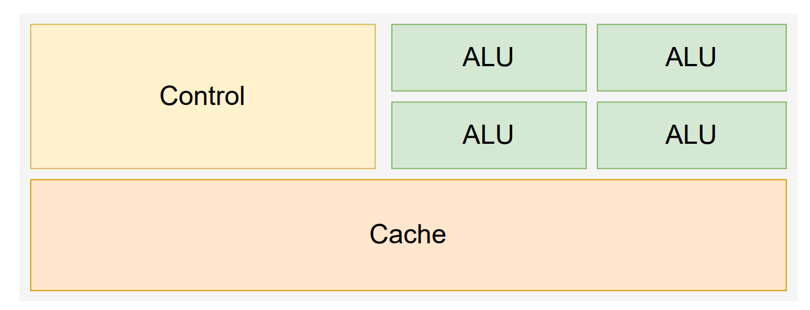

**Merkmale:**
- **Wenige leistungsstarke ALUs:** Reduzieren die Latenz einzelner Operationen
- **Große Caches:** Wandeln langsame Speicherzugriffe in schnelle Cache-Zugriffe um
- **Komplexe Steuerlogik:** Branch Prediction (Sprungvorhersage) für reduzierte Latenz

#### Durchsatz-orientiertes Design (GPU)
Die **Anzahl** der Aufgaben maximieren, die in einer bestimmten Zeit erledigt werden können.

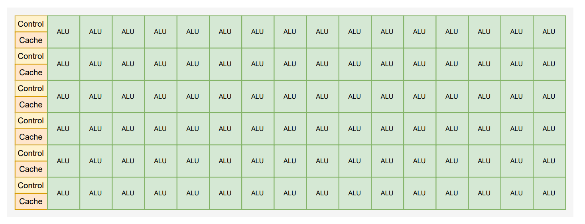

**Merkmale:**
- **Viele kleine ALUs:** Hohe Latenz, stark pipelined, aber hoher Durchsatz
- **Kleine Caches:** Optimiert für Speicherdurchsatz, nicht für Latenz
- **Einfache Steuerlogik:** Keine Branch Prediction

Die GPU opfert bewusst die Geschwindigkeit einzelner Operationen zugunsten der Fähigkeit, *massiv viele* Operationen gleichzeitig auszuführen. Das funktioniert gut, wenn alle Threads dieselbe Operation auf unterschiedlichen Daten ausführen.

| Aspekt | CPU | GPU |
|--------|------------------|-----------|
| Einzelne Aufgabe |  Schnell | Langsamer |
| Viele gleichartige Aufgaben | Begrenzt | effizient |
| Beispiel | Komplexe Entscheidungslogik | Millionen Pixel berechnen |

### Wie die GPU einsetzen?
CPU für sequentielle Teile (wo Latenz wichtig ist)
 - CPUs können für sequentiellen Code über **100x schneller** sein als GPUs.

GPU für hochparallele Teile (wo Durchsatz wichtig ist)
 - GPUs können für hochparallelen Code über **100x schneller** sein als CPUs.

Daher ganz klar, beide zusammen nutzen → Heterogenes paralleles Rechnen

**Typischer Ablauf:**
1. Die **meisten Codezeilen** werden auf der CPU ausgeführt
2. **Rechenintensive Kernel** werden auf der GPU ausgeführt

Praxisbeispiele:
**Gut für GPU:**
- Bildverarbeitung (jedes Pixel unabhängig)
- Matrixmultiplikation
- Deep Learning (Training & Inferenz)

**Schlecht für GPU:**
- Stark verzweigte Algorithmen (viele if/else)
- Rekursive Algorithmen
- Code mit vielen Abhängigkeiten zwischen Berechnungen
- Kleine Datenmengen (Overhead überwiegt)

### CUDA - Compute Unified Device Architecture

Cuda ist eine **parallele Rechenplattform** und ein **Programmiermodell** von NVIDIA. Es ermöglicht die Nutzung von NVIDIA-GPUs für **allgemeine Berechnungen** (GPGPU = General Purpose GPU).

Cuda bietet:

- Erweiterungen für **C/C++**
- **Compiler** (nvcc)
- **Debugging-Tools** (cuda-gdb, Nsight)
- **Bibliotheken** (cuBLAS, cuDNN, cuFFT, ...)
- **Performance-Analyse-Tools** (Nsight Compute, nvprof)

Ist aber leider nur auf **NVIDIA-GPUs** verfügbar :(


Als Alternativen gibt es noch **OpenCL** - offener Standard, läuft auf AMD, Intel, NVIDIA und **Vulkan** - primär für Grafik, aber auch Compute-Shader möglich.

## Datenparalleles Rechnen

Das Kernkonzept ist simple, dieselbe Operation auf vielen Datenelementen ausführen. 

### Arten von Parallelität

#### Task-Parallelität (Aufgabenparallelität)

**Verschiedene** Operationen werden auf denselben Daten ausgeführt.


**Eigenschaften:**
- Üblicherweise nur eine begrenzte Anzahl von Tasks
- Weniger Potenzial für Parallelisierung
- Typisch für CPU-Programmierung

#### Daten-Parallelität

**Dieselbe** Operation wird auf verschiedenen Datenelementen ausgeführt

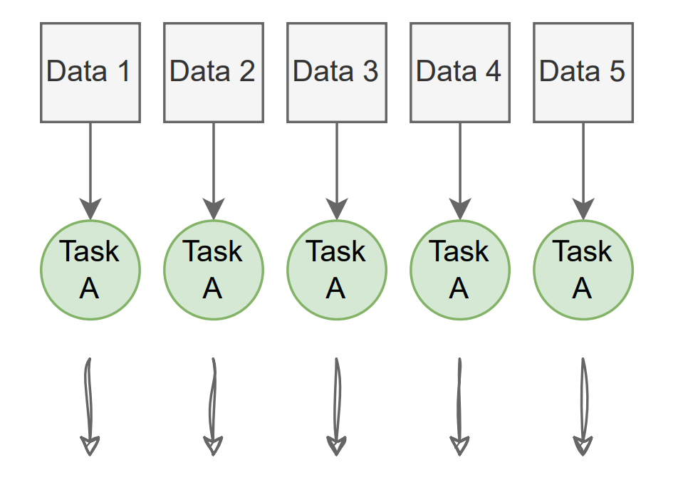

**Eigenschaften:**
- Potenziell **massive** Parallelität möglich
- **Besser geeignet für GPUs**
- Skaliert mit der Datenmenge


### Beispiel - Graustufen-Konvertierung eines Bildes

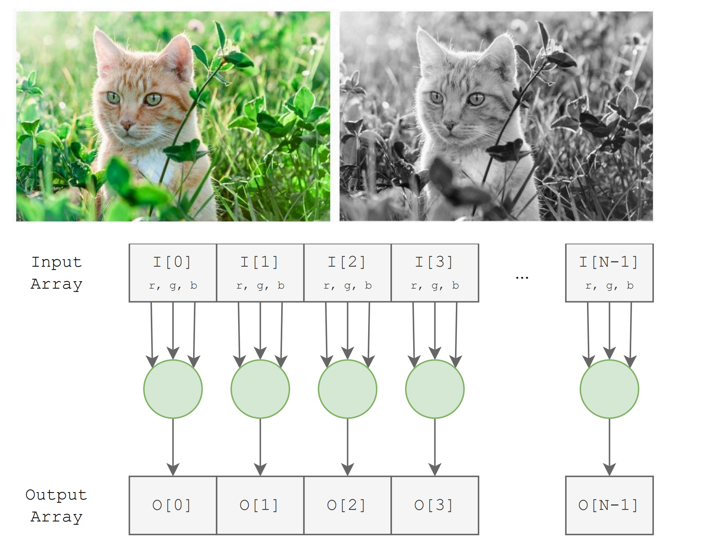

Die Berechnung ist für jeden Pixel gleich.
```
Grau = 0.3 × Rot + 0.6 × Grün + 0.1 × Blau
```
- Jedes Pixel kann **unabhängig** berechnet werden
- Keine Abhängigkeiten zwischen Pixeln
- Millionen von identischen Operationen
- Ein 4K-Bild (3840×2160) = 8.294.400 parallele Berechnungen!

→ Gefundenes Fressen für die GPU.


### Beispiel - Vektoraddition

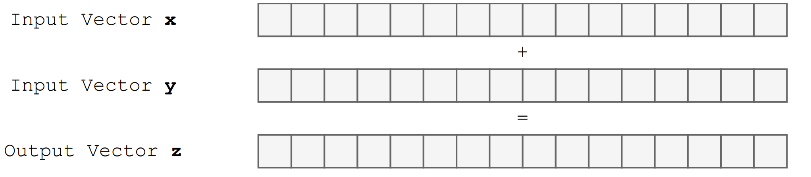
```cpp
void vector_add(float* x, float* y, float* z, int N) {
    for (int i = 0; i < N; i++) {
        z[i] = x[i] + y[i];
    }
}
```
Diese sequentielle Version **O(N)** Zeitkomplexität _(hell no)_. Und das, obwohl jede Iteration nicht von der vorherigen abhängt, daher gut geeignet für Parallelisierung.  

#### Optimierung mit CPU: Chunk-basiert

1. Vektor in **Chunks** (Abschnitte) aufteilen
2. Jeder Core verarbeitet **einen Chunk**
3. Parallelität = Anzahl der Kerne (z.B. 4-20)

```cpp
// Code für CPU mit 4 Threads
#pragma omp parallel for
for (int i = 0; i < N; i++) {
    z[i] = x[i] + y[i];
}
```

```
Vektor mit N Elementen, 4 CPU-Kerne:
Core 0:  [████████████████]  Elemente 0 bis N/4-1
Core 1:  [████████████████]  Elemente N/4 bis N/2-1
Core 2:  [████████████████]  Elemente N/2 bis 3N/4-1
Core 3:  [████████████████]  Elemente 3N/4 bis N-1
```

#### Optimierung mit GPU: Thread pro Element

1. **So viele Threads wie möglich** starten
2. **Ein Thread pro Vektorelement** zuweisen
3. Parallelität = Anzahl der Elemente (z.B. Millionen)

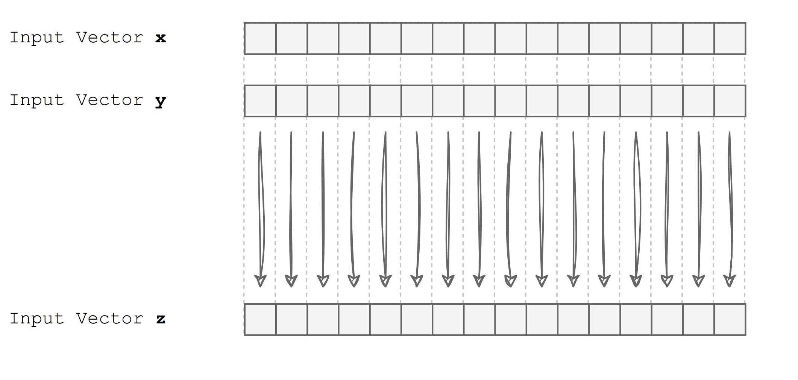

Der GPU-Ansatz mag verschwenderisch erscheinen - warum einen ganzen Thread für nur eine Addition? Die Antwort liegt in der GPU-Architektur.Bei der GPU-Programmierung ist es gängige Praxis, dass die Anzahl der Threads die Anzahl der Cores übersteigt. Mehr dazu später.

## CUDA Systemorganisation

### Die zwei Speicher

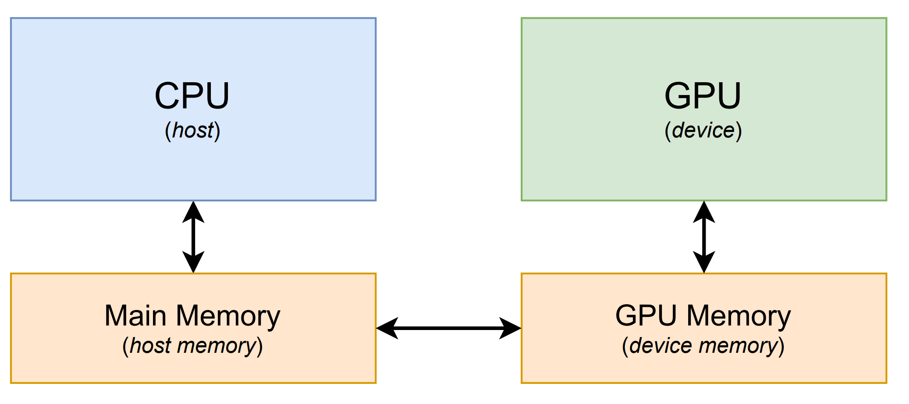

| Begriff | Bedeutung |
|---------|-----------|
| **Host** | Die CPU |
| **Device** | Die GPU |
| **Host Memory** | RAM des Computers (z.B. DDR5) |
| **Device Memory** | VRAM der Grafikkarte (z.B. GDDR7) |

- GPU kann **NICHT** direkt auf Host-Speicher zugreifen
- CPU kann **NICHT** direkt auf Device-Speicher zugreifen
- Daten müssen **EXPLIZIT** kopiert werden

Der Bottleneck besteht in der Datenübertragung zwischen Host- und Devicememory (meist via PCI Express.)

| Verbindung | Bandbreite |
|------------|------------|
| CPU ↔ RAM | ~50-100 GB/s |
| GPU ↔ VRAM | ~500-1000 GB/s |
| CPU ↔ GPU (PCIe 4.0 x16) | ~32 GB/s |

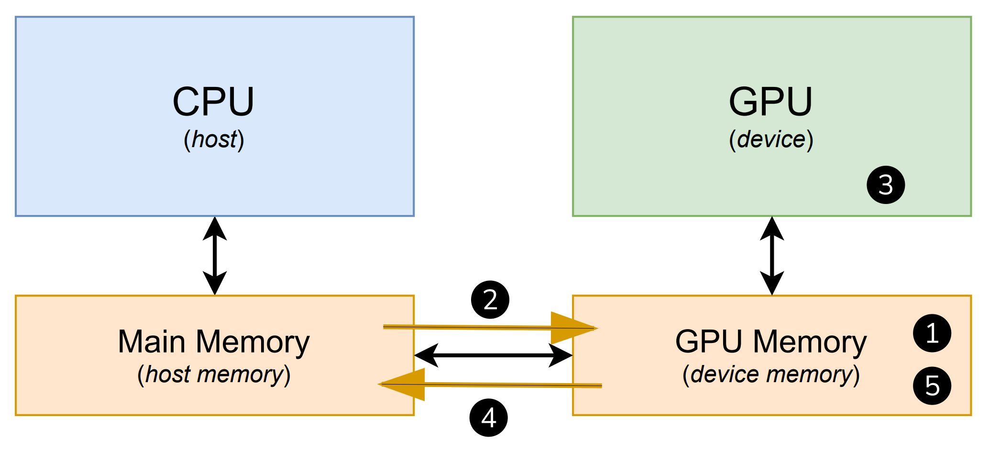

| Schritt | Funktion | Beschreibung |
|---------|----------|--------------|
| ① | `cudaMalloc` | GPU-Speicher allokieren |
| ② | `cudaMemcpy` | Daten von CPU → GPU kopieren |
| ③ | Kernel Launch | Berechnung auf GPU ausführen |
| ④ | `cudaMemcpy` | Ergebnisse von GPU → CPU kopieren |
| ⑤ | `cudaFree` | GPU-Speicher freigeben |

Dieser Ablauf ist ein sehr zentrales Muster für die CUDA-Programmierung.

### Speicherverwaltungsfunktionen

**Speicher allokieren und freigeben**

```cpp
// Speicher auf der GPU reservieren
cudaError_t cudaMalloc(void** devPtr, size_t size);

// Speicher auf der GPU freigeben
cudaError_t cudaFree(void* devPtr);
```

**Speicher kopieren**
```cpp
cudaError_t cudaMemcpy(void* dst, const void* src, size_t count, cudaMemcpyKind kind);
```
- `dst` - Zieladresse
- `src` - Quelladresse  
- `count` - Anzahl Bytes
- `kind` - Richtung der Kopie

**`cudaMemcpyKind`**:
- `cudaMemcpyHostToDevice`: CPU → GPU
- `cudaMemcpyDeviceToHost` : CPU ← GPU
- `cudaMemcpyDeviceToDevice`: GPU → GPU
- `cudaMemcpyHostToHost`: CPU → CPU

Alle CUDA-Funktionen geben `cudaError_t` zurück:
```cpp
cudaError_t err = cudaMalloc(&d_ptr, size);
if (err != cudaSuccess) {
    printf("Fehler: %s\n", cudaGetErrorString(err));
}
```

#### Beispiel Speicherverwaltung für Vektoraddition

```cpp
void vector_add(float* x, float* y, float* z, int N) {
    
    // Schritt 1: GPU-Speicher allokieren
    float *d_x, *d_y, *d_z;                    // d_ = device pointer
    cudaMalloc(&d_x, N * sizeof(float));       // Platz für x
    cudaMalloc(&d_y, N * sizeof(float));       // Platz für y
    cudaMalloc(&d_z, N * sizeof(float));       // Platz für z (Ergebnis)
    
    // Schritt 2: Eingabedaten zur GPU kopieren
    cudaMemcpy(d_x, x, N * sizeof(float), cudaMemcpyHostToDevice);
    cudaMemcpy(d_y, y, N * sizeof(float), cudaMemcpyHostToDevice);
    // Hinweis: d_z muss nicht kopiert werden (nur Ausgabe)
    
    // Schritt 3: Berechnung auf GPU ausführen
    // (Kernel-Launch kommt später)
    
    // Schritt 4: Ergebnisse zurück zur CPU kopieren
    cudaMemcpy(z, d_z, N * sizeof(float), cudaMemcpyDeviceToHost);
    
    // Schritt 5: GPU-Speicher freigeben
    cudaFree(d_x);
    cudaFree(d_y);
    cudaFree(d_z);
}
```

## CUDA Kernel und Threads

Ein **Kernel** ist eine Funktion, die auf der GPU ausgeführt wird. Das Besondere: Der Kernel-Code wird von **vielen Threads gleichzeitig** ausgeführt. Die Cuda Runtime startet ein **Grid** von Threads. Alle Threads eines Grids führen die selbe Kernel Funktion aus. Innerhalb eines Grids sind die Threads nochmal in Blöcke unterteilt. 

```
                            Grid 
        ┌─────────────────────────────────────────┐
        │                                         │
        │   ┌─────────┐  ┌─────────┐  ┌─────────┐ │
        │   │ Block 0 │  │ Block 1 │  │ Block 2 │ │
        │   │┌─┬─┬─┬─┐│  │┌─┬─┬─┬─┐│  │┌─┬─┬─┬─┐│ │
        │   ││T│T│T│T││  ││T│T│T│T││  ││T│T│T│T││ │
        │   │└─┴─┴─┴─┘│  │└─┴─┴─┴─┘│  │└─┴─┴─┴─┘│ │
        │   └─────────┘  └─────────┘  └─────────┘ │
        │                                         │
        └─────────────────────────────────────────┘
        
Grid = Sammlung von Blöcken
Block = Gruppe von Threads
```

**Gründe für die Hierachie**
| Grund | Erklärung |
|-------|-----------|
| **Ressourcenbeschränkung** | GPU kann nur begrenzt viele Threads gleichzeitig verwalten. Es gibt aber fast keine Limitierung bei der Anzahl der Blöcke. |
| **Skalierbarkeit** | Stärkere GPUs können mehr Blöcke parallel ausführen (Transparente Skalierbarkeit) |
| **Kooperation** | Threads innerhalb eines Blocks können über Shared Memory kommunizieren und sich synchronisieren. |
| **Abstraktion** | Natürliche Abbildung für mehrdimensionale Probleme (Bilder, Matrizen, 3D-Volumen). |

### Beispiel Grid-Organisation für Vektoraddition

Remember: Ein GPU-Thread pro Vektorelement. Ein Array von GPU-Threads wird als **Grid** bezeichnet.


Die blauen Gruppierungen sind die Blöcke.
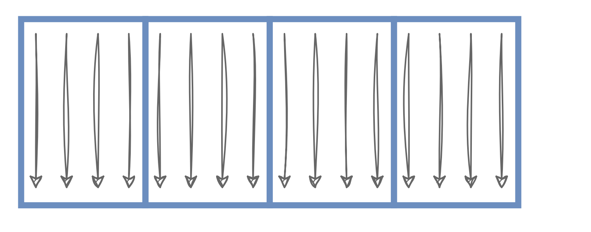

Typische Block-Größen sind 128, 256 oder 512 Threads. Die Wahl der Block-Größe beeinflusst die Performance - mehr dazu später.

### Thread-Identifikation

Jeder Thread hat Zugriff auf spezielle Variablen, um sich selbst zu identifizieren:

| Variable | Bedeutung | Typ |
|----------|-----------|-----|
| `blockIdx` | Index des Blocks im Grid | `dim3` |
| `blockDim` | Anzahl Threads pro Block | `dim3` |
| `threadIdx` | Index des Threads im Block | `dim3` |
| `gridDim` | Anzahl Blöcke im Grid | `dim3` |

Die Formel für den globalen Index
```cpp
int i = blockIdx.x * blockDim.x + threadIdx.x;
```
```
Grid mit 3 Blöcken mit 4 Threads:

Block 0              Block 1              Block 2
┌──┬──┬──┬──┐       ┌──┬──┬──┬──┐       ┌──┬──┬──┬──┐
│ 0│ 1│ 2│ 3│       │ 0│ 1│ 2│ 3│       │ 0│ 1│ 2│ 3│   ← threadIdx.x
└──┴──┴──┴──┘       └──┴──┴──┴──┘       └──┴──┴──┴──┘
│ 0│ 1│ 2│ 3│       │ 4│ 5│ 6│ 7│       │ 8│ 9│10│11│   ← globaler Index i
blockIdx.x = 0       blockIdx.x = 1     blockIdx.x = 2
blockDim.x = 4       blockDim.x = 4     blockDim.x = 4

Beispiel für Thread mit threadIdx.x = 2 in Block 1:
i = blockIdx.x * blockDim.x + threadIdx.x
i = 1          * 4          + 2
i = 6  ✓
```
Hier nochmal gezeichnet:

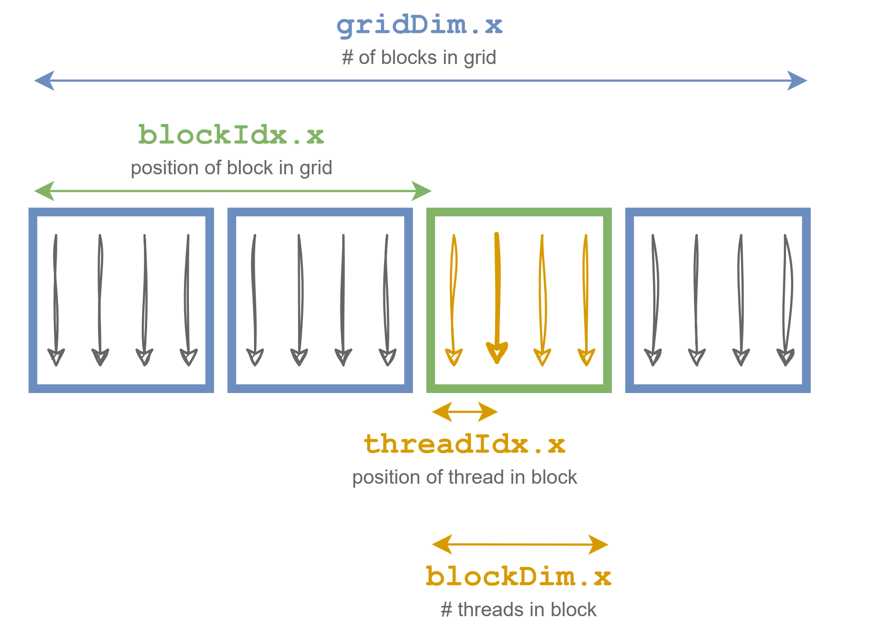

Begreift man dieses Konzept, kann man die hierarchische Thread-Organisation in einen flachen Array-Index abbilden.

### Kernel

Ein **Kernel** ist eine C/C++-Funktion, die auf der GPU ausgeführt wird.

CUDA unterscheidet zwischen verschiedenen Funktionstypen
- Host-Funktionen (normales C/C++)
- Device-Funktionen (laufen auf GPU)

Kernel-Funktionen sind eine spezielle Art von Funktionen, welche vom Host gestartet werden können.

Mit verschienden Keywords kann man bestimmen, wo die Funktionen laufen und wo sie ausgeführt werden.

| Qualifier | Aufrufbar von | Ausgeführt auf | Ausgeführt durch |
|-----------|---------------|----------------|------------------|
| `__global__` | Host | Device | Neues Grid von Device-Threads |
| `__host__` | Host | Host | Aufrufender Host-Thread |
| `__device__` | Device | Device | Aufrufender Device-Thread |

`__host__` ist der Standard und kann weggelassen werden.

`__host__` und `__device__` können kombiniert werden:
```cpp
__host__ __device__ float square(float x) {
    return x * x;
}
```

Diese Funktion wird **zweimal kompiliert** - einmal für CPU, einmal für GPU - und kann von beiden aufgerufen werden.

Einfache Beispiel:
| Qualifier | Typischer Einsatz |
|-----------|-------------------|
| `__global__` | Einstiegspunkt für GPU-Berechnung (der eigentliche Kernel) |
| `__device__` | Hilfsfunktionen, die nur von der GPU aufgerufen werden |
| `__host__ __device__` | Utility-Funktionen wie `min()`, `max()`, mathematische Operationen |

#### Beispiel Vektoradditions-Kernel

```cpp
__global__
void vec_add_kernel(float* x, float* y, float* z, int N) {
    // Globalen Index berechnen
    int i = blockIdx.x * blockDim.x + threadIdx.x;
    
    // Addition durchführen
    z[i] = x[i] + y[i];
}
```

- `blockIdx`, `blockDim`, `threadIdx` sind **automatisch verfügbar** in jedem Kernel
- Sie müssen nicht deklariert oder initialisiert werden
- i ist eine automatic (local) Variable, d.h. jeder Thread hat seine eigene Kopie.

### Starten eines CUDA Kernels

```cpp
kernel_function<<<>>>>(arguments);
```

Die spezielle Launch-Syntax `<<<>>>>` erwartet sogenannte **Execution Configuration Parameter**. Die Syntax erwartet mindestens 2 Parameter:

- 1. Argument → Anzahl der Blöcke im Grid
- 2. Argument → Anzahl der Threads pro Block

```cpp
// Beispiel: 100 Blöcke mit je 256 Threads = 25.600 Threads total
mySweetLittleKernel<<<100, 256>>>(arg1, arg2);
```

#### Beispiel: Vektoraddition starten

```cpp
const unsigned int numThreadsPerBlock = 256;
const unsigned int numBlocks = N / numThreadsPerBlock;
vec_add_kernel<<<numBlocks, numThreadsPerBlock>>>(d_x, d_y, d_z, N);
```
Folgendes ist zu beachten:
- Kernel muss mit __global__ qualifiziert sein
- Pointer-Argumente müssen auf Device-Speicher zeigen (`d_x`, `d_y`, `d_z` - nicht `x`, `y`, `z`!)
- Kernel können keinen Wert zurückgeben (immer void)
- Host-Pointer an Kernel übergeben = Crash
- Kernel Aufrufe sind asynchron (Warten möglich mit `cudaDeviceSynchronize()`)

#### Beispiel Thread-Grid für Vektoraddition

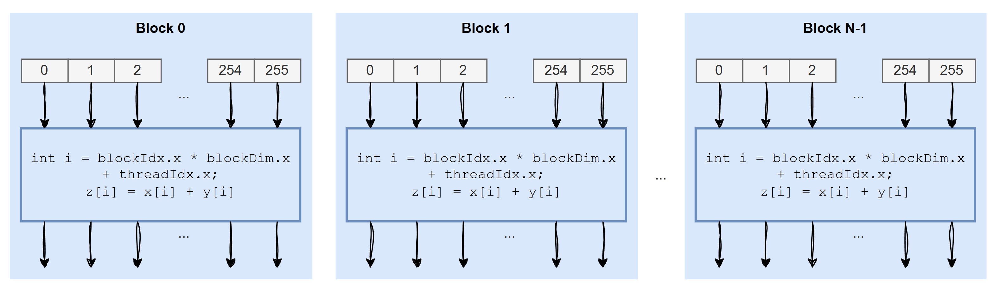

| N (Vektorgröße) | Threads/Block | Anzahl Blöcke | Total Threads |
|-----------------|---------------|---------------|---------------|
| 1.024 | 128 | 8 | 1.024 |
| 2.048 | 512 | 4 | 2.048 |
| 2.000.000 | 256 | 7.813 | 2.000.128 |

Für die korrektie Dimensionierung der Anzahl der Blöcke darf man nicht einfach `N / numThreadsPerBlock` rechnen.

```
N = 2.000.000
numThreadsPerBlock = 256

numBlocks = N / numThreadsPerBlock
          = 2.000.000 / 256
          = 7.812,5
          → 7.812 (Integer-Division!)

Tatsächliche Threads = 7.812 × 256 = 1.999.872

Problem: 128 Elemente werden nicht berechnet (Alarm!)
```

Mit folgender Formel kann man alle `N` Elemente in einem Thread ausführen.
```cpp
numBlocks = (N + numThreadsPerBlock - 1) / numThreadsPerBlock;
```

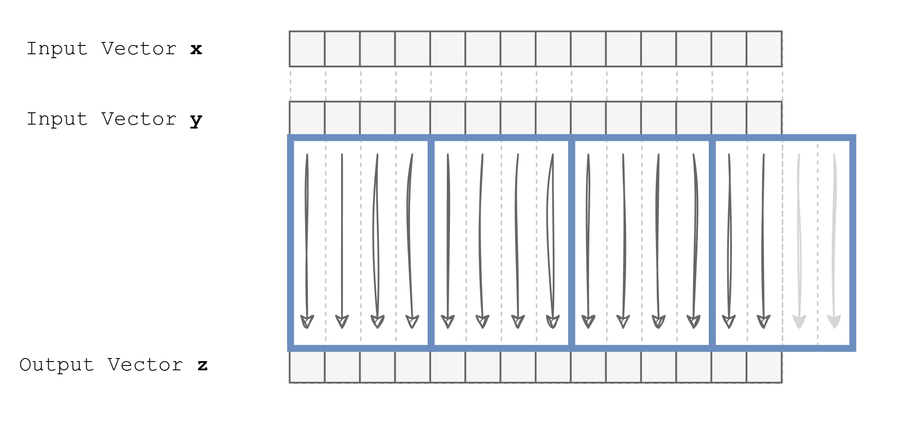

Da wir nun auch überschüssige Threads erstellen können (`i >= N`) müssen wir einen zusätzlichen Boundary-Check im Kernel einbauen.

```cpp
__global__
void vec_add_kernel(float* x, float* y, float* z, int N) {
    int i = blockIdx.x * blockDim.x + threadIdx.x;
    
    // Boundary Check: Nur gültige Indizes verarbeiten
    if (i < N) {
        z[i] = x[i] + y[i];
    }
    // Threads mit i >= N tun einfach nichts
}
```

### Kompilieren von CUDA Code

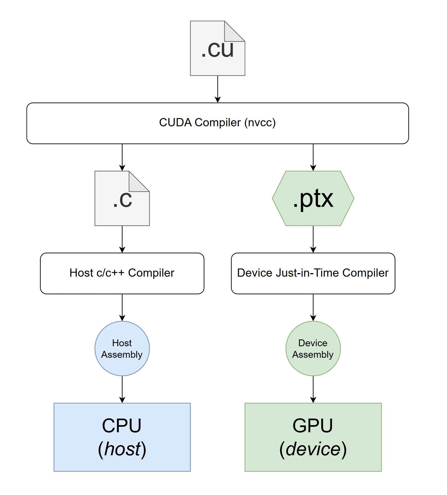

Der nvcc-Compiler ist mehr als nur ein Compiler – er ist ein **Compiler-Treiber**, der:
1. Den Quellcode analysiert und aufteilt
2. Verschiedene Compiler für verschiedene Teile aufruft
3. Alles zusammenfügt

Das ermöglicht es auch, Host- und Device-Code in derselben Datei zu schreiben, was die Entwicklung sehr bequem macht.

## Mehrdimensionale Grids und Daten

Bisher haben wir nur 1D-Grids betrachtet (eine Reihe von Blöcken, eine Reihe von Threads). Aber viele Probleme sind von Natur aus mehrdimensional.

```
1D-Problem:          Vektor        [x₀, x₁, x₂, x₃, ..., xₙ]

2D-Problem:          Bild/Matrix   ┌───┬───┬───┬───┐
                                   │   │   │   │   │
                                   ├───┼───┼───┼───┤
                                   │   │   │   │   │
                                   └───┴───┴───┴───┘

3D-Problem:          Volumen       Ein Würfel aus Datenpunkten
                     (z.B. CT-Scan, Simulation)
```

- Bildverarbeitung (2D grids und Blöcke) Graustufen, Blur, Edge Detection, Filter 
- Matrix Operatonen (2D grids und Blöcke) Matrixmultiplikation, Transposition, LU-Zerlegung
- 3D Simulationen (3D grids und Blöcke) Fluid Dynamics, CT/MRI, Wetter-Simulation
- Machine learning (2D und 3D grids und Blöcke) Convolution, Pooling, Batch Normalization 

CUDA unterstützt bis zu **3 Dimensionen** für Grids und Blöcke, um solche Probleme natürlich abzubilden.

Grids und Blöcke sind tatsächlich **3-dimensional**:
```
                            GRID
              ┌──────────────────────────────────┐
             ╱│                                 ╱│
            ╱ │                                ╱ │
           ╱  │                               ╱  │
          ╱   │                              ╱   │
         ┌──────────────────────────────────┐    │
         │    │                             │    │ gridDim.z
         │    │                             │    │
         │    │     ┌─────┐ ┌─────┐         │    │
         │    │     │Block│ │Block│ ...     │    │  
         │    │     └─────┘ └─────┘         │    │
         │    │     ┌─────┐ ┌─────┐         │    │
         │    └ ─ ─ │Block│ │Block│ ─ ─ ─ ─ │ ─ ─┘
         │   ╱      └─────┘ └─────┘         │   ╱
         │  ╱                               │  ╱ gridDim.y
         │ ╱                                │ ╱
         │╱         gridDim.x               │╱
         └──────────────────────────────────┘
```
**Für Blöcke:**
| Variable | Beschreibung |
|----------|--------------|
| `blockDim.x` | Threads in X-Richtung |
| `blockDim.y` | Threads in Y-Richtung |
| `blockDim.z` | Threads in Z-Richtung |

**Für Grids:**
| Variable | Beschreibung |
|----------|--------------|
| `gridDim.x` | Blöcke in X-Richtung |
| `gridDim.y` | Blöcke in Y-Richtung |
| `gridDim.z` | Blöcke in Z-Richtung |

**Für Thread-Identifikation:**
| Variable | Beschreibung |
|----------|--------------|
| `threadIdx.x`, `.y`, `.z` | Position des Threads im Block |
| `blockIdx.x`, `.y`, `.z` | Position des Blocks im Grid |

Um mehrdimensionale Konfigurationen anzugeben, verwendet man `dim3`.

```c
dim3 dimGrid(32, 32, 1);    // 32 × 32 × 1 = 1.024 Blöcke im Grid
dim3 dimBlock(128, 8, 1);   // 128 × 8 × 1 = 1.024 Threads pro Block

some_2d_kernel<<<dimGrid, dimBlock>>>(...);
```
Für 1D-Kernel an man auch den Shortcut via `unsigend int` wählen.

```cpp
vec_add_kernel<<<numBlocks, numThreadsPerBlock>>>
```

Hardware-Limits sind Geräteabhängig, aber bei moderner Hardware ist man in diesem Bereich unterwegs:

| Dimension | Maximum |
|-----------|---------|
| `gridDim.x` | 2³¹ - 1 (ca. 2 Milliarden) |
| `gridDim.y` | 65.535 |
| `gridDim.z` | 65.535 |
| **Threads pro Block** | **1.024** (total, nicht pro Dimension!) |

```cpp
dim3 dimGrid(32, 32, 1);  // 32 x 32 = 1024 blocks in the grid
dim3 dimBlock(128, 8, 1); // 128 x 8 = 1024 threads per block

some_2d_kernel<<<dimGrid, dimBlock>>>(...);
```

### Beispiel eines mehrdimensionalen Grids

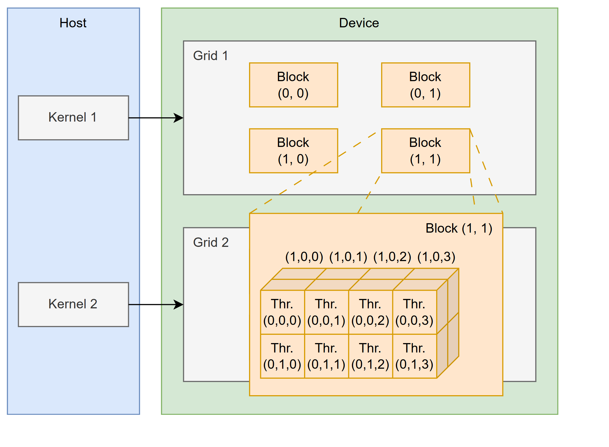

```cpp
dim3 gridDim(2, 2);     // 2×2 Blöcke
dim3 blockDim(4, 2, 2); // 4×2×2 = 16 Threads pro Block
kernel<<<gridDim, blockDim>>>(...);
```

### Beispiel – 2D Grid für Bildverarbeitung

```cpp
// Threads pro Block: 32 × 32 = 1024 (Maximum)
dim3 numThreadsPerBlock(32, 32);

// Anzahl Blöcke: Aufrunden für beide Dimensionen
dim3 numBlocks(
    ceil(width / (float)numThreadsPerBlock.x),   // Blöcke in X
    ceil(height / (float)numThreadsPerBlock.y)   // Blöcke in Y
);

// Kernel starten
grayscale<<<numBlocks, numThreadsPerBlock>>>( ...);
```

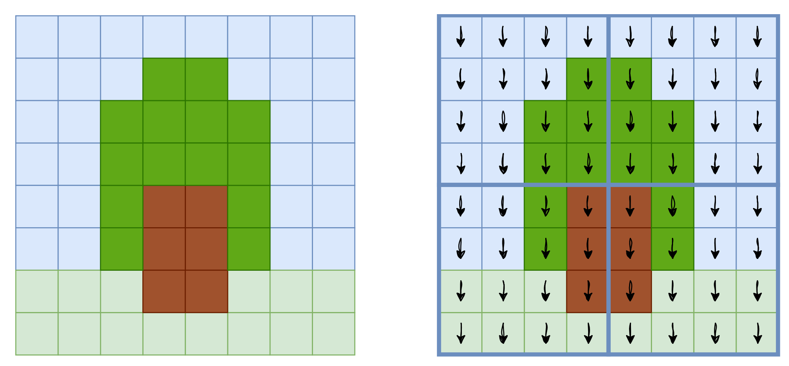


**Mehrdimensionale Thread-Indizierung**

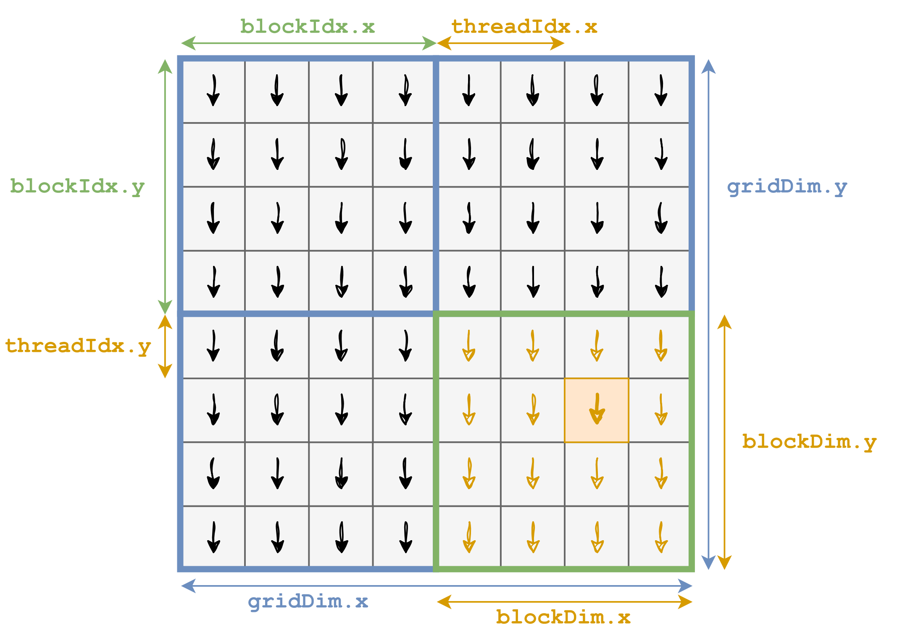

Globale Indexierung
```cpp
// Globale Spalte (X-Koordinate)
unsigned int col = blockIdx.x * blockDim.x + threadIdx.x;

// Globale Zeile (Y-Koordinate)
unsigned int row = blockIdx.y * blockDim.y + threadIdx.y;
```

**2D-Kernelcode für Graustufen-Umwandlug**

```cpp
__global__
void grayscale_kernel(unsigned char* red, 
                      unsigned char* green, 
                      unsigned char* blue,
                      unsigned char* gray,
                      unsigned int width, 
                      unsigned int height) {
    
    // Schritt 1: Globale 2D-Position berechnen
    unsigned int col = blockIdx.x * blockDim.x + threadIdx.x;
    unsigned int row = blockIdx.y * blockDim.y + threadIdx.y;
    
    // Schritt 2: Boundary Check (für beide Dimensionen)
    if (row < height && col < width) {
        
        // Schritt 3: 2D-Koordinaten → 1D-Index (Linearisierung)
        unsigned int i = row * width + col;
        
        // Schritt 4: Graustufen-Berechnung
        gray[i] = red[i] * 3/10 + green[i] * 6/10 + blue[i] * 1/10;
    }
}
```

Ein komplettes Beispiel samt Host-Code gibt's [hier](grayscale_kernel.cu).

### Beispiel Matrixmultiplikation
Sehr analog dazu kann man auch eine Matrix-Multiplikation implementieren.

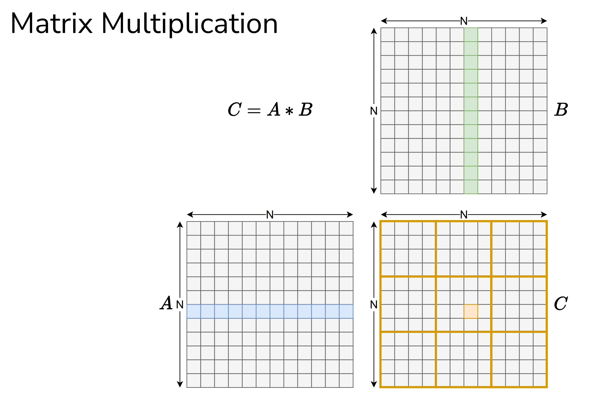

Ein gängiges Pattern für 2D-Kernels ist

1. Indizes berechnen
2. Boundary Check
3. Linearisieren
4. Arbeit machen

```cpp
__global__
void mat_mul_kernel(float* A, float* B, float* C, unsigned int N) {
  unsigned int row = blockIdx.y * blockDim.y + threadIdx.y;
  unsigned int col = blockIdx.x * blockDim.x + threadIdx.x;

  if (row < N && col < N) {
    float value = 0.0f;
    for (unsigned int k = 0; k < N; k++) {
      value += A[row * N + k] * B[k * N + col];
    }
    C[row * N + col] = value;
  }
}
```

Diese naive Version ist korrekt, aber ineffizient. 