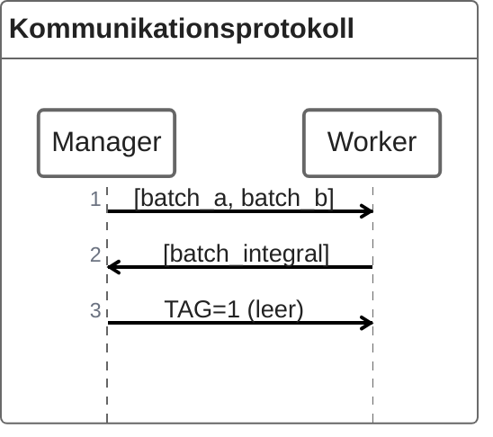

# MPI

Bei MPI handelt es sich um eine Technologie für verteiltes Rechnen mit verteiltem Speicher.
MPI steht für **M**essage **P**assing **I**nterface.

> Im Gegensatz zu Shared-Memory-Systemen (wie bei OpenMP), wo alle Threads auf denselben Speicher zugreifen, hat bei MPI jeder Prozess seinen eigenen Speicher. Die Prozesse kommunizieren durch das explizite Senden und Empfangen von Nachrichten.


## Einleitung

Mit MPI kann man Anwendungen realisieren, die hoch skalierbar sind. MPI ist Hardware- und Plattformunabhängig. Es handelt sich dabei um eine standardisierte API / Spezifikation mit verschiedenen Implementierungen (MPICH, OpenMPI, MS-MPI, …). Bei MPI hat man explizite Kontrolle über die Kommunikation, das zwingt einen zum paralleln Denken. Aufgrund der hohen Verbereitung in HPC wird es oft als "Assembler der Parallelverarbeitung" bezeichnet. MPI kennt die darunterliegende Hardware und optimiert die Kommunikation entsprechend.     

**Shared Memory**
- Begrenzt auf die Anzahl der Kerne/Sockel (8–16 bei Consumer-CPUs, bis 256+ bei HPC-Systemen)
- Probleme: Cache-Kohärenz-Overhead, Speicherbandbreiten-Engpass
- Einfach zu programmieren, aber begrenzt skalierbar

**Distributed-Memory**
- Skaliert auf tausende/millionen Knoten
- Jeder Knoten hat eigenen Speicher
- Explizite Kommunikation erforderlich
- Schwieriger zu programmieren, aber hoch skalierbar

### Das MPI Programmiermodell


- **Node** (Knoten): Eine physische Maschine
- **Prozess**: Eine laufende Programminstanz auf einem Node
- **SPMD**-Modell: Alle Prozesse führen dasselbe Programm auf lokalen Daten aus (Single Program Multiple Data)
- Prozesse kommunizieren über **Nachrichten**
- Ein Knoten kann mehrere MPI-Prozesse ausführen

> Ein Knoten kann mehrere MPI-Prozesse ausführen. Auf Shared-Memory-Knoten nutzt MPI intern Shared-Memory für schnelle Kommunikation. Hybride Ansätze (MPI + OpenMP) nutzen Threads innerhalb eines Knotens und MPI zwischen Knoten.

### Kommunikation in MPI

Die Kommunikation funktioniert über Puffer.
- Man schreibt Nachrichten in Puffer über MPI-Funktionen
- MPI kümmert sich um den Transport
- Der Empfänger liest die Nachricht aus seinem Puffer

Man kann sich das wie Briefkästen vorstellen – man legt einen Brief rein (Send), MPI liefert ihn aus, und der Empfänger holt ihn ab (Receive).


### Kompilieren und Ausführen von MPI-Programmen

Zum Kompilieren benötigt man `mpicc` bzw. `mpicxx`. Dabei handelt es sich nicht um eigene Compiler, sondern Wrapper-Skripte. Die rufen im Hintergrund deinen normalen Compiler auf (gcc, clang, etc.) und fügen automatisch hinzu:
- Include-Pfade für die MPI-Header (mpi.h)
- Linker-Flags für die MPI-Bibliothek 

Man könnte also auch manuell kompilieren – ist aber umständlich und fehleranfällig.

Zum Ausführen muss eine MPI-Implementierung installiert sein. 
Diese liefert die Bibliothek `libmpi` mit den eigenlichen MPI-Funktionen und den Launcher `mpiexec`, der die Prozesse startet und die Kommunikation verwaltet.
Mit `mpiexec` kann man MPI-Programme ausführen: 
- Auf einem Rechner: mehrere Prozesse lokal `mpiexec -n 4 my_mpi_program`
- Im Cluster via Hostfile (dieses File listet die verfügbaren Hosts)
- Im Cluster via Job-Scheduler
- Manuell: Hosts direkt auf der Kommandozeile angeben

Wenn man einfach ./my_program ausführt, startet nur ein Prozess. MPI braucht aber mehrere Prozesse, die miteinander kommunizieren können.
`mpiexec -n 4 ./my_program` macht Folgendes:`
1. Startet 4 Instanzen deines Programms
2. Richtet die Kommunikationskanäle zwischen ihnen ein
3. Weist jedem Prozess seinen Rang zu

### Hello World

```cpp
#include <iostream>
#include <mpi.h>

int main(int argc, char** argv) {
    MPI_Init(&argc, &argv);           // MPI initialisieren

    int comm_size, rank;
    MPI_Comm_size(MPI_COMM_WORLD, &comm_size);  // Anzahl Prozesse
    MPI_Comm_rank(MPI_COMM_WORLD, &rank);       // Eigene Prozess-ID (Rang)

    std::cout << "Hello cruel world from process " << rank << " of " << comm_size << "\n";

    MPI_Finalize();                   // MPI beenden
}
```

**Ausgabe (Reihenfolge kann variieren):**
```
Hello cruel world from process 0 of 4
Hello cruel world from process 3 of 4
Hello cruel world from process 2 of 4
Hello cruel world from process 1 of 4
```

Jeder Prozess bekommt einen eindeutigen Rang (0 bis n-1). Die Ausgabe ist nicht geordnet, weil alle Prozesse parallel laufen und unabhängig auf die Konsole schreiben.

### Hello World mit Nachrichten

```cpp
// ...
if (rank != 0) {
    std::string message = std::format("Seas from process {} of {}", rank, comm_size);
    MPI_Send(message.c_str(), message.length() + 1, MPI_CHAR, 0, 0, MPI_COMM_WORLD);
} else {
    std::cout << "Received the following messages:\n";
    const int MAX_LENGTH = 100;
    char buffer[MAX_LENGTH];
    for (int i = 1; i < comm_size; i++) {
        MPI_Recv(buffer, MAX_LENGTH, MPI_CHAR, i, 0, MPI_COMM_WORLD,  MPI_STATUS_IGNORE);
        std::cout << "- " << buffer << std::endl;
    }
}
// ...
```

```
Received the following messages:
- Seas from process 1 of 4
- Seas from process 2 of 4
- Seas from process 3 of 4
```

Hier wird explizit koordiniert: Prozess 0 ist der "Chef" und sammelt Nachrichten von allen anderen ein. Die Reihenfolge ist jetzt garantiert, weil Prozess 0 gezielt nacheinander von Prozess 1, 2, 3, … empfängt.

## Grundlegende MPI Funktionen

|**Funktion**| **Beschreibung** |
| --- | --- |
| `MPI_Init` | Initialisiert die MPI-Umgebung |
| `MPI_Comm_size` | Liefert die Anzahl der Prozesse |
| `MPI_Comm_rank` | Liefert den Rang (ID) des aktuellen Prozesses |
| `MPI_Send` | Sendet eine Nachricht an einen anderen Prozess |
| `MPI_Recv` | Empfängt eine Nachricht von einem anderen Prozess |
| `MPI_Finalize` | Beendet die MPI-Umgebung |

Jedes MPI-Programm **muss** `MPI_Init` **vor** allen anderen MPI-Funktionen und am Ende `MPI_Finalize ` aufrufen. MPI-Funktionen beginnen mit dem Präfix `MPI_` und MPI-Konstanten werden immer groß geschrieben. (z.B. `MPI_COMM_WORLD`, `MPI_CHAR`)

### Punkt-zu-Punkt Nachrichten versenden mit `MPI_Send`

```cpp
int MPI_Send(
    void* buf,           // Pointer auf die zu sendenden Daten
    int count,           // Anzahl der Elemente (nicht Bytes!)
    MPI_Datatype datatype, // Datentyp (z.B. MPI_INT, MPI_CHAR, MPI_DOUBLE)
    int dest,            // Rang des Zielprozesses
    int tag,             // Nachrichten-Tag zur Identifikation
    MPI_Comm comm        // Kommunikator (z.B. MPI_COMM_WORLD)
);
```

Die Parameter lassen sich in zwei Gruppen einteilen:
1. Nachrichtendaten:
 - `buf` - Wo liegen die Daten?
 - `count` - Wie viele Elemente?
 - `datatype` - Welcher Typ?
2. Nachrichten-"Umschlag" (Envelope):
 - `dest` - An wen?
 - `tag` - Welche Art von Nachricht? (zur Unterscheidung verschiedener Nachrichten)
 - `comm` - In welchem Kommunikator?

### Punkt-zu-Punkt Nachrichten empfangen mit `MPI_Recv`

```cpp
int MPI_Recv(
    void* buf,           // Pointer auf den Empfangspuffer (muss groß genug sein!)
    int count,           // maximale Anzahl der zu empfangenden Elemente
    MPI_Datatype datatype, // Datentyp
    int source,          // Rang des Senders (oder MPI_ANY_SOURCE)
    int tag,             // Nachrichten-Tag (oder MPI_ANY_TAG)
    MPI_Comm comm,       // Kommunikator
    MPI_Status* status   // Informationen über empfangene Nachricht
);
```

1. Nachrichtendaten:
- `buf` - Wohin sollen die Daten geschrieben werden?
- `count` - Wie viele Elemente passen maximal in den Puffer?
- `datatype` - Welcher Typ?
2. Nachrichten-"Umschlag":
- `source` - Von wem? (`MPI_ANY_SOURCE` = von irgendwem)
- `tag` - Welcher Tag? (`MPI_ANY_TAG` = beliebiger Tag)
- `comm` - In welchem Kommunikator?
3. Status:
- `status` - Enthält Infos über die tatsächlich empfangene Nachricht (Absender, Tag, Fehlercode)
- Kann `MPI_STATUS_IGNORE` sein, wenn man diese Infos nicht braucht

Der Empfangsbuffer muss **vorher** allokiert werden und groß genug sein. `count` ist hier das Maximum – die tatsächliche Nachricht kann kleiner sein.

### Verhalten von `MPI_Send` und `MPI_Recv`

**Blockierende Semantik**
- `MPI_Send` und `MPI_Recv` sind **blockierende** Operationen
- `MPI_Send` blockiert möglicherweise, bis der Sendepuffer wiederverwendet werden kann
- `MPI_Recv` blockiert, **bis** die Nachricht vollständig empfangen wurde

"Blockierend" bedeutet, dass das Programm an dieser Stelle wartet. Bei `MPI_Recv` ist das klar – man wartet auf die Nachricht. Bei `MPI_Send` ist es komplizierter: MPI garantiert nur, dass man den Sendepuffer danach wieder nutzen darf. Ob die Nachricht schon angekommen ist, ist nicht garantiert. Wenn zwei Prozesse gleichzeitig aufeinander warten (beide rufen zuerst `MPI_Recv` auf), blockieren beide ewig → **Deadlock**

**Reihenfolge-Garantien**
- Nachrichten zwischen **demselben** Sender-Empfänger-Paar werden **nicht überholt** (FIFO)
- Nachrichten von **verschiedenen** Sendern können in beliebiger Reihenfolge ankommen

**Nachrichten-Matching (Zuordnung)**
- Sender und Empfänger im **selben Kommunikator**
- **Tags** müssen passen (oder `MPI_ANY_TAG` beim Empfänger)
- **Datentypen** müssen übereinstimmen

### Kommunikatoren

Ein **Kommunikator** definiert eine Gruppe von Prozessen, die miteinander kommunizieren können.


`MPI_COMM_WORLD` ist der Standard-Kommunikator und enthält alle Prozesse, man kann aber auch eigene Kommunikatoren erstellen. Prozesse können nur innerhalb desselben Kommunikators kommunizieren, ein Prozess kann aber zu mehreren Kommunikatoren gehören. Die Ränge können in verschiedenen Kommunikatoren unterschiedlich sein. 

## Beispiel 1 Good ol' Trapezregel

Remember: Die Trapezregel ist ein numerisches Verfahren zur Approximation von Integralen. Statt das Integral analytisch zu lösen, unterteilen wir die Fläche unter der Kurve in viele kleine Trapeze und summieren deren Flächen.
Formel:
```math
\int_{a}^{b} f(x) \ dx \approx  h \left( \frac{f(a) + f(b)}{2} + \sum_{i=1}^{n-1} f(a+i \cdot h) \right)
```

Dabei sind:
- $a$ und $b$ die Integrationsgrenzen
- $n$ - die Anzahl der Trapeze (je mehr, desto genauer)
- $h = \frac{b-a}{n}$ - die Breite jedes Trapezes

Sequentielle Implementierung:

```cpp
double trap(double a, double b, int n, double h) {
  double integral = (f(a) + f(b)) / 2.0;
  for (int i = 1; i <= n - 1; i++) {
    double x_i = a + i * h;
    integral += f(x_i);
  }
  return h * integral;
}
```

### Zwei Parallelisierungsstrategien

#### Statische Verteilung

- Jeder Prozess bekommt von Anfang an einen festen Bereich zugeteilt
- Der Prozess weiß durch seinen Rang, welchen Teil er berechnen soll
- Einfach zu implementieren
- Problem: Ungleichmäßige Last, wenn manche Bereiche aufwändiger sind

#### Dynamische (selbst-balancierende) Verteilung
- Ein Manager-Prozess verteilt Arbeitspakete an Worker
- Worker fordern neue Arbeit an, wenn sie fertig sind
- Komplexer zu implementieren
- Vorteil: Lastausgleich

#### Lösung 1 Statische Verteilung

##### Grundstruktur:

```cpp
MPI_Init(&argc, &argv);

int rank, comm_size;
MPI_Comm_rank(MPI_COMM_WORLD, &rank);
MPI_Comm_size(MPI_COMM_WORLD, &comm_size);

// Globale Parameter
double a = 0.0, b = 1.0;    // Integriere von 0 bis 1
int n = 1000;                // 1000 Trapeze insgesamt
double h = (b - a) / n;      // Breite eines Trapezes: 0.001

// Lokale Parameter für diesen Prozess
int local_n = n / comm_size;                    // Trapeze pro Prozess
double local_a = a + rank * local_n * h;        // Lokaler Startpunkt
double local_b = local_a + local_n * h;         // Lokaler Endpunkt
double local_integral = trap(local_a, local_b, local_n, h);

// Hier: Ergebnisse zusammenführen

MPI_Finalize();
```

##### Beispielhafte Aufteilung mit 4 Prozessen und 1000 Trapezen:

| Prozess (Rang) | `local_n` | `local_a` | `local_b` | Bereich |
| --- | -- | --- | --- | --- |
| 0 | 250 | 0.0 | 0.25| [0.0, 0.25] | 
| 1 | 250 | 0.25 | 0.5| [0.25, 0.5] | 
| 2 | 250 | 0.5 | 0.75| [0.5, 0.75] | 
| 3 | 250 | 0.75 | 1.0| [0.75, 1.0] |

Jeder Prozess berechnet `local_n` = 1000/4 = 250 Trapeze. Der Rang bestimmt, welchen Abschnitt der Prozess bearbeitet. Wenn `n` nicht durch `comm_size` teilbar ist, gehen Trapeze "verloren"! In der Praxis muss man das abfangen (z.B. letzter Prozess bekommt den Rest).

##### Ergebnisse zusammenführen

```cpp
double local_integral = trap(local_a, local_b, local_n, h);

if (rank != 0) {
    // Alle Worker: Senden ihr Teilergebnis an Prozess 0
    MPI_Send(&local_integral, 1, MPI_DOUBLE, 0, 0, MPI_COMM_WORLD);

} else /* rank == 0 */ {
    // Manager (Prozess 0): Sammelt alle Ergebnisse ein
    double total_integral = local_integral;  // Eigenes Ergebnis zuerst

    for (int source = 1; source < comm_size; source++) {
        double temp_integral;
        MPI_Recv(&temp_integral, 1, MPI_DOUBLE, source, 0, 
                 MPI_COMM_WORLD, MPI_STATUS_IGNORE);
        total_integral += temp_integral;
    }

    std::cout << "Approx. integral: " << total_integral << std::endl;
}
```

Prozess 0 empfängt der Reihe nach von Prozess 1, 2, 3, ... Das ist sequentiell und nicht optimal! Wenn Prozess 3 als erstes fertig wäre, müsste er trotzdem warten, bis Prozess 0 die Nachrichten von 1 und 2 verarbeitet hat.

Verbesserung: Mit `MPI_ANY_SOURCE` könnte Prozess 0 Nachrichten in beliebiger Reihenfolge empfangen. Noch besser: `MPI_Reduce` (kommst später).

#### Lösung 2 Dynamische Verteilung

Bei der dynamischen Verteilung gibt es eine klare Manager-Worker-Architektur.

##### Grundstruktur

```cpp
MPI_Init(&argc, &argv);

int rank, comm_size;
MPI_Comm_rank(MPI_COMM_WORLD, &rank);
MPI_Comm_size(MPI_COMM_WORLD, &comm_size);

double a = 0.0, b = 1.0;
int n = 1000;
double h = (b - a) / n;

int batch_size = 200;  // Jedes Arbeitspaket enthält 200 Trapeze

if (rank == 0) {
    // MANAGER: Verteilt Arbeit und sammelt Ergebnisse
} else {
    // WORKER: Empfängt Arbeit, berechnet, sendet Ergebnis zurück
}

MPI_Finalize();
```


Der Manager schickt einen Bereich [batch_a, batch_b] zum Berechnen. Der Worker berechnet das Teilintegral und schickt es zurück. Wenn keine Arbeit mehr da ist, schickt der Manager ein Signal mit TAG=1 (leere Nachricht), das dem Worker sagt: "Du bist fertig, stfu and gtfo"

##### Manager 

Der Manager hat drei Aufgaben:
1. Initiale Verteilung
    - Am Anfang bekommen alle Worker (Prozesse 1 bis n-1) sofort einen Arbeitsauftrag
    - So arbeiten alle parallel von Beginn an
2. Hauptschleife (solange Ergebnisse fehlen)
    - Warte auf ein Ergebnis von irgendeinem Worker
    - Addiere das Ergebnis zur Gesamtsumme
    - Falls noch Arbeit übrig: Schicke dem Worker neuen Auftrag
    - Falls keine Arbeit mehr: Schicke Terminierungssignal
3. Ausgabe
    - Wenn alle Batches empfangen wurden: Ergebnis ausgeben

###### Initiale Verteilung

```cpp
int num_batches = n / batch_size;      // 1000 / 200 = 5 Batches
int batches_sent = 0;
int batches_received = 0;

// Initiale Verteilung an alle verfügbaren Worker
for (int i = 1; i < std::min(comm_size, num_batches + 1); i++) {
    // Berechne den Bereich für diesen Batch
    double batch_a = a + (batches_sent * batch_size) * h;
    double batch_b = batch_a + batch_size * h;

    // Sende als Array mit 2 Elementen: [Startpunkt, Endpunkt]
    double range[2] = { batch_a, batch_b };
    MPI_Send(range, 2, MPI_DOUBLE, i, 0, MPI_COMM_WORLD);

    batches_sent++;
}
```
Beispiel mit 4 Prozessen und 5 Batches:

| Batch | `batch_a` | `batch_b` | Gesendet an |
| --- | --- | --- | --- |
| 0 | 0.0 | 0.2 | Worker 1 |
| 0 | 0.2 | 0.4 | Worker 2 |
| 0 | 0.4 | 0.6 | Worker 3 |
| 0 | 0.6 | 0.8 | (noch nicht) |
| 0 | 0.8 | 1.0 | (noch nicht) |

Am Anfang werden nur 3 Batches verteilt (an Worker 1, 2, 3). Die restlichen 2 Batches werden später verteilt, wenn Worker fertig werden. Das `std::min` verhindert, dass wir mehr Batches verschicken als Worker vorhanden sind.

###### Empfangen und neue Arbeit verteilen

```cpp
double total_integral = 0.0;

while (batches_received < num_batches) {
    // Warte auf Ergebnis von IRGENDEINEM Worker
    double batch_integral;
    MPI_Status status;
    MPI_Recv(&batch_integral, 1, MPI_DOUBLE, MPI_ANY_SOURCE, 0, 
             MPI_COMM_WORLD, &status);

    // Ergebnis verarbeiten
    total_integral += batch_integral;
    batches_received++;

    // Entscheide: Mehr Arbeit oder Terminierung?
    if (batches_sent < num_batches) {
        // Es gibt noch Arbeit → Neuen Batch an diesen Worker senden
        double batch_a = a + (batches_sent * batch_size) * h;
        double batch_b = batch_a + batch_size * h;
        double range[2] = { batch_a, batch_b };

        // status.MPI_SOURCE = Rang des Workers, der gerade geantwortet hat
        MPI_Send(range, 2, MPI_DOUBLE, status.MPI_SOURCE, 0, MPI_COMM_WORLD);
        batches_sent++;

    } else {
        // Keine Arbeit mehr → Terminierungssignal senden (TAG = 1)
        MPI_Send(nullptr, 0, MPI_DOUBLE, status.MPI_SOURCE, 1, MPI_COMM_WORLD);
    }
}
```

Ein paar wichtige Implementierungsdetails:

`MPI_ANY_SOURCE`

Der Manager wartet auf eine Nachricht von irgendeinem Worker. D.h. wer zuerst fertig ist, wird zuerst bedient → automatischer Lastausgleich (nice)

`status.MPI_SOURCE`

Nach dem `MPI_Recv` enthält `status.MPI_SOURCE` den Rang des Absenders. So weiß man, an wen man die nächste Aufgabe schicken soll.

Terminierungssignal
`MPI_Send(nullptr, 0, MPI_DOUBLE, ..., 1, ...)` sendet eine leere Nachricht. Der Tag = 1 signalisiert dem Worker: "Beende dich", Tag = 0 bedeutet: "Hier kommt Arbeit".

#### Worker

Der Worker ist einfacher strukturiert. 
Er besteht basically aus einer Endlosschleife.
1. Empfange Nachricht vom Manager
2. Prüfe den Tag:
    - Tag = 0 → Arbeitsauftrag, berechne und sende Ergebnis
    - Tag = 1 → Terminierungssignal, beende die Schleife
3. Wiederhole


```cpp
bool more_work = true;

do {
    // Empfange Nachricht vom Manager (Tag kann 0 oder 1 sein)
    double range[2];
    MPI_Status status;
    MPI_Recv(range, 2, MPI_DOUBLE, 0, MPI_ANY_TAG, MPI_COMM_WORLD, &status);

    if (status.MPI_TAG == 1) {
        // Terminierungssignal empfangen → Schleife beenden
        more_work = false;

    } else {
        // Arbeitsauftrag empfangen → Berechnen
        double batch_a = range[0];
        double batch_b = range[1];

        double batch_integral = trap(batch_a, batch_b, batch_size, h);

        // Ergebnis an Manager zurücksenden
        MPI_Send(&batch_integral, 1, MPI_DOUBLE, 0, 0, MPI_COMM_WORLD);
    }

} while (more_work);
```

Ein paar wichtige Implementierungsdetails:

`MPI_ANY_TAG`

Der Worker weiß nicht im Voraus, ob Arbeit oder Terminierung kommt, daher akzeptiert er beide Tags und prüft danach `status.MPI_TAG`.

Warum `range[2]` auch bei Terminierung?

Bei Terminierung sendet der Manager 0 Elemente. Der Puffer `range` wird nicht beschrieben, aber muss trotzdem existieren.


#### Beispiel Logausgaben

##### Manager
```
Manager sending batch 0 to worker 1 [0, 0.2]
Manager sending batch 1 to worker 2 [0.2, 0.4]
Manager sending batch 2 to worker 3 [0.4, 0.6]
Manager waiting to receive batch integral...
Manager received batch integral 0.197396 from worker 1
Manager sending batch 3 to worker 1 [0.6, 0.8]
Manager waiting to receive batch integral...
Manager received batch integral 0.134321 from worker 1
Manager sending batch 4 to worker 1 [0.8, 1]
Manager waiting to receive batch integral...
Manager received batch integral 0.183111 from worker 2
Manager sending termination to worker 2
Manager waiting to receive batch integral...
Manager received batch integral 0.110657 from worker 1
Manager sending termination to worker 1
Manager waiting to receive batch integral...
Manager received batch integral 0.159913 from worker 3
Manager sending termination to worker 3
```

##### Workers

```
Worker 3 waiting to receive batch range...
Worker 3 received batch range [0.4, 0.6]
Worker 3 sending batch integral 0.159913 for range [0.4, 0.6]
Worker 3 waiting to receive batch range...
Worker 3 received termination signal.
Worker 3 terminating.
Worker 2 waiting to receive batch range...
Worker 2 received batch range [0.2, 0.4]
Worker 2 sending batch integral 0.183111 for range [0.2, 0.4]
Worker 2 waiting to receive batch range...
Worker 2 received termination signal.
Worker 2 terminating.
Worker 1 waiting to receive batch range...
Worker 1 received batch range [0, 0.2]
Worker 1 sending batch integral 0.197396 for range [0, 0.2]
Worker 1 waiting to receive batch range...
Worker 1 received batch range [0.6, 0.8]
Worker 1 sending batch integral 0.134321 for range [0.6, 0.8]
Worker 1 waiting to receive batch range...
Worker 1 received batch range [0.8, 1]
Worker 1 sending batch integral 0.110657 for range [0.8, 1]
Worker 1 waiting to receive batch range...
Worker 1 received termination signal.
Worker 1 terminating.
```

##### Beobachtungen
**Lastausgleich**: Worker 1 hat 3 Batches bearbeitet, Worker 2 und 3 jeweils nur 1! Das liegt daran, dass Worker 1 (zufällig oder weil sein Bereich einfacher war) schneller fertig wurde und daher mehr Arbeit zugeteilt bekam.

**Vergleich zur statischen Verteilung**: Bei statischer Verteilung hätte jeder Worker gleich viele Trapeze bekommen, unabhängig davon, wie schnell er ist. Das kann ineffizient sein, wenn die Rechenzeit pro Trapez variiert (z.B. bei komplexen Funktionen).


## Kommunikationsperformance


