# MPI

Bei MPI handelt es sich um eine Technologie für verteiltes Rechnen mit verteiltem Speicher.
MPI steht für **M**essage **P**assing **I**nterface.

> Im Gegensatz zu Shared-Memory-Systemen (wie bei OpenMP), wo alle Threads auf denselben Speicher zugreifen, hat bei MPI jeder Prozess seinen eigenen Speicher. Die Prozesse kommunizieren durch das explizite Senden und Empfangen von Nachrichten.


## Einleitung

Mit MPI kann man Anwendungen realisieren, die hoch skalierbar sind. MPI ist Hardware- und Plattformunabhängig. Es handelt sich dabei um eine standardisierte API / Spezifikation mit verschiedenen Implementierungen (MPICH, OpenMPI, MS-MPI, …). Bei MPI hat man explizite Kontrolle über die Kommunikation, das zwingt einen zum paralleln Denken. Aufgrund der hohen Verbereitung in HPC wird es oft als "Assembler der Parallelverarbeitung" bezeichnet. MPI kennt die darunterliegende Hardware und optimiert die Kommunikation entsprechend.     

**Shared Memory**
- Begrenzt auf die Anzahl der Kerne/Sockel (8–16 bei Consumer-CPUs, bis 256+ bei HPC-Systemen)
- Probleme: Cache-Kohärenz-Overhead, Speicherbandbreiten-Engpass
- Einfach zu programmieren, aber begrenzt skalierbar

**Distributed-Memory**
- Skaliert auf tausende/millionen Knoten
- Jeder Knoten hat eigenen Speicher
- Explizite Kommunikation erforderlich
- Schwieriger zu programmieren, aber hoch skalierbar

### Das MPI Programmiermodell
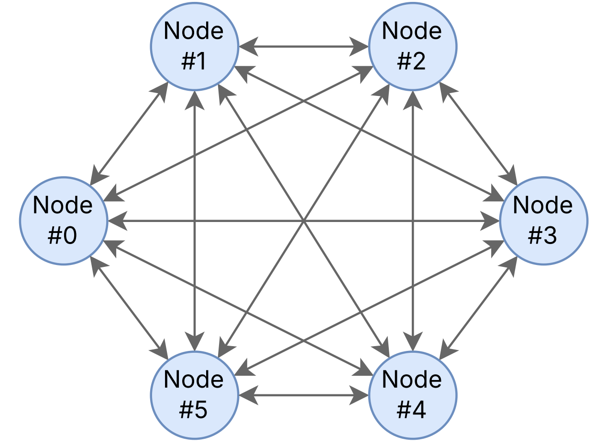

- **Node** (Knoten): Eine physische Maschine
- **Prozess**: Eine laufende Programminstanz auf einem Node
- **SPMD**-Modell: Alle Prozesse führen dasselbe Programm auf lokalen Daten aus (Single Program Multiple Data)
- Prozesse kommunizieren über **Nachrichten**
- Ein Knoten kann mehrere MPI-Prozesse ausführen

> Ein Knoten kann mehrere MPI-Prozesse ausführen. Auf Shared-Memory-Knoten nutzt MPI intern Shared-Memory für schnelle Kommunikation. Hybride Ansätze (MPI + OpenMP) nutzen Threads innerhalb eines Knotens und MPI zwischen Knoten.

### Kommunikation in MPI

Die Kommunikation funktioniert über Puffer.
- Man schreibt Nachrichten in Puffer über MPI-Funktionen
- MPI kümmert sich um den Transport
- Der Empfänger liest die Nachricht aus seinem Puffer

Man kann sich das wie Briefkästen vorstellen – man legt einen Brief rein (Send), MPI liefert ihn aus, und der Empfänger holt ihn ab (Receive).

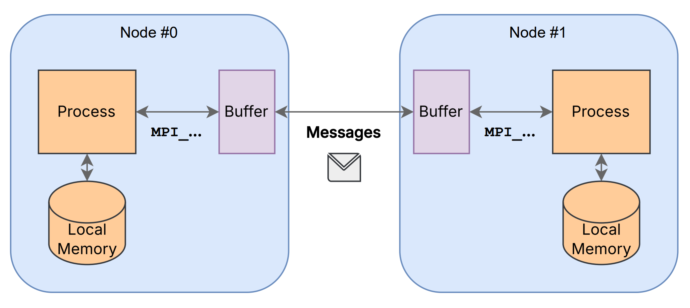

### Kompilieren und Ausführen von MPI-Programmen

Zum Kompilieren benötigt man `mpicc` bzw. `mpicxx`. Dabei handelt es sich nicht um eigene Compiler, sondern Wrapper-Skripte. Die rufen im Hintergrund deinen normalen Compiler auf (gcc, clang, etc.) und fügen automatisch hinzu:
- Include-Pfade für die MPI-Header (mpi.h)
- Linker-Flags für die MPI-Bibliothek 

Man könnte also auch manuell kompilieren – ist aber umständlich und fehleranfällig.

Zum Ausführen muss eine MPI-Implementierung installiert sein. 
Diese liefert die Bibliothek `libmpi` mit den eigenlichen MPI-Funktionen und den Launcher `mpiexec`, der die Prozesse startet und die Kommunikation verwaltet.
Mit `mpiexec` kann man MPI-Programme ausführen: 
- Auf einem Rechner: mehrere Prozesse lokal `mpiexec -n 4 my_mpi_program`
- Im Cluster via Hostfile (dieses File listet die verfügbaren Hosts)
- Im Cluster via Job-Scheduler
- Manuell: Hosts direkt auf der Kommandozeile angeben

Wenn man einfach ./my_program ausführt, startet nur ein Prozess. MPI braucht aber mehrere Prozesse, die miteinander kommunizieren können.
`mpiexec -n 4 ./my_program` macht Folgendes:`
1. Startet 4 Instanzen deines Programms
2. Richtet die Kommunikationskanäle zwischen ihnen ein
3. Weist jedem Prozess seinen Rang zu

### Hello World

```cpp
#include <iostream>
#include <mpi.h>

int main(int argc, char** argv) {
    MPI_Init(&argc, &argv);           // MPI initialisieren

    int comm_size, rank;
    MPI_Comm_size(MPI_COMM_WORLD, &comm_size);  // Anzahl Prozesse
    MPI_Comm_rank(MPI_COMM_WORLD, &rank);       // Eigene Prozess-ID (Rang)

    std::cout << "Hello cruel world from process " << rank << " of " << comm_size << "\n";

    MPI_Finalize();                   // MPI beenden
}
```

**Ausgabe (Reihenfolge kann variieren):**
```
Hello cruel world from process 0 of 4
Hello cruel world from process 3 of 4
Hello cruel world from process 2 of 4
Hello cruel world from process 1 of 4
```

Jeder Prozess bekommt einen eindeutigen Rang (0 bis n-1). Die Ausgabe ist nicht geordnet, weil alle Prozesse parallel laufen und unabhängig auf die Konsole schreiben.

### Hello World mit Nachrichten

```cpp
// ...
if (rank != 0) {
    std::string message = std::format("Seas from process {} of {}", rank, comm_size);
    MPI_Send(message.c_str(), message.length() + 1, MPI_CHAR, 0, 0, MPI_COMM_WORLD);
} else {
    std::cout << "Received the following messages:\n";
    const int MAX_LENGTH = 100;
    char buffer[MAX_LENGTH];
    for (int i = 1; i < comm_size; i++) {
        MPI_Recv(buffer, MAX_LENGTH, MPI_CHAR, i, 0, MPI_COMM_WORLD,  MPI_STATUS_IGNORE);
        std::cout << "- " << buffer << std::endl;
    }
}
// ...
```

```
Received the following messages:
- Seas from process 1 of 4
- Seas from process 2 of 4
- Seas from process 3 of 4
```

Hier wird explizit koordiniert: Prozess 0 ist der "Chef" und sammelt Nachrichten von allen anderen ein. Die Reihenfolge ist jetzt garantiert, weil Prozess 0 gezielt nacheinander von Prozess 1, 2, 3, … empfängt.

## Grundlegende MPI Funktionen

|**Funktion**| **Beschreibung** |
| --- | --- |
| `MPI_Init` | Initialisiert die MPI-Umgebung |
| `MPI_Comm_size` | Liefert die Anzahl der Prozesse |
| `MPI_Comm_rank` | Liefert den Rang (ID) des aktuellen Prozesses |
| `MPI_Send` | Sendet eine Nachricht an einen anderen Prozess |
| `MPI_Recv` | Empfängt eine Nachricht von einem anderen Prozess |
| `MPI_Finalize` | Beendet die MPI-Umgebung |

Jedes MPI-Programm **muss** `MPI_Init` **vor** allen anderen MPI-Funktionen und am Ende `MPI_Finalize ` aufrufen. MPI-Funktionen beginnen mit dem Präfix `MPI_` und MPI-Konstanten werden immer groß geschrieben. (z.B. `MPI_COMM_WORLD`, `MPI_CHAR`)

### Punkt-zu-Punkt Nachrichten versenden mit `MPI_Send`

```cpp
int MPI_Send(
    void* buf,           // Pointer auf die zu sendenden Daten
    int count,           // Anzahl der Elemente (nicht Bytes!)
    MPI_Datatype datatype, // Datentyp (z.B. MPI_INT, MPI_CHAR, MPI_DOUBLE)
    int dest,            // Rang des Zielprozesses
    int tag,             // Nachrichten-Tag zur Identifikation
    MPI_Comm comm        // Kommunikator (z.B. MPI_COMM_WORLD)
);
```

Die Parameter lassen sich in zwei Gruppen einteilen:
1. Nachrichtendaten:
 - `buf` - Wo liegen die Daten?
 - `count` - Wie viele Elemente?
 - `datatype` - Welcher Typ?
2. Nachrichten-"Umschlag" (Envelope):
 - `dest` - An wen?
 - `tag` - Welche Art von Nachricht? (zur Unterscheidung verschiedener Nachrichten)
 - `comm` - In welchem Kommunikator?

### Punkt-zu-Punkt Nachrichten empfangen mit `MPI_Recv`

```cpp
int MPI_Recv(
    void* buf,           // Pointer auf den Empfangspuffer (muss groß genug sein!)
    int count,           // maximale Anzahl der zu empfangenden Elemente
    MPI_Datatype datatype, // Datentyp
    int source,          // Rang des Senders (oder MPI_ANY_SOURCE)
    int tag,             // Nachrichten-Tag (oder MPI_ANY_TAG)
    MPI_Comm comm,       // Kommunikator
    MPI_Status* status   // Informationen über empfangene Nachricht
);
```

1. Nachrichtendaten:
- `buf` - Wohin sollen die Daten geschrieben werden?
- `count` - Wie viele Elemente passen maximal in den Puffer?
- `datatype` - Welcher Typ?
2. Nachrichten-"Umschlag":
- `source` - Von wem? (`MPI_ANY_SOURCE` = von irgendwem)
- `tag` - Welcher Tag? (`MPI_ANY_TAG` = beliebiger Tag)
- `comm` - In welchem Kommunikator?
3. Status:
- `status` - Enthält Infos über die tatsächlich empfangene Nachricht (Absender, Tag, Fehlercode)
- Kann `MPI_STATUS_IGNORE` sein, wenn man diese Infos nicht braucht

Der Empfangsbuffer muss **vorher** allokiert werden und groß genug sein. `count` ist hier das Maximum – die tatsächliche Nachricht kann kleiner sein.

### Verhalten von `MPI_Send` und `MPI_Recv`

**Blockierende Semantik**
- `MPI_Send` und `MPI_Recv` sind **blockierende** Operationen
- `MPI_Send` blockiert möglicherweise, bis der Sendepuffer wiederverwendet werden kann
- `MPI_Recv` blockiert, **bis** die Nachricht vollständig empfangen wurde

"Blockierend" bedeutet, dass das Programm an dieser Stelle wartet. Bei `MPI_Recv` ist das klar – man wartet auf die Nachricht. Bei `MPI_Send` ist es komplizierter: MPI garantiert nur, dass man den Sendepuffer danach wieder nutzen darf. Ob die Nachricht schon angekommen ist, ist nicht garantiert. Wenn zwei Prozesse gleichzeitig aufeinander warten (beide rufen zuerst `MPI_Recv` auf), blockieren beide ewig → **Deadlock**

**Reihenfolge-Garantien**
- Nachrichten zwischen **demselben** Sender-Empfänger-Paar werden **nicht überholt** (FIFO)
- Nachrichten von **verschiedenen** Sendern können in beliebiger Reihenfolge ankommen

**Nachrichten-Matching (Zuordnung)**
- Sender und Empfänger im **selben Kommunikator**
- **Tags** müssen passen (oder `MPI_ANY_TAG` beim Empfänger)
- **Datentypen** müssen übereinstimmen

### Kommunikatoren

Ein **Kommunikator** definiert eine Gruppe von Prozessen, die miteinander kommunizieren können.


`MPI_COMM_WORLD` ist der Standard-Kommunikator und enthält alle Prozesse, man kann aber auch eigene Kommunikatoren erstellen. Prozesse können nur innerhalb desselben Kommunikators kommunizieren, ein Prozess kann aber zu mehreren Kommunikatoren gehören. Die Ränge können in verschiedenen Kommunikatoren unterschiedlich sein. 

## Beispiel 1 Good ol' Trapezregel

Remember: Die Trapezregel ist ein numerisches Verfahren zur Approximation von Integralen. Statt das Integral analytisch zu lösen, unterteilen wir die Fläche unter der Kurve in viele kleine Trapeze und summieren deren Flächen.
Formel:
```math
\int_{a}^{b} f(x) \ dx \approx  h \left( \frac{f(a) + f(b)}{2} + \sum_{i=1}^{n-1} f(a+i \cdot h) \right)
```

Dabei sind:
- $a$ und $b$ die Integrationsgrenzen
- $n$ - die Anzahl der Trapeze (je mehr, desto genauer)
- $h = \frac{b-a}{n}$ - die Breite jedes Trapezes

Sequentielle Implementierung:

```cpp
double trap(double a, double b, int n, double h) {
  double integral = (f(a) + f(b)) / 2.0;
  for (int i = 1; i <= n - 1; i++) {
    double x_i = a + i * h;
    integral += f(x_i);
  }
  return h * integral;
}
```

### Zwei Parallelisierungsstrategien

#### Statische Verteilung

- Jeder Prozess bekommt von Anfang an einen festen Bereich zugeteilt
- Der Prozess weiß durch seinen Rang, welchen Teil er berechnen soll
- Einfach zu implementieren
- Problem: Ungleichmäßige Last, wenn manche Bereiche aufwändiger sind

#### Dynamische (selbst-balancierende) Verteilung
- Ein Manager-Prozess verteilt Arbeitspakete an Worker
- Worker fordern neue Arbeit an, wenn sie fertig sind
- Komplexer zu implementieren
- Vorteil: Lastausgleich

#### Lösung 1 Statische Verteilung

##### Grundstruktur:

```cpp
MPI_Init(&argc, &argv);

int rank, comm_size;
MPI_Comm_rank(MPI_COMM_WORLD, &rank);
MPI_Comm_size(MPI_COMM_WORLD, &comm_size);

// Globale Parameter
double a = 0.0, b = 1.0;    // Integriere von 0 bis 1
int n = 1000;                // 1000 Trapeze insgesamt
double h = (b - a) / n;      // Breite eines Trapezes: 0.001

// Lokale Parameter für diesen Prozess
int local_n = n / comm_size;                    // Trapeze pro Prozess
double local_a = a + rank * local_n * h;        // Lokaler Startpunkt
double local_b = local_a + local_n * h;         // Lokaler Endpunkt
double local_integral = trap(local_a, local_b, local_n, h);

// Hier: Ergebnisse zusammenführen

MPI_Finalize();
```

##### Beispielhafte Aufteilung mit 4 Prozessen und 1000 Trapezen:

| Prozess (Rang) | `local_n` | `local_a` | `local_b` | Bereich |
| --- | -- | --- | --- | --- |
| 0 | 250 | 0.0 | 0.25| [0.0, 0.25] | 
| 1 | 250 | 0.25 | 0.5| [0.25, 0.5] | 
| 2 | 250 | 0.5 | 0.75| [0.5, 0.75] | 
| 3 | 250 | 0.75 | 1.0| [0.75, 1.0] |

Jeder Prozess berechnet `local_n` = 1000/4 = 250 Trapeze. Der Rang bestimmt, welchen Abschnitt der Prozess bearbeitet. Wenn `n` nicht durch `comm_size` teilbar ist, gehen Trapeze "verloren"! In der Praxis muss man das abfangen (z.B. letzter Prozess bekommt den Rest).

##### Ergebnisse zusammenführen

```cpp
double local_integral = trap(local_a, local_b, local_n, h);

if (rank != 0) {
    // Alle Worker: Senden ihr Teilergebnis an Prozess 0
    MPI_Send(&local_integral, 1, MPI_DOUBLE, 0, 0, MPI_COMM_WORLD);

} else /* rank == 0 */ {
    // Manager (Prozess 0): Sammelt alle Ergebnisse ein
    double total_integral = local_integral;  // Eigenes Ergebnis zuerst

    for (int source = 1; source < comm_size; source++) {
        double temp_integral;
        MPI_Recv(&temp_integral, 1, MPI_DOUBLE, source, 0, 
                 MPI_COMM_WORLD, MPI_STATUS_IGNORE);
        total_integral += temp_integral;
    }

    std::cout << "Approx. integral: " << total_integral << std::endl;
}
```

Prozess 0 empfängt der Reihe nach von Prozess 1, 2, 3, ... Das ist sequentiell und nicht optimal! Wenn Prozess 3 als erstes fertig wäre, müsste er trotzdem warten, bis Prozess 0 die Nachrichten von 1 und 2 verarbeitet hat.

Verbesserung: Mit `MPI_ANY_SOURCE` könnte Prozess 0 Nachrichten in beliebiger Reihenfolge empfangen. Noch besser: `MPI_Reduce` (kommst später).

#### Lösung 2 Dynamische Verteilung

Bei der dynamischen Verteilung gibt es eine klare Manager-Worker-Architektur.

##### Grundstruktur

```cpp
MPI_Init(&argc, &argv);

int rank, comm_size;
MPI_Comm_rank(MPI_COMM_WORLD, &rank);
MPI_Comm_size(MPI_COMM_WORLD, &comm_size);

double a = 0.0, b = 1.0;
int n = 1000;
double h = (b - a) / n;

int batch_size = 200;  // Jedes Arbeitspaket enthält 200 Trapeze

if (rank == 0) {
    // MANAGER: Verteilt Arbeit und sammelt Ergebnisse
} else {
    // WORKER: Empfängt Arbeit, berechnet, sendet Ergebnis zurück
}

MPI_Finalize();
```

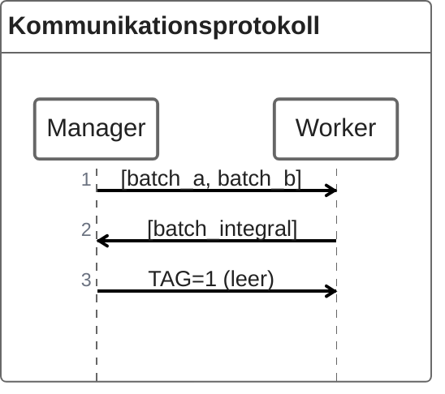
Der Manager schickt einen Bereich [batch_a, batch_b] zum Berechnen. Der Worker berechnet das Teilintegral und schickt es zurück. Wenn keine Arbeit mehr da ist, schickt der Manager ein Signal mit TAG=1 (leere Nachricht), das dem Worker sagt: "Du bist fertig, stfu and gtfo"

##### Manager 

Der Manager hat drei Aufgaben:
1. Initiale Verteilung
    - Am Anfang bekommen alle Worker (Prozesse 1 bis n-1) sofort einen Arbeitsauftrag
    - So arbeiten alle parallel von Beginn an
2. Hauptschleife (solange Ergebnisse fehlen)
    - Warte auf ein Ergebnis von irgendeinem Worker
    - Addiere das Ergebnis zur Gesamtsumme
    - Falls noch Arbeit übrig: Schicke dem Worker neuen Auftrag
    - Falls keine Arbeit mehr: Schicke Terminierungssignal
3. Ausgabe
    - Wenn alle Batches empfangen wurden: Ergebnis ausgeben

###### Initiale Verteilung

```cpp
int num_batches = n / batch_size;      // 1000 / 200 = 5 Batches
int batches_sent = 0;
int batches_received = 0;

// Initiale Verteilung an alle verfügbaren Worker
for (int i = 1; i < std::min(comm_size, num_batches + 1); i++) {
    // Berechne den Bereich für diesen Batch
    double batch_a = a + (batches_sent * batch_size) * h;
    double batch_b = batch_a + batch_size * h;

    // Sende als Array mit 2 Elementen: [Startpunkt, Endpunkt]
    double range[2] = { batch_a, batch_b };
    MPI_Send(range, 2, MPI_DOUBLE, i, 0, MPI_COMM_WORLD);

    batches_sent++;
}
```
Beispiel mit 4 Prozessen und 5 Batches:

| Batch | `batch_a` | `batch_b` | Gesendet an |
| --- | --- | --- | --- |
| 0 | 0.0 | 0.2 | Worker 1 |
| 0 | 0.2 | 0.4 | Worker 2 |
| 0 | 0.4 | 0.6 | Worker 3 |
| 0 | 0.6 | 0.8 | (noch nicht) |
| 0 | 0.8 | 1.0 | (noch nicht) |

Am Anfang werden nur 3 Batches verteilt (an Worker 1, 2, 3). Die restlichen 2 Batches werden später verteilt, wenn Worker fertig werden. Das `std::min` verhindert, dass wir mehr Batches verschicken als Worker vorhanden sind.

###### Empfangen und neue Arbeit verteilen

```cpp
double total_integral = 0.0;

while (batches_received < num_batches) {
    // Warte auf Ergebnis von IRGENDEINEM Worker
    double batch_integral;
    MPI_Status status;
    MPI_Recv(&batch_integral, 1, MPI_DOUBLE, MPI_ANY_SOURCE, 0, 
             MPI_COMM_WORLD, &status);

    // Ergebnis verarbeiten
    total_integral += batch_integral;
    batches_received++;

    // Entscheide: Mehr Arbeit oder Terminierung?
    if (batches_sent < num_batches) {
        // Es gibt noch Arbeit → Neuen Batch an diesen Worker senden
        double batch_a = a + (batches_sent * batch_size) * h;
        double batch_b = batch_a + batch_size * h;
        double range[2] = { batch_a, batch_b };

        // status.MPI_SOURCE = Rang des Workers, der gerade geantwortet hat
        MPI_Send(range, 2, MPI_DOUBLE, status.MPI_SOURCE, 0, MPI_COMM_WORLD);
        batches_sent++;

    } else {
        // Keine Arbeit mehr → Terminierungssignal senden (TAG = 1)
        MPI_Send(nullptr, 0, MPI_DOUBLE, status.MPI_SOURCE, 1, MPI_COMM_WORLD);
    }
}
```

Ein paar wichtige Implementierungsdetails:

`MPI_ANY_SOURCE`

Der Manager wartet auf eine Nachricht von irgendeinem Worker. D.h. wer zuerst fertig ist, wird zuerst bedient → automatischer Lastausgleich (nice)

`status.MPI_SOURCE`

Nach dem `MPI_Recv` enthält `status.MPI_SOURCE` den Rang des Absenders. So weiß man, an wen man die nächste Aufgabe schicken soll.

Terminierungssignal
`MPI_Send(nullptr, 0, MPI_DOUBLE, ..., 1, ...)` sendet eine leere Nachricht. Der Tag = 1 signalisiert dem Worker: "Beende dich", Tag = 0 bedeutet: "Hier kommt Arbeit".

#### Worker

Der Worker ist einfacher strukturiert. 
Er besteht basically aus einer Endlosschleife.
1. Empfange Nachricht vom Manager
2. Prüfe den Tag:
    - Tag = 0 → Arbeitsauftrag, berechne und sende Ergebnis
    - Tag = 1 → Terminierungssignal, beende die Schleife
3. Wiederhole


```cpp
bool more_work = true;

do {
    // Empfange Nachricht vom Manager (Tag kann 0 oder 1 sein)
    double range[2];
    MPI_Status status;
    MPI_Recv(range, 2, MPI_DOUBLE, 0, MPI_ANY_TAG, MPI_COMM_WORLD, &status);

    if (status.MPI_TAG == 1) {
        // Terminierungssignal empfangen → Schleife beenden
        more_work = false;

    } else {
        // Arbeitsauftrag empfangen → Berechnen
        double batch_a = range[0];
        double batch_b = range[1];

        double batch_integral = trap(batch_a, batch_b, batch_size, h);

        // Ergebnis an Manager zurücksenden
        MPI_Send(&batch_integral, 1, MPI_DOUBLE, 0, 0, MPI_COMM_WORLD);
    }

} while (more_work);
```

Ein paar wichtige Implementierungsdetails:

`MPI_ANY_TAG`

Der Worker weiß nicht im Voraus, ob Arbeit oder Terminierung kommt, daher akzeptiert er beide Tags und prüft danach `status.MPI_TAG`.

Warum `range[2]` auch bei Terminierung?

Bei Terminierung sendet der Manager 0 Elemente. Der Puffer `range` wird nicht beschrieben, aber muss trotzdem existieren.


#### Beispiel Logausgaben

##### Manager
```
Manager sending batch 0 to worker 1 [0, 0.2]
Manager sending batch 1 to worker 2 [0.2, 0.4]
Manager sending batch 2 to worker 3 [0.4, 0.6]
Manager waiting to receive batch integral...
Manager received batch integral 0.197396 from worker 1
Manager sending batch 3 to worker 1 [0.6, 0.8]
Manager waiting to receive batch integral...
Manager received batch integral 0.134321 from worker 1
Manager sending batch 4 to worker 1 [0.8, 1]
Manager waiting to receive batch integral...
Manager received batch integral 0.183111 from worker 2
Manager sending termination to worker 2
Manager waiting to receive batch integral...
Manager received batch integral 0.110657 from worker 1
Manager sending termination to worker 1
Manager waiting to receive batch integral...
Manager received batch integral 0.159913 from worker 3
Manager sending termination to worker 3
```

##### Workers

```
Worker 3 waiting to receive batch range...
Worker 3 received batch range [0.4, 0.6]
Worker 3 sending batch integral 0.159913 for range [0.4, 0.6]
Worker 3 waiting to receive batch range...
Worker 3 received termination signal.
Worker 3 terminating.
Worker 2 waiting to receive batch range...
Worker 2 received batch range [0.2, 0.4]
Worker 2 sending batch integral 0.183111 for range [0.2, 0.4]
Worker 2 waiting to receive batch range...
Worker 2 received termination signal.
Worker 2 terminating.
Worker 1 waiting to receive batch range...
Worker 1 received batch range [0, 0.2]
Worker 1 sending batch integral 0.197396 for range [0, 0.2]
Worker 1 waiting to receive batch range...
Worker 1 received batch range [0.6, 0.8]
Worker 1 sending batch integral 0.134321 for range [0.6, 0.8]
Worker 1 waiting to receive batch range...
Worker 1 received batch range [0.8, 1]
Worker 1 sending batch integral 0.110657 for range [0.8, 1]
Worker 1 waiting to receive batch range...
Worker 1 received termination signal.
Worker 1 terminating.
```

##### Beobachtungen
**Lastausgleich**: Worker 1 hat 3 Batches bearbeitet, Worker 2 und 3 jeweils nur 1! Das liegt daran, dass Worker 1 (zufällig oder weil sein Bereich einfacher war) schneller fertig wurde und daher mehr Arbeit zugeteilt bekam.

**Vergleich zur statischen Verteilung**: Bei statischer Verteilung hätte jeder Worker gleich viele Trapeze bekommen, unabhängig davon, wie schnell er ist. Das kann ineffizient sein, wenn die Rechenzeit pro Trapez variiert (z.B. bei komplexen Funktionen).


## Kommunikationsperformance

Die Zeit für eine Nachrichtenübertragung lässt sich modellieren als:

```math
Übertragungszeit = Latenz + \frac{Nachrichtengröße}{Bandbreite}
```

### Latenz

Ist die Startup-Zeit, unabhängig von der Nachrichtengröße (wie lange dauert es, überhaupt eine Verbindung aufzubauen?). Typische Werte sind 0.5 µs – 50 µs.

### Bandbreite
Ist die Datenübertragungsrate in Bytes pro Sekunde. Typische Werte sind 125 MB/s – 50 GB/s.

### Wer dominiert?

**Kleine Nachrichten:** Latenz dominiert
- Die Zeit zum "Aufbauen" der Übertragung ist viel größer als die eigentliche Datenübertragung
- Beispiel: 100 Bytes bei 50 µs Latenz → Latenz macht 99% der Zeit aus

**Große Nachrichten:** Bandbreite dominiert
- Die reine Datenübertragung braucht viel länger als der Startup
- Beispiel: 1 GB bei 50 µs Latenz → Latenz ist vernachlässigbar

### Kritische Nachrichtengröße

Ab welcher Größe wird Bandbreite wichtiger als Latenz?

```math
Kritische Größe = Latenz \cdot Bandbreite
```

Beispielrechnungen:

| Netzwerk | Bandbreite | Latenz | Kritische Größe |
| --- | --- | --- | --- | --- |
| Gigabit Ethernet | 125 MB/s (1 Gbps) | 50 µs | 6.25 kB |
| InfiniBand NDR| 50 GB/s (400 Gbps) | 0.5 µs | 25 kB |

Erklärung Gigabit Ethernet:
- 125 MB/s × 50 µs = 125 × 10⁶ B/s × 50 × 10⁻⁶ s = 6250 Bytes ≈ 6.25 kB
- Nachrichten unter 6.25 kB: Latenz ist der Flaschenhals
- Nachrichten über 6.25 kB: Bandbreite wird zum Flaschenhals

Erklärung InfiniBand:
- Viel schneller (400 Gbps!) und viel niedrigere Latenz (0.5 µs)
- Kritische Größe trotzdem bei 25 kB, weil beides proportional besser ist
- InfiniBand wird in HPC-Clustern verwendet

#### Maxls praktische Empfehlungen

1. Viele kleine Nachrichten vermeiden
 - Jede Nachricht kostet mindestens die Latenz
 - Besser: Daten sammeln und in einer großen Nachricht senden
2. Kommunikation und Berechnung überlappen
 - Während auf eine Nachricht gewartet wird, kann man etwas anderes berechnen
 - MPI bietet dafür nicht-blockierende Operationen (`MPI_Isend`, `MPI_Irecv`)
3. Kollektive Operationen nutzen
 - `MPI_Reduce` ist effizienter als viele einzelne `MPI_Send`/`MPI_Recv`
 - MPI kann intern Baumstrukturen nutzen

## Kollektive Kommunikation
Kollektive Kommunikation bedeutet Kommunikation, an der alle Prozesse eines Kommunikators beteiligt sind – im Gegensatz zur Punkt-zu-Punkt-Kommunikation (wie `MPI_Send`/`MPI_Recv`), wo nur zwei Prozesse miteinander reden.

Es gibt ein paar wichtige Eigenschaften:

| Eigenschaft | Beschreibung |
| --- | --- |
| Alle Prozesse beteiligt | Jeder Prozess im Kommunikator muss die gleiche kollektive Funktion aufrufen |
| Synchronisation | Alle müssen teilnehmen – wenn einer fehlt, blockieren alle anderen |
| Blockierend | Die Standardvarianten warten, bis die Operation abgeschlossen ist | 
| Keine Tags | Anders als bei `MPI_Send`/`MPI_Recv` gibt es keine Message-Tags | 
| MPI optimiert intern | MPI wählt automatisch effiziente Algorithmen basierend auf der Hardware |

Im wesentlichen punktet kollektive Kommunikation mit 2 Vorteilen.

1. Einfacherer Code

```cpp
// Statt vieler Send/Recv-Aufrufe...
if (rank == 0) {
    for (int i = 1; i < size; i++) {
        MPI_Send(data, n, MPI_INT, i, 0, MPI_COMM_WORLD);
    }
} else {
    MPI_Recv(data, n, MPI_INT, 0, 0, MPI_COMM_WORLD, MPI_STATUS_IGNORE);
}

// ...ein einziger Aufruf:
MPI_Bcast(data, n, MPI_INT, 0, MPI_COMM_WORLD); // hell yeah
```

2. Bessere Performance
MPI kennt die Netzwerktopologie und wählt optimale Algorithmen, ein Beispiel ist Baumbasierte Kommunikation statt sequentieller Schleifen. Außerdem kann MPI auch noch Hardware-spezifische Optimierungen (z.B. für InfiniBand) vornehmen.

### Zwei Kategorien kollektiver Operationen

**Kollektive Datenbewegung (Data Movement):**
- `MPI_Bcast` – Einer sendet an alle
- `MPI_Scatter` – Einer verteilt Teile an alle
- `MPI_Gather` – Alle senden Teile an einen
- `MPI_Allgather` – Alle sammeln von allen
- `MPI_Alltoall` – Jeder sendet jedem etwas anderes

**Kollektive Berechnung (Computation):**
- `MPI_Reduce` – Alle Werte werden kombiniert (z.B. Summe), Ergebnis bei einem
- `MPI_Allreduce` – Wie Reduce, aber Ergebnis bei allen
- `MPI_Scan` – Präfixsumme (jeder bekommt Summe aller Vorgänger)

#### Baumstrukturiertes Senden
Sequentielles Senden ist ineffizient.

Wenn Prozess 0 nacheinander an alle anderen sendet:
```
Prozess 0 → Prozess 1    (Zeit 1)
Prozess 0 → Prozess 2    (Zeit 2)
Prozess 0 → Prozess 3    (Zeit 3)
...
Prozess 0 → Prozess n-1  (Zeit n-1)
```

**Zeitkomplexität: O(n)** – Bei 1000 Prozessen braucht man 999 Schritte

Eine Lösung: Baumbasierte Kommunikation, d.h. Prozesse, die schon Daten haben, helfen beim Weiterverteilen.

```
Zeit 1:  0 → 1                          (0 sendet an 1)
Zeit 2:  0 → 2,  1 → 3                  (0 und 1 senden parallel)
Zeit 3:  0 → 4,  1 → 5,  2 → 6,  3 → 7  (0, 1, 2, 3 senden parallel)
```

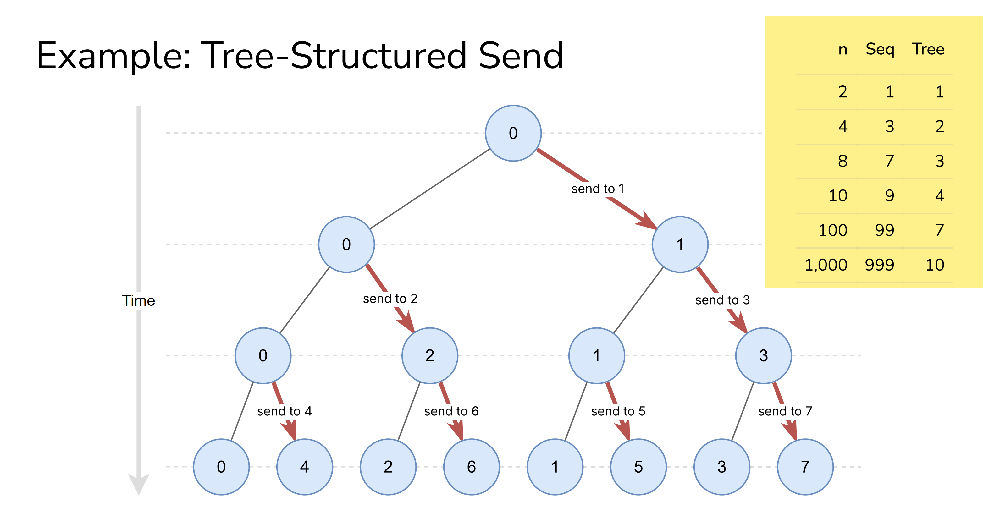

**Zeitkomplexität Baum: O(log n)** – Bei 1000 Prozessen nur 10 Schritte
In jedem Schritt verdoppelt sich die Anzahl der Prozesse, die Daten haben. Nach $k$ Schritten haben $2^k$ Prozesse die Daten. Um $n$ Prozesse zu erreichen, braucht man $\lceil \log_2 n \rceil$ Schritte.

>Das ist nur ein konzeptuelles Modell MPI-Implementierungen nutzen noch ausgefeiltere Algorithmen (Pipeline, Ring, etc.) je nach Nachrichtengröße und Hardware.

#### Broadcast `MPI_Bcast`

Ein Prozess ("Root") sendet dieselben Daten an alle anderen Prozesse.

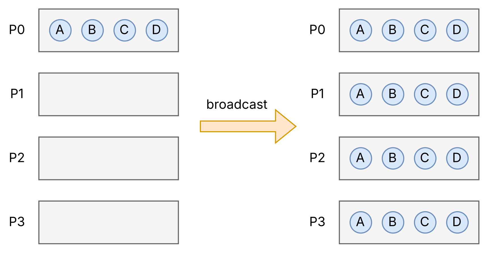

```cpp
int MPI_Bcast(
    void* buffer,          // Pointer auf die Daten
    int count,             // Anzahl der Elemente
    MPI_Datatype datatype, // Datentyp (z.B. MPI_INT, MPI_DOUBLE)
    int root,              // Rang des sendenden Prozesses
    MPI_Comm comm          // Kommunikator
);
```

Beim Aufruf muss man auf folgendes aufpassen:
- **Alle rufen auf** - Jeder Prozess im Kommunikator muss `MPI_Bcast` aufrufen.
- **Gleiche Parameter** - `count`, `datatype`, `root` und `comm` müssen bei allen identisch sein
- **Buffer-Verwendung** - Bei Root: enthält die zu sendenden Daten. Bei anderen: wird mit empfangenen Daten gefüllt

Beispiel-Verwendung
```cpp
int data[4];

if (rank == 0) {
    // Nur Prozess 0 initialisiert die Daten
    data[0] = 10; data[1] = 20; data[2] = 30; data[3] = 40;
}

// ALLE Prozesse rufen Bcast auf – auch der Root!
MPI_Bcast(data, 4, MPI_INT, 0, MPI_COMM_WORLD);

// Jetzt haben alle Prozesse data = {10, 20, 30, 40}
```

Obacht, verlockender Fehler:
```cpp
if (rank == 0) {
    MPI_Bcast(data, 4, MPI_INT, 0, MPI_COMM_WORLD);
}
```

> Das ist falsch! Alle Prozesse müssen `MPI_Bcast` aufrufen, sonst warten die anderen ewig (Deadlock).

#### Scatter `MPI_Scatter`

Der Root verteilt unterschiedliche Datenteile an jeden Prozess. Unterschied zu Broadcast: Bei Broadcast bekommt jeder dieselben Daten. Bei Scatter bekommt jeder unterschiedliche Teile.

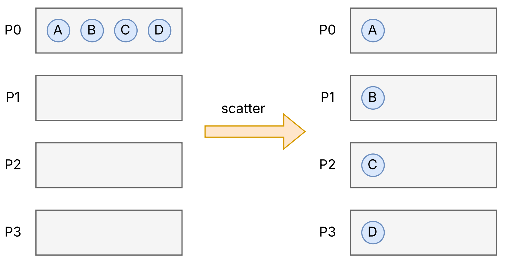

```cpp
int MPI_Scatter(
    void* sendbuf,           // Sendepuffer (nur beim Root relevant)
    int sendcount,           // Anzahl Elemente PRO EMPFÄNGER
    MPI_Datatype sendtype,   // Datentyp der Sendedaten
    void* recvbuf,           // Empfangspuffer (bei jedem Prozess)
    int recvcount,           // Anzahl Elemente zum Empfangen
    MPI_Datatype recvtype,   // Datentyp der Empfangsdaten
    int root,                // Rang des Senders
    MPI_Comm comm            // Kommunikator
);
```

Beim Aufruf muss man auf folgendes aufpassen:
- `sendbuf` muss beim Root alle Daten enthalten und wird bei allen adneren ignoriert (kann `nullptr` sein)
- `recvbuf` empfängt beim sowohl beim Root als auch bei allen anderen seinen Teil
- `sendcount` ist die Anzahl der Elemente, die jeder einzelne Prozess bekommt – nicht die Gesamtzahl

Beispiel-Verwendung
```cpp
int* sendbuf = nullptr;
int recvbuf[3];  // Jeder Prozess empfängt 3 Elemente

if (rank == 0) {
    // Root hat alle Daten: 12 Elemente für 4 Prozesse
    sendbuf = new int[12];
    for (int i = 0; i < 12; i++) {
        sendbuf[i] = i * 10;  // 0, 10, 20, 30, 40, ...
    }
}

// Verteile: Jeder bekommt 3 Elemente
MPI_Scatter(
    sendbuf, 3, MPI_INT,    // Sende 3 Elemente pro Prozess
    recvbuf, 3, MPI_INT,    // Empfange 3 Elemente
    0, MPI_COMM_WORLD
);

// Ergebnis:
// P0: recvbuf = {0, 10, 20}
// P1: recvbuf = {30, 40, 50}
// P2: recvbuf = {60, 70, 80}
// P3: recvbuf = {90, 100, 110}
```
Die Daten werden **der Reihe nach** verteilt. Die ersten `sendcount` Elemente gehen an Prozess 0, die nächsten an Prozess 1, usw.

Fancy:
```
┌───┬───┬───┬───┬───┬───┬───┬───┬───┬───┬───┬───┐
│ 0 │10 │20 │30 │40 │50 │60 │70 │80 │90 │100│110│
└───┴───┴───┴───┴───┴───┴───┴───┴───┴───┴───┴───┘
 └────P0────┘└────P1────┘└────P2────┘└────P3────┘
 ```

#### Gather `MPI_Gather`
Gather ist das Gegenteil von Scatter. Alle Prozesse senden ihre Daten an den Root, der sie einsammelt.

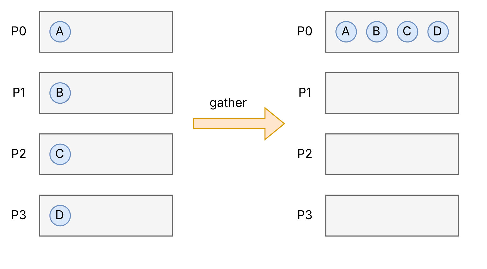

```cpp
int MPI_Gather(
    void* sendbuf,           // Sendepuffer (bei jedem Prozess)
    int sendcount,           // Anzahl Elemente zum Senden
    MPI_Datatype sendtype,   // Datentyp der Sendedaten
    void* recvbuf,           // Empfangspuffer (nur beim Root relevant)
    int recvcount,           // Anzahl Elemente PRO SENDER
    MPI_Datatype recvtype,   // Datentyp der Empfangsdaten
    int root,                // Rang des Empfängers
    MPI_Comm comm            // Kommunikator
);
```

Beim Aufruf muss man auf folgendes aufpassen:
- `sendbuf` - es wird auch der Teil von Root gesendet, sowie der von allen anderen
- `recvbuf` - Muss im Root Platz für alle Daten haben, wird von allen anderen ignoriert
- `recvcount` ist wieder die Anzahl pro Sender – nicht die Gesamtzahl

Beispiel-Verwendung

```cpp
int sendbuf[3];  // Jeder Prozess hat 3 Elemente
int* recvbuf = nullptr;

// Jeder Prozess füllt seinen Sendepuffer
for (int i = 0; i < 3; i++) {
    sendbuf[i] = rank * 100 + i;
}
// P0: {0, 1, 2}
// P1: {100, 101, 102}
// P2: {200, 201, 202}
// P3: {300, 301, 302}

if (rank == 0) {
    // Nur Root braucht Platz für alle Daten
    recvbuf = new int[12];  // 4 Prozesse × 3 Elemente
}

MPI_Gather(
    sendbuf, 3, MPI_INT,    // Jeder sendet 3 Elemente
    recvbuf, 3, MPI_INT,    // Root empfängt 3 pro Prozess
    0, MPI_COMM_WORLD
);

// Ergebnis bei P0: // shit so fancy, gawd help me
// recvbuf = {0, 1, 2, 100, 101, 102, 200, 201, 202, 300, 301, 302}
//           └──P0──┘  └────P1────┘  └────P2────┘  └────P3────┘ 
```

#### `MPI_Scatter` und `MPI_Gather` in Kombination

Scatter und Gather werden oft zusammen verwendet.

```cpp
// 1. Root verteilt Arbeit
MPI_Scatter(all_data, chunk_size, MPI_DOUBLE,
            local_data, chunk_size, MPI_DOUBLE,
            0, MPI_COMM_WORLD);

// 2. Jeder Prozess bearbeitet seinen Teil
process(local_data, local_result, chunk_size);

// 3. Root sammelt Ergebnisse ein
MPI_Gather(local_result, chunk_size, MPI_DOUBLE,
           all_results, chunk_size, MPI_DOUBLE,
           0, MPI_COMM_WORLD);
```

#### Allgather  `MPI_Allgather`
Wie Gather, aber das Ergebnis landet bei ALLEN Prozessen, nicht nur beim Root.

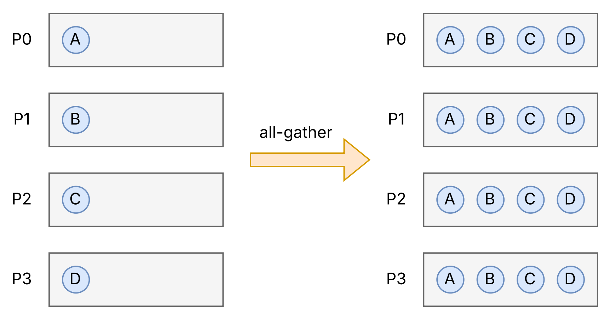

Allgather = Gather + Broadcast (aber effizienter implementiert)

```cpp
int MPI_Allgather(
    void* sendbuf,           // Sendepuffer
    int sendcount,           // Anzahl Elemente zum Senden
    MPI_Datatype sendtype,   // Datentyp der Sendedaten
    void* recvbuf,           // Empfangspuffer (bei JEDEM Prozess!)
    int recvcount,           // Anzahl Elemente pro Sender
    MPI_Datatype recvtype,   // Datentyp der Empfangsdaten
    MPI_Comm comm            // Kommunikator (kein Root-Rang)
);
```

Es gibt drei wichtige Unterschiede zu `MPI_Gather`:
- `MPI_Allgather` braucht keinen `root` Parameter
- Bei `MPI_Allgather` brauchen alle einen `recvbuf`
- Das Ergebnis wird mit allen geteilt

Beispiel-Verwendung
```cpp
int sendbuf[2];
int recvbuf[8];  // JEDER braucht Platz für alle Daten!

// Jeder füllt seinen Teil
sendbuf[0] = rank * 10;
sendbuf[1] = rank * 10 + 1;
// P0: {0, 1}, P1: {10, 11}, P2: {20, 21}, P3: {30, 31}

MPI_Allgather(
    sendbuf, 2, MPI_INT,
    recvbuf, 2, MPI_INT,
    MPI_COMM_WORLD          // Kein Root-Parameter
);

// Ergebnis bei ALLEN Prozessen:
// recvbuf = {0, 1, 10, 11, 20, 21, 30, 31}
```

#### Vergleich der Operationen

| Operation | Vorher | Nachher | Beschreibung |
|-----------|--------|---------|--------------|
| **Broadcast** | Root hat Daten | Alle haben **dieselben** Daten | Einer → Alle (gleich) |
| **Scatter** | Root hat alle Daten | Jeder hat **seinen Teil** | Einer → Alle (unterschiedlich) |
| **Gather** | Jeder hat seinen Teil | Root hat **alle** Daten | Alle → Einer |
| **Allgather** | Jeder hat seinen Teil | Alle haben **alle** Daten | Alle → Alle |

```
Broadcast:     [ABCD] → [ABCD] [ABCD] [ABCD] [ABCD]

Scatter:       [ABCD] → [A] [B] [C] [D]

Gather:        [A] [B] [C] [D] → [ABCD]

Allgather:     [A] [B] [C] [D] → [ABCD] [ABCD] [ABCD] [ABCD]
```

## Beispiel 2 Matrix-Vektor-Multiplikation

Wir wollen berechnen:

```math
y = A \cdot x
```

Dabei ist:
- $A$ eine Matrix mit $M$ Zeilen und $N$ Spalten (Größe $M \cdot N$)
- $x$ ein Vektor mit $N$ Elementen
- $y$ das Ergebnis, ein Vektor mit $M$ Elementen

Berechnung eines einzelnen Elements:

```math
y_i =\sum_{j=1}^{N-1} A_{ij} \cdot x_j
```
Jedes Element $y_i$ ist das Skalarprodukt der $i$-ten Zeile von $A$ mit dem Vektor $x$.

#### Parallelisierungsstrategie
Jeder Prozess berechnet einen Teil der Ergebniszeilen.

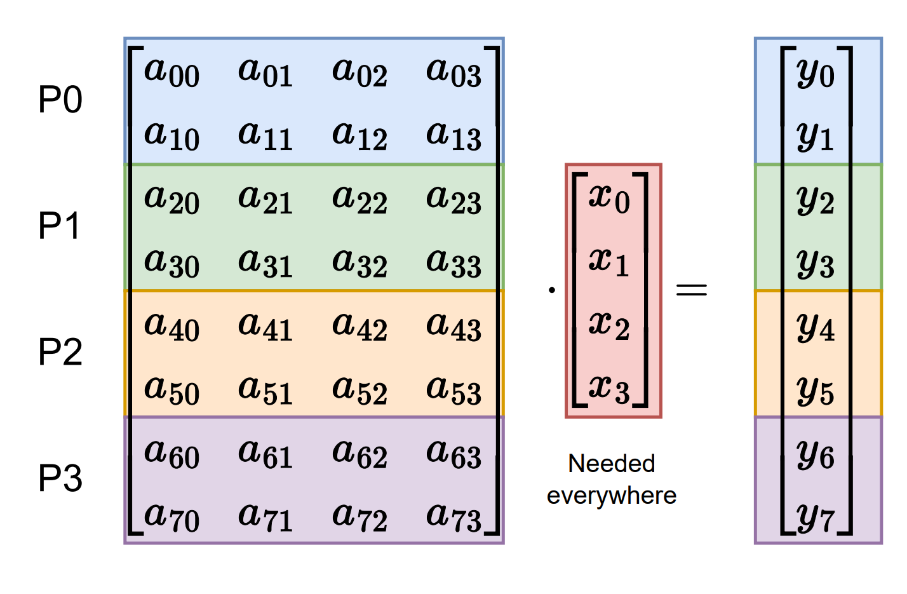

Das Problem: Jeder braucht den gesamten Vektor $x$ - nicht nur einen Teil davon.

Ein grober Ablauf kann so aussehen:

| Schritt | Operation | MPI-Funktion |
| --- | --- | --- |
| 1 | Vektor $x$ an alle verteilen | `MPI_Bcast` |
| 2 | Zeilen von Matrix  $A$ aufteilen | `MPI_Scatter` |
| 3 | Jeder berechnet seinen Teil von $y$ | (lokal) |
| 4 | Teilergebnisse bei Root sammeln | `MPI_Gather` |

#### Grundstruktur

```cpp
int rank, comm_size;
MPI_Comm_rank(MPI_COMM_WORLD, &rank);
MPI_Comm_size(MPI_COMM_WORLD, &comm_size);

int M = 1000;  // Anzahl Zeilen der Matrix
int N = 100;   // Anzahl Spalten der Matrix (= Länge von x)

// Zufallszahlengenerator für Testdaten
std::default_random_engine generator;
std::uniform_real_distribution<double> distribution { -1.0, 1.0 };

// 1. Broadcast: Vektor x an alle Prozesse verteilen
// 2. Scatter: Zeilen der Matrix A verteilen
// 3. Jeder Prozess berechnet seinen Teil des Ergebnisvektors y
// 4. Gather: Teilergebnisse bei Root (Prozess 0) sammeln
// 5. Root gibt das Ergebnis aus

MPI_Finalize();`
```

Prozess 0 (Root) hält die komplette Matrix $A$ (nur am Anfang), kompletter Vektor $x$, komplettes Ergebnis $y$. Alle anderen halten nur ihren Teil von $A$, aber kompletten Vektor $x$ und nur ihren Teil von $y$.

> **Annahme für dieses Beispiel: **  
Wir nehmen an, dass $M$ (Anzahl der Zeilen) durch `comm_size` (Anzahl der Prozesse) teilbar ist. In der Praxis müsste man ungleiche Verteilungen mit `MPI_Scatterv` handhaben.

#### Schritt 1 – Broadcast des Vektors $x$

```cpp
// Speicher für Vektor x allokieren (bei ALLEN Prozessen)
double* x = new double[N];

// Nur Prozess 0 initialisiert die Daten
if (rank == 0) {
    for (int i = 0; i < N; i++) {
        x[i] = distribution(generator);  // Zufallswerte zwischen -1 und 1
    }
}

// Vektor x an ALLE Prozesse verteilen
MPI_Bcast(
    x,                  // Puffer: bei Root die Quelldaten, bei anderen das Ziel
    N,                  // Anzahl Elemente
    MPI_DOUBLE,         // Datentyp
    0,                  // Root = Prozess 0
    MPI_COMM_WORLD      // Kommunikator
);
```
Das führt zu
```
VORHER:                              NACHHER:
┌─────────────────────┐              ┌─────────────────────┐
│ P0: x = [0.3, -0.7, │              │ P0: x = [0.3, -0.7, │
│         0.1, ...]   │              │         0.1, ...]   │
├─────────────────────┤              ├─────────────────────┤
│ P1: x = [?, ?, ...] │  ────────→   │ P1: x = [0.3, -0.7, │
├─────────────────────┤   Bcast      │         0.1, ...]   │
│ P2: x = [?, ?, ...] │              ├─────────────────────┤
├─────────────────────┤              │ P2: x = [0.3, -0.7, │
│ P3: x = [?, ?, ...] │              │         0.1, ...]   │
└─────────────────────┘              ├─────────────────────┤
                                     │ P3: x = [0.3, -0.7, │
                                     │         0.1, ...]   │
                                     └─────────────────────┘
```

Alle Prozesse allokieren Speicher für $x$ - nicht nur der Root. Ebenso rufen alle Prozesse `MPI_Bcast` auf - das ist eine kollektive Operation. Nach dem Broadcast hat nun jeder Prozess eine Kopie des kompletten Vektors.

#### Schritt 2 - Scatter der Matrix-Zeilen
skidibidip mndadap bo - I'm a scatman

```cpp
// Matrix A existiert nur beim Root
double* A = nullptr;

if (rank == 0) {
    // Root allokiert und initialisiert die komplette Matrix
    A = new double[M * N];  // M Zeilen × N Spalten
    for (int i = 0; i < M * N; i++) {
        A[i] = distribution(generator);
    }
}

// Berechne, wie viele Zeilen jeder Prozess bekommt
int rows_per_proc = M / comm_size;

// Jeder Prozess allokiert Speicher für seinen Teil der Matrix
double* local_A = new double[rows_per_proc * N];

// Verteile die Zeilen der Matrix
MPI_Scatter(
    A,                          // Sendepuffer (nur bei Root relevant)
    rows_per_proc * N,          // Anzahl Elemente PRO PROZESS
    MPI_DOUBLE,                 // Datentyp
    local_A,                    // Empfangspuffer
    rows_per_proc * N,          // Anzahl zu empfangender Elemente
    MPI_DOUBLE,                 // Datentyp
    0,                          // Root
    MPI_COMM_WORLD              // Kommunikator
);

// Root kann seinen Speicher für A freigeben
if (rank == 0) {
    delete[] A;
}
```

Beispiel mit konkreten Zahlen:
$M=1000$ Zeilen, $N=100$ Spalten, 4 Prozesse

Jeder Prozess bekommt: $\frac{1000}{4} = 250$ Zeilen

```
Matrix A beim Root (1000 × 100 = 100.000 Elemente):
┌─────────────────────────────────────┐
│ Zeile 0:   a[0][0], a[0][1], ..., a[0][99]     │  ─┐
│ Zeile 1:   a[1][0], a[1][1], ..., a[1][99]     │   │
│ ...                                            │   ├── → P0 (25.000 Elemente)
│ Zeile 249: a[249][0], ..., a[249][99]          │  ─┘
├─────────────────────────────────────┤
│ Zeile 250: a[250][0], ..., a[250][99]          │  ─┐
│ ...                                            │   ├── → P1 (25.000 Elemente)
│ Zeile 499: a[499][0], ..., a[499][99]          │  ─┘
├─────────────────────────────────────┤
│ Zeile 500: ...                                 │  ─┐
│ ...                                            │   ├── → P2 (25.000 Elemente)
│ Zeile 749: ...                                 │  ─┘
├─────────────────────────────────────┤
│ Zeile 750: ...                                 │  ─┐
│ ...                                            │   ├── → P3 (25.000 Elemente)
│ Zeile 999: ...                                 │  ─┘
└─────────────────────────────────────┘
```

> In C/C++ werden Matrizen **zeilenweise** im Speicher abgelegt. Das ergibt dann folgendes Speicherlayout:
```
[a00, a01, ..., a0N, a10, a11, ..., a1N, a20, ...]
 └─── Zeile 0 ───┘   └─── Zeile 1 ───┘  └── ...
```
Die Memory-Repräsentation in Zeilen ist geeignet für unseren Task.

#### Schritt 3 - Lokale Berechnung

```cpp
// Jeder Prozess allokiert Speicher für seinen Teil des Ergebnisses
double* local_y = new double[rows_per_proc];

// Berechne: local_y = local_A × x
for (int i = 0; i < rows_per_proc; i++) {
    local_y[i] = 0.0;
    
    for (int j = 0; j < N; j++) {
        // local_A ist ein 1D-Array, daher: Zeile i, Spalte j = Index i*N + j
        local_y[i] += local_A[i * N + j] * x[j];
    }
}

// Aufräumen: x und local_A werden nicht mehr gebraucht
delete[] x;
delete[] local_A;
```

**Prozess 0** berechnet $y_0, y_1, ..., y_{249}$
**Prozess 1** berechnet $y_{250}, y_{251}, ..., y_{499}$
**Prozess 2** berechnet $y_{500}, y_{501}, ..., y_{749}$
**Prozess 3** berechnet $y_{750}, y_{751}, ..., y_{999}$

Während diesem Schritt arbeiten **alle Prozesse gleichzeitig** an ihren Teilen – keine Kommunikation nötig.
```
Zeit →
P0: [═══════ Berechne y[0..249] ═══════]
P1: [═══════ Berechne y[250..499] ═════]
P2: [═══════ Berechne y[500..749] ═════]
P3: [═══════ Berechne y[750..999] ═════]
     ↑                                  ↑
     Alle starten                       Alle fertig
     gleichzeitig                       (ungefähr)
```

#### Schritt 4 - Gather der Teilergebnisse

```cpp
// Ergebnisvektor y existiert nur beim Root
double* y = nullptr;

if (rank == 0) {
    // Root allokiert Speicher für das komplette Ergebnis
    y = new double[M];
}

// Sammle alle Teilergebnisse beim Root
MPI_Gather(
    local_y,            // Sendepuffer (jeder Prozess)
    rows_per_proc,      // Anzahl Elemente pro Sender
    MPI_DOUBLE,         // Datentyp
    y,                  // Empfangspuffer (nur bei Root relevant)
    rows_per_proc,      // Anzahl Elemente pro Sender (!)
    MPI_DOUBLE,         // Datentyp
    0,                  // Root
    MPI_COMM_WORLD      // Kommunikator
);

// Lokales Ergebnis wird nicht mehr gebraucht
delete[] local_y;
```

Die Daten werden in **Rang-Reihenfolge** zusammengesetzt: erst P0, dann P1, dann P2, dann P3.

```
VORHER:                              NACHHER:
┌──────────────────┐                 ┌──────────────────┐
│ P0: local_y =    │                 │ P0: y =          │
│   [y0, y1, ...]  │                 │   [y0, y1, ...,  │
├──────────────────┤                 │    y250, y251,...│
│ P1: local_y =    │   ─────────→    │    y500, y501,...│
│   [y250, y251,.. │     Gather      │    y750, y751,...│
├──────────────────┤                 │    ..., y999]    │
│ P2: local_y =    │                 ├──────────────────┤
│   [y500, y501,.. │                 │ P1: (unchanged)  │
├──────────────────┤                 ├──────────────────┤
│ P3: local_y =    │                 │ P2: (unchanged)  │
│   [y750, y751,.. │                 ├──────────────────┤
└──────────────────┘                 │ P3: (unchanged)  │
                                     └──────────────────┘
```

### Speicheraufbau beim Root nach Gather
```
y beim Root:
┌─────┬─────┬─────┬─────┬─────┬─────┬─────┬─────┬─────┬─────┐
│ y0  │ y1  │ ... │y249 │y250 │ ... │y499 │y500 │ ... │y999 │
└─────┴─────┴─────┴─────┴─────┴─────┴─────┴─────┴─────┴─────┘
 └────── von P0 ──────┘ └─── von P1 ───┘ └─P2─┘  └─P3─┘
```

#### Schritt 5 – Ausgabe des Ergebnisses

```cpp
if (rank == 0) { // nur root
    std::cout << "Result vector y (first 10 elements):" << std::endl;

    // Nur die ersten 10 Elemente ausgeben
    for (int i = 0; i < std::min(10, M); i++) {
        std::cout << y[i] << " ";
    }

    std::cout << std::endl;

    // Speicher freigeben
    delete[] y;
}
```

Nur Prozess 0 hat das komplette Ergebnis. Die anderen Prozesse haben nach dem Gather ihre Teilergebnisse zwar noch in `local_y`, dieser Speicher ist aber bereits freigegeben.


Eine vollständige Impl ist hier erstichtlich: [Matrixmultiplikation](Matmult.cpp)


## Mehr Kollektive Kommunikation


#### Alltoall (`MPI_Alltoall`)
Jeder Prozess sendet unterschiedliche Daten an jeden anderen Prozess. Das ist wie eine "Transposition" der Daten über alle Prozesse hinweg.


```cpp
int MPI_Alltoall(
    void* sendbuf,           // Sendepuffer
    int sendcount,           // Anzahl Elemente PRO ZIEL-PROZESS
    MPI_Datatype sendtype,   // Datentyp
    void* recvbuf,           // Empfangspuffer
    int recvcount,           // Anzahl Elemente PRO QUELL-PROZESS
    MPI_Datatype recvtype,   // Datentyp
    MPI_Comm comm            // Kommunikator
);
```

Beim Aufruf muss man auf folgendes aufpassen:
- `sendcount` ist die Anzahl der Elemente, die an jeden Prozess gesendet werden
- `recvcount` ist die Anzahl der Elemente, die von jedem Prozess empfangen werden
- Gesamtgröße `sendbuf` ist also `sendcount` x `comm_size`
- Gesamtgröße `recvbuf` ist also `recvcount ` x `comm_size`

Beispiel-Verwendung:

```cpp
int comm_size = 4;
int sendbuf[4];  // Jeder hat 4 Elemente (1 für jeden Prozess)
int recvbuf[4];  // Jeder empfängt 4 Elemente (1 von jedem Prozess)

// Jeder Prozess initialisiert seine Daten
// P0: sendbuf = {0, 1, 2, 3}
// P1: sendbuf = {10, 11, 12, 13}
// P2: sendbuf = {20, 21, 22, 23}
// P3: sendbuf = {30, 31, 32, 33}
for (int i = 0; i < comm_size; i++) {
    sendbuf[i] = rank * 10 + i;
}

MPI_Alltoall(
    sendbuf, 1, MPI_INT,    // Sende 1 Element pro Ziel
    recvbuf, 1, MPI_INT,    // Empfange 1 Element pro Quelle
    MPI_COMM_WORLD
);

// Ergebnis:
// P0: recvbuf = {0, 10, 20, 30}  (Element 0 von jedem)
// P1: recvbuf = {1, 11, 21, 31}  (Element 1 von jedem)
// P2: recvbuf = {2, 12, 22, 32}  (Element 2 von jedem)
// P3: recvbuf = {3, 13, 23, 33}  (Element 3 von jedem)
```

#### Reduce (`MPI_Reduce`)
Kombiniert Daten von allen Prozessen mit einer Operation (z.B. Summe, Maximum) und speichert das Ergebnis beim Root.

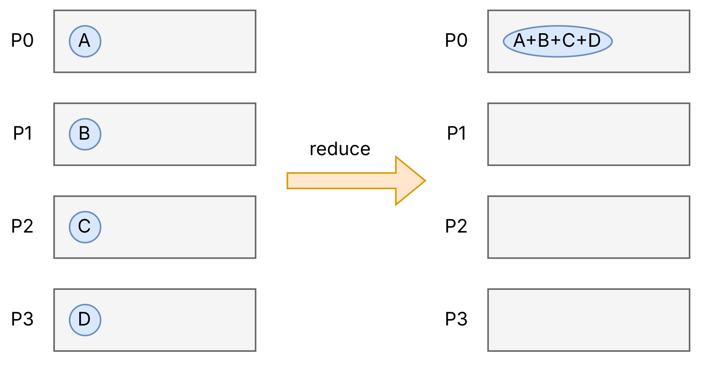

```cpp
int MPI_Reduce(
    void* sendbuf,           // Sendepuffer (bei jedem Prozess)
    void* recvbuf,           // Empfangspuffer (nur bei Root relevant)
    int count,               // Anzahl Elemente
    MPI_Datatype datatype,   // Datentyp
    MPI_Op op,               // Reduktionsoperation
    int root,                // Rang des Prozesses, der das Ergebnis bekommt
    MPI_Comm comm            // Kommunikator
);
```

Beispiel-Verwendung:

```cpp
double local_value = rank + 1.0;  // P0: 1.0, P1: 2.0, P2: 3.0, P3: 4.0
double global_sum;

MPI_Reduce(
    &local_value,      // Jeder sendet seinen Wert
    &global_sum,       // Nur Root empfängt das Ergebnis
    1,                 // Ein Element
    MPI_DOUBLE,
    MPI_SUM,           // Summe bilden
    0,                 // Root = Prozess 0
    MPI_COMM_WORLD
);

if (rank == 0) {
    std::cout << "Summe: " << global_sum << std::endl;  // Ausgabe: 10.0
}
```

Man kann eigene Reduktionsoperationen definieren oder die von MPI bereitgestellten verwenden. (`MPI_SUM`, `MPI_PROD`, `MPI_MAX`, `MPI_MIN`, `MPI_LAND` = Logisches UND, `MPI_MAXLOC` = Maximum mit Postion, ...)

## Beispiel 3 Good ol' Trapezregel again

### Lösung 1 mit `MPI_Send` und `MPI_Recv`
Die "alte" ineffiziente Implementierung sieht folgendermaßen aus.

```cpp
double local_integral = trap(local_a, local_b, local_n, h);

if (rank != 0) {
    // Alle außer Root: Senden ihr Ergebnis
    MPI_Send(&local_integral, 1, MPI_DOUBLE, 0, 0, MPI_COMM_WORLD);

} else /* rank == 0 */ {
    // Root: Sammelt alle Ergebnisse sequentiell ein
    double total_integral = local_integral;

    for (int source = 1; source < comm_size; source++) {
        double temp_integral;
        MPI_Recv(&temp_integral, 1, MPI_DOUBLE, source, 0, 
                 MPI_COMM_WORLD, MPI_STATUS_IGNORE);
        total_integral += temp_integral;
    }

    std::cout << "Result: " << total_integral << std::endl;
}
```

Die Implementierung ist nicht optimal, denn bei `comm_size - 1` Prozessen braucht man `comm_size - 1` Empfangsoperationen. Das sind bei 1000 Prozessen: 999 sequentielle Receives! Außerdem mehr Code und mehr Fehlerquellen, da man Send/Recv-Logik selbst schreiben muss und so leicht Deadlocks verursachen kann.

### Lösung 2 mit `MPI_Reduce`
`MPI_Reduce` vereinfacht den Sourcecode.

```cpp
double local_integral = trap(local_a, local_b, local_n, h);

double total_integral;
MPI_Reduce(
    &local_integral,    // Jeder sendet sein lokales Ergebnis
    &total_integral,    // Root empfängt die Summe
    1,                  // Ein Element
    MPI_DOUBLE,
    MPI_SUM,            // Summe bilden
    0,                  // Root = Prozess 0
    MPI_COMM_WORLD
);

if (rank == 0) {
    std::cout << "Result: " << total_integral << std::endl;
}
```
Jetzt ist es nur ein Aufruf statt einer komplexen if-else-Struktur mit Schleifen und man erhält weitaus bessere Performance durch die Baumstruktur. Die Zeitkomplexität ist nun `O(log n)`, d.h. mit 1000 Prozessen: nur ~10 Schritte statt 999


## Noch Mehr Kollektive Kommunikation

### Allreduce (`MPI_Allreduce`)

Wie Reduce, aber das Ergebnis landet bei ALLEN Prozessen, nicht nur beim Root.
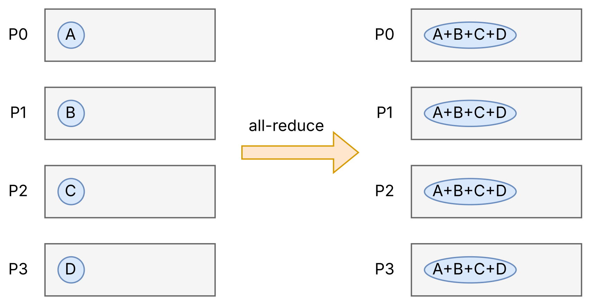

Allreduce = Reduce + Broadcast (aber effizienter implementiert!)

```cpp
int MPI_Allreduce(
    void* sendbuf,           // Sendepuffer
    void* recvbuf,           // Empfangspuffer (bei JEDEM Prozess)
    int count,               // Anzahl Elemente
    MPI_Datatype datatype,   // Datentyp
    MPI_Op op,               // Reduktionsoperation
    MPI_Comm comm            // Kommunikator (KEIN Root)
);
```

Beim Aufruf muss man auf folgendes aufpassen:
- Bei `MPI_Reduce` braucht man einen `root`-Parameter, bei `MPI_Allreduce` nicht
- Bei `MPI_Reduce` braucht nur der `root` einen `recvbuf` bei `MPI_Allreduce` alle
- Bei `MPI_Reduce` hält nur der `root` das Ergebnis, bei `MPI_Allreduce` alle

Beispiel-Verwendung:

```cpp
double local_sum = 0.0;
int local_count = 0;

// Jeder Prozess berechnet lokale Statistiken
for (int i = 0; i < local_n; i++) {
    local_sum += local_data[i];
    local_count++;
}

// Struktur für Summe und Anzahl
double local_values[2] = {local_sum, (double)local_count};
double global_values[2];

// Alle Prozesse erhalten die globale Summe und Anzahl
MPI_Allreduce(
    local_values,
    global_values,
    2,              // Zwei Werte: Summe und Anzahl
    MPI_DOUBLE,
    MPI_SUM,
    MPI_COMM_WORLD
);

// JEDER Prozess kann jetzt den Durchschnitt berechnen
double global_average = global_values[0] / global_values[1];
```

#### Wann Allreduce statt Reduce?


Reduce verwenden, wenn:
- Nur ein Prozess das Ergebnis braucht
- Das Ergebnis für die Ausgabe oder finale Verarbeitung gedacht ist

Allreduce verwenden, wenn:
- Alle Prozesse das Ergebnis für weitere Berechnungen brauchen
- Iterative Algorithmen, wo jeder die globale Information benötigt

Typische Anwendungsfälle für Allreduce:
- Konvergenzprüfung in iterativen Verfahren (alle müssen wissen, ob fertig)
- Normalisierung (alle brauchen den Gesamtwert)
- Globale Statistiken für lokale Entscheidungen

#### Wie implementiert MPI Allreduce effizient?

Eine naive Implementierung wäre:
```cpp
MPI_Reduce(..., 0, ...);      // Erst Reduce zu Root
MPI_Bcast(..., 0, ...);       // Dann Broadcast von Root
```

Das hätte Zeitkomplexität `O(log n) + O(log n) = O(log n)`, aber mit doppelter Kommunikation.

Die Lösung: Butterfly-Algorithmus
Er kombiniert Reduce und Broadcast in einem einzigen Durchlauf.

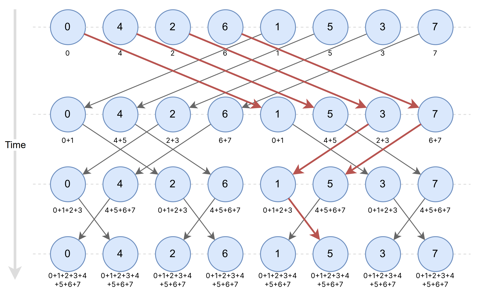

### Scan (`MPI_Scan`) – Präfixsumme

Jeder Prozess erhält die Reduktion aller Werte von Prozess 0 bis einschließlich sich selbst.

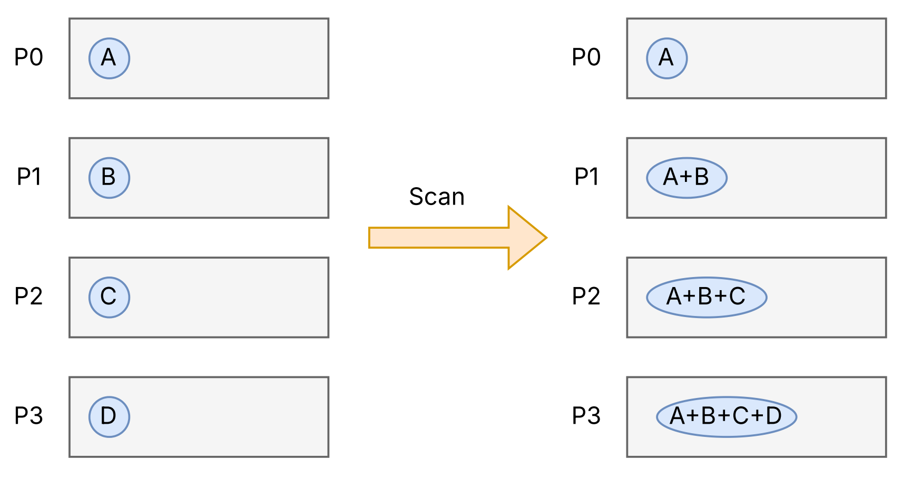

Die Reihenfolge (Rang) ist hier entscheidend. Bei Reduce/Allreduce ist die Reihenfolge egal (weil kommutativ), bei Scan nicht.

```cpp
int MPI_Scan(
    void* sendbuf,           // Sendepuffer
    void* recvbuf,           // Empfangspuffer
    int count,               // Anzahl Elemente
    MPI_Datatype datatype,   // Datentyp
    MPI_Op op,               // Reduktionsoperation
    MPI_Comm comm            // Kommunikator
);
```

Beispiel-Verwendung:

```cpp
int local_value = rank + 1;  // P0: 1, P1: 2, P2: 3, P3: 4
int prefix_sum;

MPI_Scan(
    &local_value,
    &prefix_sum,
    1,
    MPI_INT,
    MPI_SUM,
    MPI_COMM_WORLD
);

// Ergebnis:
// P0: prefix_sum = 1         (nur eigener Wert)
// P1: prefix_sum = 1+2 = 3
// P2: prefix_sum = 1+2+3 = 6
// P3: prefix_sum = 1+2+3+4 = 10
```

### Exklusiver Scan (`MPI_Exscan`)

Es gibt auch MPI_Exscan, bei dem der eigene Wert nicht einbezogen wird.

Beispiel-Verwendung:

```cpp
MPI_Exscan(&local_value, &prefix_sum, 1, MPI_INT, MPI_SUM, MPI_COMM_WORLD);

// Ergebnis:
// P0: prefix_sum = undefiniert!  (kein Vorgänger)
// P1: prefix_sum = 1             (nur P0)
// P2: prefix_sum = 1+2 = 3       (P0 + P1)
// P3: prefix_sum = 1+2+3 = 6     (P0 + P1 + P2)
```

Ein Beispiel mit konkretes Anwendungsbeispiel ist globale Indizierung.

```cpp
int local_count = anzahl_lokaler_elemente();

int global_start_index;
MPI_Exscan(&local_count, &global_start_index, 1, MPI_INT, MPI_SUM, MPI_COMM_WORLD);

if (rank == 0) {
    global_start_index = 0;  // P0 startet bei 0
}

// Jetzt weiß jeder Prozess, ab welchem globalen Index seine Daten beginnen
// Beispiel: P0 hat 100, P1 hat 150, P2 hat 80 Elemente
// P0: start = 0
// P1: start = 100
// P2: start = 250
```

## In-Place Operationen

Normalerweise braucht man zwei separate Puffer für kollektive Operationen:
- `sendbuf` - die Eingabedaten
- `recvbuf ` - das Ergebnis

Bei In-Place Operationen wird derselbe Puffer für Ein- und Ausgabe verwendet. Man aktiviert In-Place in dem man `MPI_IN_PLACE`als Sendepuffer verwendet.

Beispiel-Verwendung:

```cpp
// OHNE In-Place (zwei Puffer):
double local_integral = trap(...);
double total_integral;
MPI_Allreduce(&local_integral, &total_integral, 1, MPI_DOUBLE, MPI_SUM, MPI_COMM_WORLD);
// Ergebnis in total_integral

// MIT In-Place (ein Puffer):
double local_integral = trap(...);
MPI_Allreduce(MPI_IN_PLACE, &local_integral, 1, MPI_DOUBLE, MPI_SUM, MPI_COMM_WORLD);
// Ergebnis direkt in local_integral
```

### Beispiel der good ol' Trapezregel

```cpp
double local = trap(local_a, local_b, local_n, h);

MPI_Allreduce(
    MPI_IN_PLACE,       // Kein separater Sendepuffer
    &local,             // Dieser Puffer wird überschrieben
    1, 
    MPI_DOUBLE,
    MPI_SUM,
    MPI_COMM_WORLD
);

// Jetzt enthält 'local' bei ALLEN Prozessen die Gesamtsumme (jawoi)
std::cout << "Prozess " << rank << ": Integral = " << local << std::endl;
```

Die Vorteile sind, das nur ein ein Puffer statt zwei nötig ist, einfacherer Code, da keine separate Variable für das Ergebnis und die Daten müssen nicht zwischen Puffern kopiert werden müssen.

Bei manchen Operationen ist `MPI_IN_PLACE` nur im root erlaubt.

```cpp
// Nur beim ROOT ist MPI_IN_PLACE erlaubt!
if (rank == 0) {
    MPI_Reduce(MPI_IN_PLACE, &value, 1, MPI_DOUBLE, MPI_SUM, 0, MPI_COMM_WORLD);
} else {
    MPI_Reduce(&value, nullptr, 1, MPI_DOUBLE, MPI_SUM, 0, MPI_COMM_WORLD);
}
```

## Noch weitere kollektive Operationen (fml)

### Reduce-Scatter (`MPI_Reduce_scatter`)

Kombiniert Reduce und Scatter in einer Operation.

```cpp
int MPI_Reduce_scatter(
    void* sendbuf,
    void* recvbuf,
    int recvcounts[],    // Array: wie viele Elemente jeder Prozess bekommt
    MPI_Datatype datatype,
    MPI_Op op,
    MPI_Comm comm
);
```
1. Alle Elemente werden reduziert
2. Das Ergebnis wird auf die Prozesse verteilt (wie Scatter)

### Barrier (`MPI_Barrier`)
Barrier ist ein Synchronisationspunkt - alle Prozesse warten, bis alle angekommen sind.

```cpp
// Alle Prozesse arbeiten
do_some_work();

// Warten, bis ALLE fertig sind
MPI_Barrier(MPI_COMM_WORLD);

// Erst jetzt geht's weiter
do_next_phase();
```

Mit Barrier kann z.Bsp. realisieren:
- Zeitmessungen (alle starten gleichzeitig)
- Debugging (Ausgaben synchronisieren)
- Phasenübergänge in Algorithmen

aber keinesfalls:
- Vor/nach kollektiven Operationen (die synchronisieren schon selbstständig)
- Als "Sicherheit" überall einstreuen (kostet Performance)

### Variable-Count Varianten (Scatterv, Gatherv, etc.)
Die normalen Scatter/Gather erwarten, dass jeder Prozess gleich viele Elemente bekommt/sendet. Die `v`-Varianten erlauben unterschiedliche Anzahlen.

```cpp
int MPI_Scatterv(
    void* sendbuf,
    int sendcounts[],    // Array: wie viele Elemente an jeden Prozess
    int displs[],        // Array: Offset im Sendepuffer für jeden Prozess
    MPI_Datatype sendtype,
    void* recvbuf,
    int recvcount,       // Wie viele dieser Prozess empfängt
    MPI_Datatype recvtype,
    int root,
    MPI_Comm comm
);
```
Beispiel-Verwendung:
```cpp
// Problem: 10 Elemente auf 4 Prozesse verteilen
// P0: 3, P1: 3, P2: 2, P3: 2

int sendcounts[4] = {3, 3, 2, 2};
int displs[4] = {0, 3, 6, 8};  // Startpositionen im Array

// Beim Root: sendbuf = [0, 1, 2, 3, 4, 5, 6, 7, 8, 9]
//                       └─P0──┘  └─P1──┘  └P2┘  └P3┘

int recvcount = sendcounts[rank];  // Jeder weiß, wie viel er bekommt
int* recvbuf = new int[recvcount];

MPI_Scatterv(
    sendbuf, sendcounts, displs, MPI_INT,
    recvbuf, recvcount, MPI_INT,
    0, MPI_COMM_WORLD
);

// Ergebnis:
// P0: recvbuf = {0, 1, 2}
// P1: recvbuf = {3, 4, 5}
// P2: recvbuf = {6, 7}
// P3: recvbuf = {8, 9}
```


#### Übersicht aller "v"-Varianten

| Standard | Variable-Count |
|----------|----------------|
| `MPI_Scatter` | `MPI_Scatterv` |
| `MPI_Gather` | `MPI_Gatherv` |
| `MPI_Allgather` | `MPI_Allgatherv` |
| `MPI_Alltoall` | `MPI_Alltoallv` |

## Checkliste

Wenn man diese Konstrukte begreift, ist man gut dabei:

| Kategorie | Konstrukte |
|-----------|------------|
| **Grundfunktionen** | `MPI_Init`, `MPI_Finalize`, `MPI_Comm_rank`, `MPI_Comm_size` |
| **Punkt-zu-Punkt** | `MPI_Send`, `MPI_Recv`, Tags, `MPI_ANY_SOURCE`, `MPI_ANY_TAG`, `MPI_Status` |
| **Kollektive Datenbewegung** | `MPI_Bcast`, `MPI_Scatter`, `MPI_Gather`, `MPI_Allgather`, `MPI_Alltoall` |
| **Kollektive Berechnung** | `MPI_Reduce`, `MPI_Allreduce`, `MPI_Scan`, `MPI_Exscan`, `MPI_Reduce_scatter` |
| **Reduktionsoperationen** | `MPI_SUM`, `MPI_PROD`, `MPI_MAX`, `MPI_MIN`, `MPI_LAND`, `MPI_MAXLOC` |
| **Variable-Count** | `MPI_Scatterv`, `MPI_Gatherv`, `MPI_Allgatherv`, `MPI_Alltoallv` |
| **Synchronisation** | `MPI_Barrier` |
| **Kommunikatoren** | `MPI_COMM_WORLD`, eigene Kommunikatoren |
| **Sonstiges** | `MPI_IN_PLACE`, `MPI_STATUS_IGNORE`, Datentypen (`MPI_INT`, `MPI_DOUBLE`, ...) |