# MPI für Fortgeschrittene (und die, die es noch werden wollen)

## Fortgeschrittene Punkt-zu-Punkt-Kommunikation in MPI

Hier geht es um fortgeschrittene Punkt-zu-Punkt-Kommunikation in MPI, insbesondere verschiedene Kommunikationsmodi, kombiniertes Senden/Empfangen und nicht-blockierende Kommunikation.

### Sicherheit in MPI-Programmen

**Das Problem:** Betrachte folgenden Code:

| Zeit | Prozess 0 | Prozess 1 |
| --- | --- | --- |
| t0 | Send an P1, tag = 0 | - |
| t1 | Send an P1, tag = 1 | - |
| t2 | - | Recv von P0, tag = 1 |
| t3 | - | Recv von P0, tag = 0 |

**Erklärung:** P0 sendet zwei Nachrichten, aber P1 empfängt sie in umgekehrter Reihenfolge. Das System muss die erste Nachricht zwischenspeichern (puffern), bis P1 bereit ist, sie zu empfangen.

- Wenn kein Puffer verfügbar ist → Deadlock 
- Programme, die sich auf Systempufferung verlassen, sind unsicher

### Blockierende Kommunikation

Blockierend heißt in dem Kontext: Die Funktion kehrt erst zurück, wenn eine bestimmte Bedingung erfüllt ist.
- `MPI_Send` blockiert bis: Der Sendepuffer wiederverwendet werden kann
- `MPI_Recv` blockiert bis: Die Nachricht vollständig empfangen wurde


Wichtiger Unterschied: 
"Sendepuffer kann wiederverwendet werden" bedeutet nicht zwangsläufig, dass die Nachricht schon angekommen ist!

```
Dein Puffer → [MPI interner Puffer] → Netzwerk → Empfänger
              ↑
              Nach dieser Kopie kehrt Send zurück, auch wenn die Nachricht noch unterwegs ist
```

### Buffered Send mit `MPI_Bsend`


Statt sich auf den internen MPI-Puffer zu verlassen (der vielleicht nicht existiert), stellt man explizit einen Puffer bereit.

```cpp
// 1. Berechne die Puffergröße
//    Für jede Nachricht: Nachrichtengröße + Overhead
int bufsize = 2 * (100 + MPI_BSEND_OVERHEAD);
//            ↑     ↑           ↑
//            |     |           MPI braucht etwas Platz für Verwaltungsdaten
//            |     Nachrichtengröße (100 chars)
//            Anzahl der Nachrichten

// 2. Puffer anlegen
char* buffer = new char[bufsize];

// 3. Puffer bei MPI registrieren
MPI_Buffer_attach(buffer, bufsize);

// 4. Jetzt kann gepuffert gesendet werden
MPI_Bsend(data0, 100, MPI_CHAR, 1, 0, MPI_COMM_WORLD);
MPI_Bsend(data1, 100, MPI_CHAR, 1, 1, MPI_COMM_WORLD);
// Diese Aufrufe kehren SOFORT zurück, nachdem die Daten
// in den Puffer kopiert wurden

// 5. Am Ende: Puffer freigeben
//    Dies blockiert, bis alle Sends abgeschlossen sind!
MPI_Buffer_detach(&detached, &size);
delete[] detached;
```

Das bringt Vorteile:
- Explizite Kontrolle über Buffering
- Vermeidet Deadlocks, die durch fehlende interne Buffer entstehen
- Send kehrt schnell zurück (gut für kleine Nachrichten)

Wo viel Licht ist, ist viel Schatten:
- Man muss den Buffer selbst verwalten (fehleranfällig!)
- Extra Kopiervorgang: Deine Daten → Buffer → Netzwerk
- Bei großen Nachrichten wird die zusätzliche Kopie zum Bottleneck

Fleck Philiip sagt: **"Nicht verwenden"**
1. Kompliziert und fehleranfällig
2. Es gibt bessere Alternativen (nicht-blockierende Kommunikation)
3. Die Performance-Vorteile sind meist marginal

### Die vier Kommunikationsmodi im Detail

MPI bietet vier verschiedene Arten, eine Nachricht zu senden.

#### Standard-Modus: `MPI_Send`
```cpp
MPI_Send(buf, count, type, dest, tag, comm);
```

Verhalten: MPI entscheidet selbst, was am besten ist
- Kleine Nachrichten: Werden meist gepuffert (schnelle Rückkehr)
- Große Nachrichten: Werden synchron gesendet (wartet auf Empfänger)

**Vorteil:** Einfach zu benutzen, MPI optimiert automatisch

**Nachteil:** Verhalten ist nicht vorhersagbar (implementierungsabhängig)

#### Synchroner Modus: `MPI_Ssend`
```cpp
MPI_Ssend(buf, count, type, dest, tag, comm);
```
Verhalten: Wartet, bis der Empfänger sein `MPI_Recv` aufgerufen hat.

```
Sender                              Empfänger
   |                                    |
MPI_Ssend()                             |
   | (wartet...)                        |
   |                              MPI_Recv()
   | ←-- "Empfänger ist bereit" ---     |
   |                                    |
   | ------ Daten übertragen -----→     |
   |                                    |
kehrt zurück                      kehrt zurück
```

Wenn du sicherstellen willst, dass Sender und Empfänger synchronisiert sind

#### Gepufferter Modus: `MPI_Bsend`
```cpp
MPI_Bsend(buf, count, type, dest, tag, comm);
```
Funktionsweise wurde schon erklärt. Verwendet den manuell definierten Buffer und kehrt nach dem Kopieren der Daten in den Buffer zurück. Am besten nicht verwenden. 

#### Ready-Modus: `MPI_Rsend`
```cpp
MPI_Rsend(buf, count, type, dest, tag, comm);
```

Verhalten: Der Sender **nimmt an**, dass der Empfänger bereits wartet.
Wenn der Empfänger noch nicht bereit ist → **undefiniertes Verhalten!**

#### Allgemein gültig.
All diese (blocking) Modi garantieren, das nach dem Retounieren des Send-Calls der Send-Buffer sicher wiederverwendet werden kann. Verwende `MPI_Ssend` für Synchronisation und sonst `MPI_Send` (MPI soll entscheiden ob buffern oder nicht.) Verwende nicht `MPI_Bsend` oder `MPI_Rsend`. Programmiere so, als wären alle Sends synchron.

### Das Ring-Deadlock-Problem


Jeder Prozess will an seinen Nachbarn senden und von seinem anderen Nachbarn empfangen:
Nehmen wir an, alle Sends sind synchron (warten auf den Empfänger):

1. **P0** ruft `Send` an P1 auf → wartet, bis P1 empfängt
2. **P1** ruft `Send` an P2 auf → wartet, bis P2 empfängt
3. **P2** ruft `Send` an P0 auf → wartet, bis P0 empfängt

**Aber:** Keiner ruft je `Recv` auf, weil alle beim `Send` festhängen!

```
P0: "Ich warte auf P1..."
P1: "Ich warte auf P2..."
P2: "Ich warte auf P0..."
```

→ Zyklische Abhängigkeit = Deadlock

Es gibt 2 Lösungen:

1. Lösung mit `MPI_Sendrecv`
- Kombiniert Send und Receive in einem Aufruf
- MPI kümmert sich intern um die richtige Reihenfolge

2. Lösung mit nicht-blockierende Kommunikation
- Startet Send/Receive, ohne zu blockieren
- Wartet später auf Abschluss

### 1. Lösung mit `MPI_Sendrecv`
Statt getrennt zu senden und zu empfangen, macht man beides **gleichzeitig**.
Es ist wichtig zu begreifen, das beide Operationen "gleichzeitig" passieren. https://stackoverflow.com/questions/11018175/how-does-the-mpi-sendrecv-work


```cpp
MPI_Sendrecv(
    sendbuf, sendcount, sendtype, dest, sendtag,      // Was senden, wohin
    recvbuf, recvcount, recvtype, source, recvtag,    // Was empfangen, woher
    comm, &status
);
```
```cpp
int rank, comm_size;
MPI_Comm_rank(MPI_COMM_WORLD, &rank);
MPI_Comm_size(MPI_COMM_WORLD, &comm_size);

int send_data = rank;        // Jeder sendet seinen eigenen Rang
int recv_data;

// Berechne Nachbarn im Ring
int right_neighbor = (rank + 1) % comm_size;
int left_neighbor  = (rank - 1 + comm_size) % comm_size;
//                           ↑
//                   +comm_size verhindert negative Zahlen
//                   (z.B. wenn rank=0)

// Sende nach rechts, empfange von links
MPI_Sendrecv(
    &send_data, 1, MPI_INT, right_neighbor, 0,    // Senden
    &recv_data, 1, MPI_INT, left_neighbor, 0,     // Empfangen
    MPI_COMM_WORLD, MPI_STATUS_IGNORE
);
```

### Nicht-blockierende Kommunikation
Bei **blockierender** Kommunikation wartet der Prozess, bis die Operation abgeschlossen ist.
Bei **nicht-blockierender** Kommunikation kehrt die Funktion **sofort** zurück.

```
MPI_Isend() → kehrt sofort zurück
             |
             | Prozess kann andere Arbeit erledigen
             | (Berechnung, andere Kommunikation, ...)
             |
MPI_Wait() ──┘ Wartet auf Abschluss
```

Nicht-blockierende Operationen geben einen Request-Handle zurück - ein "Makerl", mit dem du später den Status abfragen kannst.

```cpp
MPI_Request request;  // Das "Makerl"

// Starte das Senden (kehrt sofort zurück)
MPI_Isend(buffer, count, type, dest, tag, comm, &request);

// ... hier kannst du andere Dinge tun ...

// Warte auf Abschluss
MPI_Wait(&request, &status);

// Jetzt ist das Senden garantiert abgeschlossen
```

**Wichtig:** Zwischen `MPI_Isend` und `MPI_Wait` darf man den Sendepuffer NICHT verändern.

```
MPI_Isend(buffer, ...);

buffer[0] = 67;  // FEHLER! Undefiniertes Verhalten

MPI_Wait(&request, ...);

buffer[0] = 67;  // hier ist es sicher
```
```cpp
// Das hier...
MPI_Isend(buf, count, type, dest, tag, comm, &request);
MPI_Wait(&request, &status);

// ...ist funktional identisch zu:
MPI_Send(buf, count, type, dest, tag, comm);
```

Der Unterschied: Zwischen `Isend` und `Wait` kann man andere Arbeit erledigen.

### 2. Lösung für das Ringproblme mit nicht-blockierender Kommunikation
```cpp
MPI_Request send_request, recv_request;

// Starte beide Operationen (kehren sofort zurück)
MPI_Isend(&send_data, 1, MPI_INT, right_neighbor, 0, comm, &send_request);
MPI_Irecv(&recv_data, 1, MPI_INT, left_neighbor, 0, comm, &recv_request);

// Jetzt warte auf beide
MPI_Wait(&send_request, MPI_STATUS_IGNORE);
MPI_Wait(&recv_request, MPI_STATUS_IGNORE);
```
- `Isend` und `Irecv` blockieren nicht
- Beide Operationen werden initiiert
- Erst dann wird gewartet
- MPI kann die Operationen in beliebiger Reihenfolge abschließen → kein Deadlock

### Übersicht der nicht-blockierenden Funktionen

| Blockierend | Nicht-blockierend | Beschreibung |
| --- | --- | --- |
| `MPI_Send` | `MPI_Isend` | Standard-Senden |
| `MPI_Ssend` | `MPI_Issend` | Synchrones Senden |
| `MPI_Bsend` | `MPI_Ibsend` | Gepuffertes Senden |
| `MPI_Rsend` | `MPI_Irsend` | Ready-Senden |
| `MPI_Recv` | `MPI_Irecv` |  Empfangen|

Auch kollektive Operationen haben nicht-blockierende Versionen:
- `MPI_Ibcast` (Broadcast)
- `MPI_Ireduce` (Reduce)
- `MPI_Ialltoall` (All-to-All)
- usw. 

#### Funktionen zum Warten und Testen

Warten = **blockierend**

| Funktion | Beschreibung |
| --- | --- |
| `MPI_Wait(&request, &status)` | Wartet auf EINEN Request |
| `MPI_Waitall(count, requests[], statuses[])` | Wartet auf ALLE Requests |
| `MPI_Waitany(count, requests[], &index, &status)` | Wartet auf IRGENDEINEN Request |
| `MPI_Waitsome(count, requests[], &outcount, indices[], statuses[])` |  Wartet auf MINDESTENS EINEN |

Beispiel mit mehren Requests:

```cpp
MPI_Request requests[4];
MPI_Status statuses[4];

// Starte 4 nicht-blockierende Operationen
MPI_Isend(buf0, ..., &requests[0]);
MPI_Isend(buf1, ..., &requests[1]);
MPI_Irecv(buf2, ..., &requests[2]);
MPI_Irecv(buf3, ..., &requests[3]);

// Warte auf alle 4
MPI_Waitall(4, requests, statuses);
```

Testen = **nicht blockierend**

| Funktion | Beschreibung |
| --- | --- |
| `MPI_Test(&request, &flag, &status)` | Prüft EINEN Request  |
| `MPI_Testall(...)` | Prüft, ob ALLE fertig sind |
| `MPI_Testany(...)` | Prüft, ob IRGENDEINER fertig ist  |
| `MPI_Testsome(...)` | Gibt zurück, welche fertig sind |

### Maxls Empfehlung

1. Safety first
- Nimm immer an, dass Sends synchron sind
- Verlasse dich nie auf interne Pufferung
2. Vermeide Deadlocks durch
- `MPI_Sendrecv` für einfache Austausch-Muster
- icht-blockierende Kommunikation für komplexere Fälle
3. Wähle den richtigen Modus
- `MPI_Send`: Standardfall, MPI optimiert
- `MPI_Ssend`: Wenn Synchronisation gewünscht ist
- `MPI_Bsend`/`MPI_Rsend`: Hau weg den Dreck
4. Nutze nicht-blockierende Kommunikation für
- Überlappung von Berechnung und Kommunikation
- Komplexe Kommunikationsmuster
- Bessere Performance

## Abgeleitete Datentypen

Hier geht es um abgeleitete Datentypen (Derived Datatypes) - ein mächtiges Werkzeug in MPI, um komplexere Datenstrukturen effizient zu übertragen.

### Eingebaute Datentypen

MPI kennt viele grundlegende Datentypen, die direkt den C/C++-Typen entsprechen.

| MPI-Typ | C/C++-Typ |
| --- | --- |
| `MPI_INT` | `int` |
| `MPI_FLOAT` | `float` |
| `MPI_DOUBLE` | `double` |
| `MPI_CHAR` | `char` |
| `MPI_LONG` | `long` |
| `MPI_UNSIGNED` | `unsigned int` |
| ... | ... |

Diese Standardtypen funktionieren gut, wenn die Daten zusammenhängend (contiguous) im Speicher liegen.

```cpp
// Einfaches Array - zusammenhängend im Speicher
double data[100];
MPI_Send(data, 100, MPI_DOUBLE, dest, tag, comm);  // Funktioniert perfekt!
```

#### Das Problem

Komplizierter wird es jedoch bei:
- Strukturen (Structs) mit verschiedenen Datentypen:
```cpp
struct Particle {
    double x, y, z;      // Position
    double vx, vy, vz;   // Geschwindigkeit
    int id;              // Identifikator
};
```
- **Nicht-zusammenhängende Daten** wie Spalten einer Matrix:
```
Matrix im Speicher (zeilenweise):
[a00][a01][a02][a10][a11][a12][a20][a21][a22]

Spalte 0: a00, a10, a20 - also nicht zusammenhängend
```

- Generell Teile von Arrays mit regelmäßigen Abständen:
```cpp
// Jedes zweite Element
array[0], array[2], array[4], ...
```

#### Die Lösung Abgeleitete Datentypen

MPI erlaubt es, **eigene Datentypen zu definieren**, die beschreiben:
- Welche Basistypen enthalten sind
- Wo sie im Speicher liegen (Abstände/Offsets)
- Wie viele Elemente es gibt

### Typemaps - Die Beschreibung abgeleiteter Typen

Eine **Typemap** ist eine Sequenz von Paaren, die einen abgeleiteten Typ vollständig beschreibt.

Pseudocode:
```
Typemap = [ (Basistyp₁, Offset₁), (Basistyp₂, Offset₂), ... ]
```

Jedes Paar enthält:
- Basistyp: Ein MPI-Datentyp (z.B. `MPI_DOUBLE`, `MPI_INT`)
- Displacement (Offset): Position in Bytes relativ zum Anfang

```cpp
struct MyStruct {
    double value;   // 8 Bytes, beginnt bei Offset 0
    char flag;      // 1 Byte, beginnt bei Offset 8
};
```

Die Typemap dafür:
```
[
    (MPI_DOUBLE, 0),   // double bei Byte 0
    (MPI_CHAR, 8)      // char bei Byte 8
]
```

Wenn man ein Array von Structs hat, wird es komplizierter.

```cpp
MyStruct array[10];
```

**Problem:** Wegen **Padding** (Auffüllung) kann die Struktur größer sein als die Summe ihrer Teile. Der Compiler fügt Padding ein, damit das nächste Element wieder an einer 8-Byte-Grenze beginnt (Alignment). 

```
Byte:    0  1  2  3  4  5  6  7  8  9 10 11 12 13 14 15 16 ...
         ├──────────────────────┼──┼─────────────────────┤
         │      double          │c │      Padding        │
         └──────────────────────┴──┴─────────────────────┘
         ←-------------- 16 Bytes (sizeof) --------------→
```

Fleck Philipp empfiehlt:
- Berechne echte Offsets mit `MPI_Get_address`
- Erstelle den Typ mit `MPI_Type_create_struct`
- Setze das Extent korrekt mit `MPI_Type_create_resized` auf `sizeof(struct)`

Dadurch werden Arrays von Structs korrekt behandelt.

### Hilfsfunktionen für abgeleitete Datentypen
MPI bietet verschiedene Funktionen, um abgeleitete Typen zu erstellen.

| Funktion | Verwendung |
| --- | --- |
| `MPI_Type_contiguous` | Zusammenhängende Blöcke gleicher Elemente  |
| `MPI_Type_vector` | Regelmäßig verteilte Blöcke (mit konstantem Abstand)  |
| `MPI_Type_indexed` | Blöcke mit beliebigen Abständen  |
| `MPI_Type_create_struct` | Kombination verschiedener Datentypen  |

Jeder abgeleitete Datentyp muss in vier Schritten erstellt werden.

```cpp
// 1. DEFINIEREN: Beschreibe den neuen Typ
MPI_Datatype my_type;
MPI_Type_vector(..., &my_type);  // oder andere Konstruktor-Funktion

// 2. COMMITTEN: Mache den Typ für MPI nutzbar
MPI_Type_commit(&my_type);

// 3. VERWENDEN: Nutze den Typ in Kommunikation
MPI_Send(data, 1, my_type, dest, tag, comm);

// 4. FREIGEBEN: Wenn nicht mehr benötigt
MPI_Type_free(&my_type);
```
Ein Typ kann erst nach dem Commit verwendet werden

#### Contiguous Type - Zusammenhängende Elemente

```cpp
int MPI_Type_contiguous(
    int count,              // Anzahl der Elemente
    MPI_Datatype oldtype,   // Basis-Datentyp
    MPI_Datatype* newtype   // Neuer abgeleiteter Typ (Ausgabe)
);
```


Erstellt einen Typ, der `count` aufeinanderfolgende Elemente des Basistyps beschreibt.

```cpp
MPI_Datatype row_type;
MPI_Type_contiguous(10, MPI_DOUBLE, &row_type);
MPI_Type_commit(&row_type);

// Jetzt sind diese beiden Aufrufe äquivalent:
MPI_Send(data, 10, MPI_DOUBLE, dest, tag, MPI_COMM_WORLD);
MPI_Send(data, 1, row_type, dest, tag, MPI_COMM_WORLD);
```
```
Speicher: [d0][d1][d2][d3][d4][d5][d6][d7][d8][d9]
           ←------------- row_type --------------→
           
           10 zusammenhängende MPI_DOUBLEs
```
Auf den ersten Blick scheint `MPI_Type_contiguous` überflüssig - man könnte ja einfach `count=10` verwenden. Aber es ist nützlich:
- **Klarerer Code:** Der Typ hat einen sprechenden Namen
- **Kombinierbar:** Als Basis für komplexere Typen
- **Wiederverwendbarkeit:** Einmal definieren, überall nutzen

#### Vector Type - Regelmäßig verteilte Elemente
```cpp
int MPI_Type_vector(
    int count,              // Anzahl der Blöcke
    int blocklength,        // Elemente pro Block
    int stride,             // Abstand zwischen Blockstarts (in Elementen, nicht bytes)
    MPI_Datatype oldtype,   // Basis-Datentyp
    MPI_Datatype* newtype   // Neuer Typ (Ausgabe)
);
```
Erstellt einen Typ für **regelmäßig verteilte** Daten - Hey, perfekt für Zeilen/Spalten von Matrizen.


```
count = 4 (Anzahl Blöcke)
blocklength = 2 (Elemente pro Block)
stride = 5 (Abstand zwischen Blockstarts)

Speicher:  [X][X][ ][ ][ ][X][X][ ][ ][ ][X][X][ ][ ][ ][X][X]
            ←--→           ←--→           ←--→           ←--→
           Block 0       Block 1       Block 2       Block 3
           
           ←-------5-----→   (stride)
```

#### Beispiel: 2D-Array mit Layout `data[x][y]`

Betrachte ein Array mit `nx` Spalten und `ny` Zeilen, gespeichert als `data[x * ny + y]`.
```
Logische Ansicht:          Speicher (linear):
    y=0  y=1  y=2          Index: 0  1  2  3  4  5  6  7  8
x=0  A    B    C                 [A][B][C][D][E][F][G][H][I]
x=1  D    E    F                  ↑        ↑        ↑
x=2  G    H    I                 x=0      x=1      x=2
```
Der zweite Index (y) ist zusammenhängend im Speicher.

Man kann also zwei Slice-Typen erstellen.
```cpp
int nx = 3;  // Anzahl Spalten
int ny = 3;  // Anzahl Zeilen

MPI_Datatype x_slice_type, y_slice_type;

// X-Slice (eine Zeile): Elemente mit Abstand ny
MPI_Type_vector(nx, 1, ny, MPI_DOUBLE, &x_slice_type);

// Y-Slice (eine Spalte): Zusammenhängende Elemente
MPI_Type_vector(ny, 1, 1, MPI_DOUBLE, &y_slice_type);

MPI_Type_commit(&x_slice_type);
MPI_Type_commit(&y_slice_type);
```
Ein gestrideter Sendetyp kann in einen anderen Empfangstyp empfangen werden.

```cpp
// Sender: Jedes zweite Element senden
MPI_Type_vector(5, 1, 2, MPI_INT, &send_type);

// Empfänger: Zusammenhängend empfangen
// Die 5 Elemente landen direkt hintereinander
MPI_Recv(buffer, 5, MPI_INT, source, tag, comm, &status);
```

#### Vector Type Beispiel - X-Slice (eine Zeile)
Im Grunde eine Wiederholung zu oben.

```
Logische 2D-Ansicht:
     y →
    ┌───┬───┬───┬───┐
  x │   │   │   │   │  x=0
  ↓ ├───┼───┼───┼───┤
    │ ● │ ● │ ● │ ● │  x=1  ← Diese Zeile wollen wir
    ├───┼───┼───┼───┤
    │   │   │   │   │  x=2
    └───┴───┴───┴───┘
     y=0 y=1 y=2 y=3
```
Das Array ist als `data[x * ny + y]` gespeichert:

```
Index:    0   1   2   3   4   5   6   7   8   9  10  11
        ┌───┬───┬───┬───┬───┬───┬───┬───┬───┬───┬───┬───┐
Wert:   │0,0│0,1│0,2│0,3│1,0│1,1│1,2│1,3│2,0│2,1│2,2│2,3│
        └───┴───┴───┴───┴───┴───┴───┴───┴───┴───┴───┴───┘
        │ ● │   │   │   │ ● │   │   │   │ ●
        x=1,y=0          x=1,y=1          x=1,y=2 ...
        
        ←---- ny=4 ----→ (Abstand zwischen Elementen derselben Zeile)
```
Die Elemente einer Zeile (gleiches `x`, verschiedene `y`) liegen `ny` Elemente auseinander.

```cpp
MPI_Type_vector(
    nx,          // Anzahl Elemente in der Zeile
    1,           // Ein Element pro "Block"
    ny,          // Abstand zum nächsten Element = ny
    MPI_DOUBLE,
    &x_slice_type
);
```

#### Vector Type Beispiel - Y-Slice (eine Spalte) 

```
Logische 2D-Ansicht:
        y →
    ┌───┬───┬───┬───┐
  x │ ● │   │   │   │  x=0
  ↓ ├───┼───┼───┼───┤       ↑
    │ ● │   │   │   │  x=1  │ Diese Spalte wollen wir (y=1)
    ├───┼───┼───┼───┤       ↓
    │ ● │   │   │   │  x=2
    └───┴───┴───┴───┘
     y=0 y=1 y=2 y=3
```
Memory-Layout
```
Index:    0   1   2   3   4   5   6   7   8   9  10  11
        ┌───┬───┬───┬───┬───┬───┬───┬───┬───┬───┬───┬───┐
Wert:   │0,0│0,1│0,2│0,3│1,0│1,1│1,2│1,3│2,0│2,1│2,2│2,3│
        └───┴───┴───┴───┴───┴───┴───┴───┴───┴───┴───┴───┘
        │ ● │ ● │ ● │
        y=0 bei x=0,1,2 - zusammenhängend
```

Die Elemente einer Spalte (gleiches y, verschiedene x) liegen direkt hintereinander.

```cpp
MPI_Type_vector(
    ny,          // Anzahl Elemente in der Spalte
    1,           // Ein Element pro Block
    1,           // Stride = 1 (zusammenhängend)
    MPI_DOUBLE,
    &y_slice_type
);
```

**Alternative:** `MPI_Type_contiguous`

Da die Elemente zusammenhängend sind, könnten wir auch schreiben
```cpp
MPI_Type_contiguous(ny, MPI_DOUBLE, &y_slice_type);
```

### Matrix-Speicherlayout

Man unterscheidet 2 Ansichten einer Matrix.

**Logische Ansicht**
```
          Spalte 0 Spalte 1  Spalte 2  ...  Spalte nx-1
             ↓        ↓        ↓                ↓
Zeile 0 →  [0,0]    [1,0]    [2,0]    ...    [nx-1,0]
Zeile 1 →  [0,1]    [1,1]    [2,1]    ...    [nx-1,1]
  ...       ...      ...      ...             ...
Zeile ny-1→[0,ny-1] [1,ny-1] [2,ny-1] ...   [nx-1,ny-1]
```

**Physische Ansicht** (wie sie im Speicher liegt)

```
┌─────────────────────────────────────────────────────────┐
│ [0,0][0,1]...[0,ny-1] │ [1,0][1,1]...[1,ny-1] │ ... │
└─────────────────────────────────────────────────────────┘
  ←----- Spalte 0 -----→ ←----- Spalte 1 -------→
     (zusammenhängend)     (zusammenhängend)
```


Spalten (festes x, variierendes y) sind zusammenhängend
- Elemente liegen direkt hintereinander
- Einfach zu übertragen

Zeilen (festes y, variierendes x) sind gestridet
- Elemente haben Abstand `ny`
- Benötigen `MPI_Type_vector`

Um auf die Daten zuzugreifen kann man
- den Index manuell berechnen
```cpp
double* data = new double[nx * ny];
// Zugriff auf Element (x, y):
double value = data[x * ny + y];
```
- oder mit einem Array von Pointern (Doppelindizierung) arbeiten
```cpp
// Zusammenhängender Datenblock
double* data = new double[nx * ny];

// Array von Zeigern auf jede Spalte
double** u = new double*[nx];
for (int x = 0; x < nx; x++) {
    u[x] = &data[x * ny];
}

// Jetzt können wir schreiben:
double value = u[x][y];  // lesbarer
```

## Kommunikatoren und Topologien

Hier geht es um Kommunikatoren und Topologien - Werkzeuge zur Organisation von Prozessen und deren Kommunikation.

### Kommunikatoren 

Ein Kommunikator ist eine Gruppe von Prozessen, die miteinander kommunizieren können. Er definiert den "Kontext" für alle MPI-Operationen.+

**Gruppe (Group)**
- Eine beschreibende Menge von Prozessen
- Wird nicht direkt für Kommunikation verwendet
- Definiert, welche Prozesse zusammengehören

**Kommunikator (Communicator)**
- Wird aus einer Gruppe abgeleitet
- Wird für tatsächliche Kommunikation verwendet
- Enthält zusätzliche Informationen (Kontext, Topologie, etc.)

#### Der Standard-Kommunikator
```cpp
MPI_COMM_WORLD
```
ist der **Default-Kommunikator**, der automatisch alle Prozesse enthält, die beim Programmstart erzeugt wurden.
Alle Prozesse können miteinander kommunizieren. Warum aber neue Kommunikatoren erstellen?

1. **Teilmengen bilden:** Nur bestimmte Prozesse sollen kommunizieren
2. **Kollektive Operationen einschränken:** Ein `MPI_Bcast` soll nicht alle Prozesse betreffen
3. **Logische Trennung:** Manager vs. Worker, verschiedene Aufgabenbereiche
4. **Topologien:** Prozesse in Grids, Ringen etc. anordnen

| Funktion | Beschreibung |
|----------|--------------|
| `MPI_Comm_split` | Teilt einen Kommunikator nach Farbe/Schlüssel |
| `MPI_Comm_create` | Erstellt Kommunikator aus einer Gruppe |
| `MPI_Comm_dup` | Dupliziert einen Kommunikator |

#### Beispiel - Worker-Kommunikator erstellen

Typisches **Manager-Worker-Muster:**
- Prozess 0 ist der **Manager** (koordiniert, verteilt Arbeit)
- Prozesse 1 bis N-1 sind **Worker** (führen Berechnungen durch)

Die Worker sollen untereinander kollektive Operationen ausführen können, **ohne den Manager einzubeziehen**.
```
Vorher (MPI_COMM_WORLD):
┌─────────┬─────────┬─────────┬─────────┐
│ Manager │ Worker  │ Worker  │ Worker  │
│  (P0)   │  (P1)   │  (P2)   │  (P3)   │
└─────────┴─────────┴─────────┴─────────┘

Nachher (worker_comm):
          ┌─────────┬─────────┬─────────┐
          │ Worker  │ Worker  │ Worker  │
          │  (P1)   │  (P2)   │  (P3)   │
          └─────────┴─────────┴─────────┘
```

Jeder Kommunikator hat eine zugehörige Gruppe. Wir extrahieren diese, um sie zu modifizieren.
```cpp
// 1. Hole die Gruppe aus dem World-Kommunikator
MPI_Group world_group;
MPI_Comm_group(MPI_COMM_WORLD, &world_group);
```
`MPI_Group_excl` erstellt eine neue Gruppe, die alle Prozesse enthält außer den angegebenen.
```cpp
// 2. Erstelle eine neue Gruppe ohne den Manager (Rang 0)
int ranks_to_exclude[] = { 0 };  // Manager ausschließen
MPI_Group worker_group;
MPI_Group_excl(world_group, 1, ranks_to_exclude, &worker_group);
```
`MPI_Comm_create` erzeugt einen neuen Kommunikator basierend auf der Gruppe.
```cpp
// 3. Erstelle den neuen Kommunikator aus der Worker-Gruppe
MPI_Comm worker_comm;
MPI_Comm_create(MPI_COMM_WORLD, worker_group, &worker_comm);
```

Was passiert beim Manager (Rang 0)?
```cpp
// Beim Manager ist worker_comm == MPI_COMM_NULL
if (worker_comm != MPI_COMM_NULL) {
    // Nur Worker führen diesen Code aus
    MPI_Bcast(data, 100, MPI_DOUBLE, 0, worker_comm);
}
```

Durch den neuen Kommunikator entstehen auch neue Ränge.
| Prozess | Rang in `WORLD` | Rang in `worker_comm` |
| --- | --- | --- |
| Manager  | 0 | (nicht enthalten) |
| Worker 1 | 1 | 0 |
| Worker 2 | 2 | 1 |
| Worker 3 | 3 | 2 |

Worker können weiterhin mit dem Manager über `MPI_COMM_WORLD` kommunizieren

```cpp
if (rank == 0) {
    // Manager sendet Arbeit an Worker
    MPI_Send(work, size, MPI_INT, 1, tag, MPI_COMM_WORLD);
} else {
    // Worker empfängt vom Manager
    MPI_Recv(work, size, MPI_INT, 0, tag, MPI_COMM_WORLD, &status);
    
    // Worker kommuniziert mit anderen Workern
    MPI_Allreduce(local, global, 1, MPI_DOUBLE, MPI_SUM, worker_comm);
}
```

#### Virtuelle Topologien
Eine **virtuelle Topologie** definiert eine **logische Anordnung** von Prozessen. Sie beschreibt, wie Prozesse "benachbart" sind - unabhängig von der physischen Netzwerkstruktur.

Beispiele für Topologien
```
Ring:                    2D-Grid:          
                         
P0 → P1 → P2 → P3        P0 ─ P1 ─ P2           
↑              ↓         │    │    │            
└───────←──────┘         P3 ─ P4 ─ P5           
                         │    │    │            
                         P6 ─ P7 ─ P8           
```

Topologien bringen Algorithmische Klarhei, viele Algorithmen haben natürliche Nachbarschaftsbeziehungen. MPI berechnet Nachbarn automatisch und kann Prozesse auf die Hardware-Topologie abbilden und so potentiell optimieren.

Funktionen für Topologien
| Funktion | Beschreibung |
| --- | --- |
| `MPI_Cart_create`  | Erstellt kartesische (Grid-)Topologie  |
| `MPI_Graph_create`  | Erstellt beliebige Graph-Topologie  |
| `MPI_Cart_shift`  | Berechnet Nachbarn in einer Richtung  |
| `MPI_Cart_coords`  | Gibt Koordinaten eines Prozesses zurück  |
| `MPI_Cart_rank`  |  Gibt Rang für gegebene Koordinaten zurück |

#### Kartesische Topologie

```cpp
int MPI_Cart_create(
    MPI_Comm comm_old,      // Ausgangs-Kommunikator
    int ndims,              // Anzahl Dimensionen
    const int dims[],       // Größe jeder Dimension
    const int periods[],    // Periodisch (wrap-around) pro Dimension?
    int reorder,            // Darf MPI Ränge umsortieren?
    MPI_Comm *comm_cart     // Neuer kartesischer Kommunikator
);
```

Mit konkreten Zahlen
```cpp
int dim_size[2] = {4, 3};   // 4 Zeilen, 3 Spalten
int periods[2] = {0, 0};    // Kein Wrap-around
MPI_Comm grid_comm;

MPI_Cart_create(
    MPI_COMM_WORLD,
    2,              // 2D
    dim_size,       // 4x3
    periods,        // nicht periodisch
    1,              // reorder = true (MPI darf optimieren)
    &grid_comm
);
```

Wichtige Parameter

`dims[]` - Dimensionen
```
dims = {4, 3} bedeutet:

     Spalte 0  Spalte 1  Spalte 2
        ↓         ↓         ↓
Zeile 0: P0 ───── P1 ───── P2
         │        │        │
Zeile 1: P3 ───── P4 ───── P5
         │        │        │
Zeile 2: P6 ───── P7 ───── P8
         │        │        │
Zeile 3: P9 ───── P10 ──── P11

Insgesamt: 4 × 3 = 12 Prozesse
```

`periods[]` - Periodische Ränder

```
periods = {0, 0}: Keine Periodizität (offene Ränder)

     P0 ─── P1 ─── P2          Ränder sind "Sackgassen"
     │      │      │
     P3 ─── P4 ─── P5
     │      │      │
     P6 ─── P7 ─── P8


periods = {1, 1}: (Wrap-around in beiden Richtungen)

   ┌─ P0 ─── P1 ─── P2 ─┐      P2 ist Nachbar von P0 (horizontal)
   │  │      │      │   │      P6 ist Nachbar von P0 (vertikal)
   │  P3 ─── P4 ─── P5  │
   │  │      │      │   │
   └─ P6 ─── P7 ─── P8 ─┘
```

`reorder = 1`, d.h. MPI darf die Ränge so zuweisen, dass die logische Topologie besser zur physischen Hardware passt. Das kann die Performance verbessern.

#### Sendrecv im 2D-Grid

Nachbarn finden mit `MPI_Cart_shift`
```cpp
int MPI_Cart_shift(
    MPI_Comm comm,      // Kartesischer Kommunikator
    int direction,      // Dimension (0, 1, 2, ...)
    int displacement,   // Verschiebung (+1 = vorwärts, -1 = rückwärts)
    int *source,        // Rang des Nachbarn in negativer Richtung
    int *dest           // Rang des Nachbarn in positiver Richtung
);
```

Beispiel: Horizontale Nachbarn (links/rechts)

```cpp
int left, right;
MPI_Cart_shift(grid_comm, 1, 1, &left, &right);
//                        │  │
//                        │  └─ displacement = 1 (eine Position)
//                        └──── direction = 1 (zweite Dimension = horizontal)

// Sende nach rechts, empfange von links
MPI_Sendrecv(
    &send_data, 1, MPI_INT, right, 0,    // Senden
    &recv_data, 1, MPI_INT, left, 0,     // Empfangen
    grid_comm, MPI_STATUS_IGNORE
);
```
```
        left        aktueller      right
          │         Prozess          │
          ↓            ↓             ↓
    ─── [P3] ◄══════ [P4] ═══════► [P5] ───
         │     recv    │     send    │
```

Beispiel: Vertikale Nachbarn (oben/unten)

```cpp
int up, down;
MPI_Cart_shift(grid_comm, 0, 1, &up, &down);
//                        │
//                        └──── direction = 0 (erste Dimension = vertikal)

// Sende nach unten, empfange von oben
MPI_Sendrecv(
    &send_data, 1, MPI_INT, down, 0,
    &recv_data, 1, MPI_INT, up, 0,
    grid_comm, MPI_STATUS_IGNORE
);
```
```
           [P1]  ← up
             ▲
             │ recv
             │
           [P4]  ← aktueller Prozess
             │
             │ send
             ▼
           [P7]  ← down
```

Wenn ein Prozess keinen Nachbarn hat (bei nicht-periodischer Topologie), gibt `MPI_Cart_shift` den speziellen Wert `MPI_PROC_NULL` zurück.
```cpp
// Am linken Rand:
MPI_Cart_shift(grid_comm, 1, 1, &left, &right);
// left == MPI_PROC_NULL
// right == gültiger Rang
```

#### Weitere nützliche Grid-Funktionen

##### `MPI_Cart_coords` - liefert die Koordinaten eines Prozesses

```cpp
int coords[2];
MPI_Cart_coords(grid_comm, rank, 2, coords);
// coords[0] = Zeile
// coords[1] = Spalte
```
Beispiel mit konkreten Zahlen

```
Rang 5 in einem 4×3 Grid:
coords = {1, 2}  →  Zeile 1, Spalte 2

     Spalte 0  Spalte 1  Spalte 2
Zeile 0: P0       P1       P2
Zeile 1: P3       P4      [P5] ← huhu hier
Zeile 2: P6       P7       P8
Zeile 3: P9       P10      P11
```

##### `MPI_Cart_rank` - Rang aus Koordinaten

```cpp
int coords[2] = {2, 1};  // Zeile 2, Spalte 1
int rank;
MPI_Cart_rank(grid_comm, coords, &rank);
// rank == 7
```

##### `MPI_Cart_sub` - Unter-Kommunikatoren erstellen
Erstellt Kommunikatoren für Teilmengen des Grids (z.B. alle Prozesse einer Zeile oder Spalte).

```cpp
// Kommunikator für jede Zeile
int remain_dims[2] = {0, 1};  // 0 = diese Dim fixieren, 1 = diese Dim behalten
MPI_Comm row_comm;
MPI_Cart_sub(grid_comm, remain_dims, &row_comm);
```

```
Originales Grid:          Nach MPI_Cart_sub({0, 1}):
                            (Jede Zeile wird ein eigener Kommunikator)
P0 ─── P1 ─── P2            
│      │      │             row_comm für Zeile 0: [P0 ─── P1 ─── P2]
P3 ─── P4 ─── P5            row_comm für Zeile 1: [P3 ─── P4 ─── P5]
│      │      │             row_comm für Zeile 2: [P6 ─── P7 ─── P8]
P6 ─── P7 ─── P8
```

Das ist nützlich für: 
- Kollektive Operationen nur innerhalb einer Zeile/Spalte
- z.B. `MPI_Allreduce` über alle Prozesse einer Zeile

#### Theorie Beispiel - 2D-Stencil mit Halo-Austausch

Wir haben ein **10×10 Grid** von Datenpunkten, das auf mehrere Prozesse verteilt werden soll.

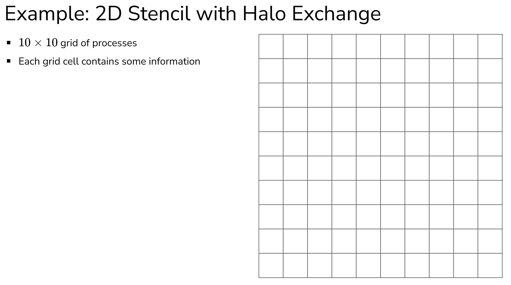

Jeder Punkt enthält einen Wert (z.B. Temperatur)

Die äußeren Punkte haben konstante Werte (z.B. bei der Wärmeleitung: feste Temperaturen am Rand).

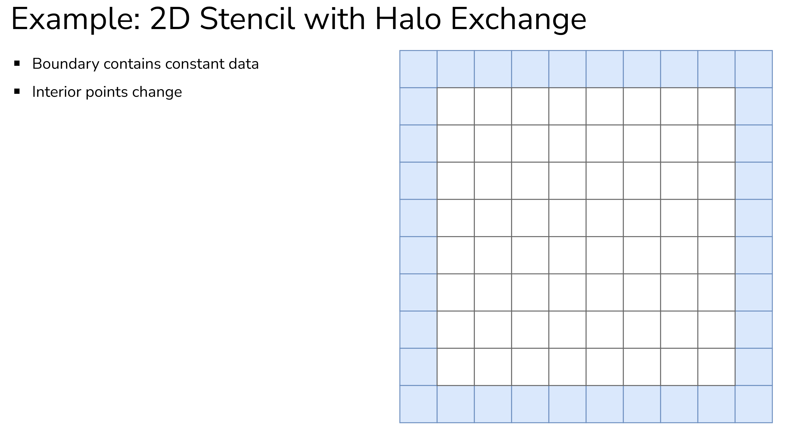

Jeder innere Punkt wird basierend auf seinen **4 Nachbarn** aktualisiert. Man spricht von einem 5-Punkte-Stencil.

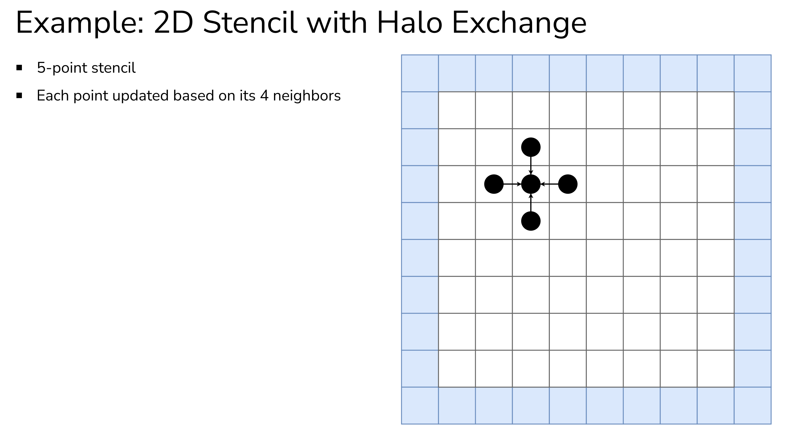

**Formel (z.B. für Wärmeleitung):**
```
neu[i,j] = 0.25 * (alt[i-1,j] + alt[i+1,j] + alt[i,j-1] + alt[i,j+1])
```

Der neue Wert ist der **Durchschnitt** der vier Nachbarn.


##### Domain Decomposition - Aufteilung auf Prozesse

Das Grid wird in **Teilgebiete** (Partitionen) aufgeteilt, die verschiedenen Prozessen zugewiesen werden.
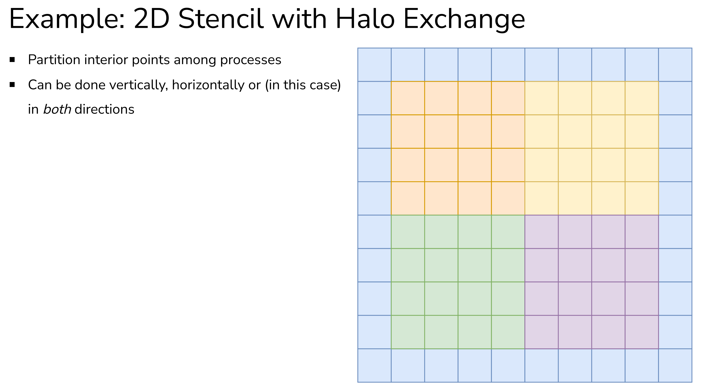

**Mögliche Aufteilungsstrategien:**
- Nur horizontal (Streifen)
- Nur vertikal (Streifen)
- Beides (Blöcke) 

##### Lokale Berechnung - Innere Punkte

Für die **inneren Punkte** einer Partition sind alle Nachbarn lokal verfügbar.

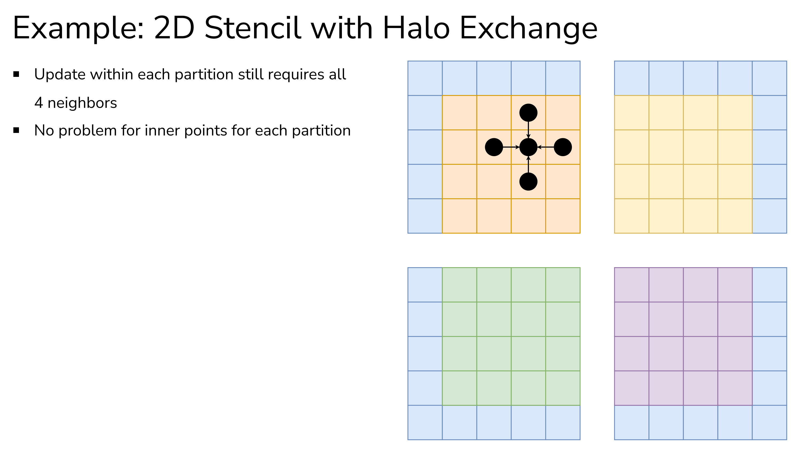

Die inneren Punkte (weit weg von Partitionsgrenzen) können **ohne Kommunikation** berechnet werden. (Ez cheezy)

##### Das Problem an den Partitionsgrenzen

Punkte **an der Grenze** zur nächsten Partition brauchen Daten, die einem anderen Prozess gehören.

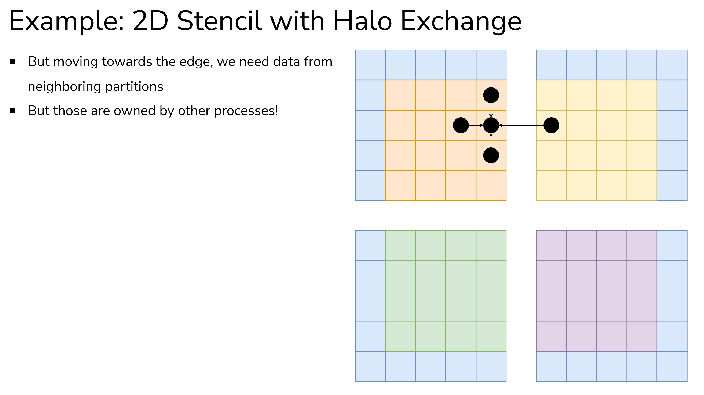

**Problem:** Der Stencil-Operator braucht den Wert von der gelben Partition, dieser liegt aber nicht im Speicher.

##### Die Lösung - Halo-Regionen (Ghost Cells)

Statt für jeden benötigten Nachbarpunkt einzeln zu kommunizieren, tauschen wir **ganze Randstreifen** aus - die sogenannten **Halo-** oder **Ghost-Regionen**.

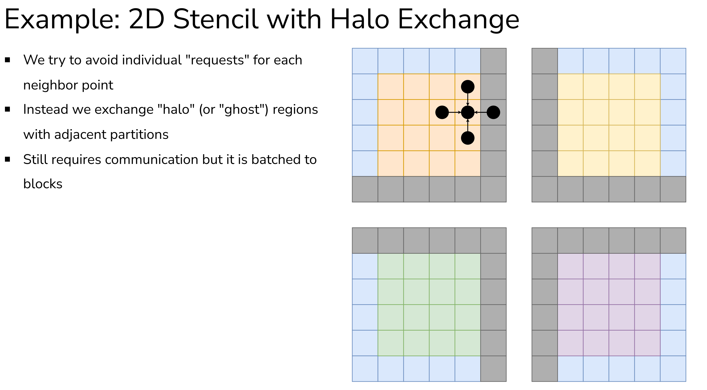

Vorteile
1. **Batch-Kommunikation:** Viele Werte in einem Send/Recv statt vieler einzelner
2. **Einfache Berechnung:** Nach dem Halo-Austausch sind alle Nachbarn lokal verfügbar
3. **Überlappung möglich:** Kommunikation kann mit Berechnung der inneren Punkte überlappt werden

##### Halo-Austausch - Senden der eigenen Randwerte

Jeder Prozess muss:
1. Seine **eigenen Randwerte** an Nachbarn **senden**
2. Die **Randwerte der Nachbarn** in sein Halo **empfangen**

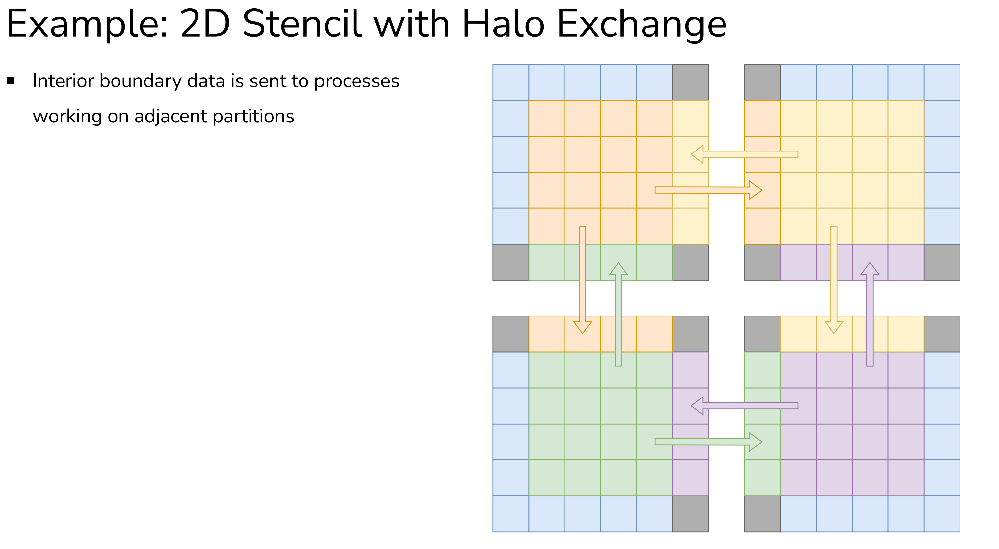
Nach dem Halo-Austausch hat jeder Prozess alle Daten, die er für die Stencil-Berechnung braucht.
Jetzt kann der Stencil komplett lokal berechnet werden.


### 2D-Stencil mit Halo-Austausch - Implementierung

#### Kommunikationsmuster für den Halo-Austausch

Für einen vollständigen Halo-Austausch im 2D-Grid brauchen wir **vier Kommunikationsschritte**:

1. Sende nach "oben", empfange von "unten"
2. Sende nach "unten", empfange von "oben"
3. Sende nach "rechts", empfange von "links"
4. Sende nach "links", empfange von "rechts"

##### Punkt-zu-Punkt-Kommunikation

Wir verwenden `MPI_Sendrecv` für jeden Austausch:

```
Prozess sendet Halo ──────► Nachbar
Prozess empfängt Halo ◄──── Nachbar
```

Woher bekommen wir die Nachbarränge?
1. **Kartesische Topologie erstellen** mit `MPI_Cart_create`
2. **Nachbarn abfragen** mit `MPI_Cart_shift`

#### Kartesischen Kommunikator erstellen

```cpp
// 1. MPI berechnet die optimale Gridgröße
int dims[2] = {0, 0};  // 0 bedeutet: MPI soll entscheiden
MPI_Dims_create(comm_size, 2, dims);
// Bei 12 Prozessen könnte dims = {4, 3} oder {3, 4} sein
```

`MPI_Dims_create` verteilt `comm_size` Prozesse möglichst gleichmäßig auf ein 2D-Grid.

```cpp
// 2. Erstelle die kartesische Topologie
int periods[2] = {0, 0};  // Keine periodischen Ränder
MPI_Comm grid_comm;
MPI_Cart_create(
    MPI_COMM_WORLD,
    2,              // 2 Dimensionen
    dims,           // Größe jeder Dimension
    periods,        // Periodizität
    1,              // reorder = true (MPI darf Ränge optimieren)
    &grid_comm
);
```

- `periods = {0, 0}`: Kein Wrap-around an den Rändern
  - Am Rand gibt es keine Nachbarn (wichtig für Randbedingungen)
- `reorder = 1`: MPI darf die Prozesse umsortieren
  - Ermöglicht bessere Zuordnung zur Hardware-Topologie
  - Kann die Performance verbessern

```cpp
// 3. Hole den neuen Rang im Grid-Kommunikator
MPI_Comm_rank(grid_comm, &rank_in_grid);
```
Nach `MPI_Cart_create` mit `reorder=1` kann sich der Rang ändern! Deshalb müssen wir den neuen Rang abfragen.

#### Lokale Gridgröße für jeden Prozess berechnen
Jeder Prozess muss wissen:
- Welchen Teil des globalen Grids er bearbeitet
- Die Koordinaten `(x0, y0)` bis `(x1, y1)` seines Teilgebiets

```cpp
// 1. Hole die eigenen Koordinaten im Prozessgrid
int coords[2];
MPI_Cart_coords(
    grid_comm,  // Der kartesische Kommunikator
    rank,       // Mein Rang
    2,          // Anzahl Dimensionen
    coords      // Ausgabe: meine Koordinaten
);
// coords[0] = meine Zeile im Prozessgrid
// coords[1] = meine Spalte im Prozessgrid
```

**Beispiel:** Bei einem 4×3 Prozessgrid hat Rang 5:
```
     Spalte 0  Spalte 1  Spalte 2
Zeile 0:  P0       P1       P2
Zeile 1:  P3       P4      [P5] ← coords = {1, 2}
Zeile 2:  P6       P7       P8
Zeile 3:  P9       P10      P11
```

```cpp
// 2. Berechne die lokale Gridgröße
int local_nx = NX / dims[0];  // Spalten pro Prozess
int local_ny = NY / dims[1];  // Zeilen pro Prozess

// 3. Berechne die globalen Indizes meines Teilgebiets
int x0 = coords[0] * local_nx;  // Startindex x
int y0 = coords[1] * local_ny;  // Startindex y
int x1 = x0 + local_nx;         // Endindex x (exklusiv)
int y1 = y0 + local_ny;         // Endindex y (exklusiv)
```

```
Globales Grid (NX=8, NY=6):        Aufteilung auf 2×2 Prozesse:

┌─────────────────────────────┐      ┌──────────────┬──────────────┐
│ 0,0  1,0  2,0  3,0  4,0 ... │      │     P0       │     P1       │
│ 0,1  1,1  2,1  3,1  4,1 ... │      │  x: 0-3      │  x: 4-7      │
│ 0,2  1,2  2,2  3,2  4,2 ... │      │  y: 0-2      │  y: 0-2      │
│ 0,3  1,3  2,3  3,3  4,3 ... │      ├──────────────┼──────────────┤
│ 0,4  1,4  2,4  3,4  4,4 ... │      │     P2       │     P3       │
│ 0,5  1,5  2,5  3,5  4,5 ... │      │  x: 0-3      │  x: 4-7      │
└─────────────────────────────┘      │  y: 3-5      │  y: 3-5      │
                                     └──────────────┴──────────────┘

Für P0: x0=0, y0=0, x1=4, y1=3
        local_nx=4, local_ny=3
```

#### Nachbarränge ermitteln

Für den Halo-Austausch braucht jeder Prozess die Ränge seiner vier Nachbarn:
- `left` (links)
- `right` (rechts)
- `up` (oben)
- `down` (unten)

Die Anwendung von `MPI_Cart_shift`
```cpp
int left, right, up, down;

// Horizontale Nachbarn (direction = 0)
MPI_Cart_shift(
    grid_comm,
    0,              // direction: erste Dimension (x)
    1,              // displacement: +1 = vorwärts
    &left,          // Quelle bei negativer Verschiebung
    &right          // Ziel bei positiver Verschiebung
);

// Vertikale Nachbarn (direction = 1)
MPI_Cart_shift(
    grid_comm,
    1,              // direction: zweite Dimension (y)
    1,              // displacement: +1 = vorwärts
    &up,            // Quelle bei negativer Verschiebung
    &down           // Ziel bei positiver Verschiebung
);
```
Die Rückgabwerte bedeuten:
```
MPI_Cart_shift(comm, direction, 1, &source, &dest):

source = Nachbar in negativer Richtung
dest   = Nachbar in positiver Richtung
```

Wenn es keinen Nachbarn gibt (bei nicht-periodischer Topologie), wird `MPI_PROC_NULL` zurückgegeben.

#### Lokales Grid um Halo-Regionen erweitern

Bisher haben wir nur die Größe des **eigenen Datenbereichs** berechnet. Aber wir brauchen zusätzlichen Platz für die **Halo-Zellen** - die Kopien der Randwerte unserer Nachbarn. Prozesse am **Rand des globalen Grids** haben nicht in alle Richtungen Nachbarn, deswegen die Prüfung auf `MPI_PROC_NULL`

```cpp
// Erweitere das lokale Grid, wenn es einen Nachbarn gibt
if (left != MPI_PROC_NULL)  x0 -= 1;  // Platz für linkes Halo
if (right != MPI_PROC_NULL) x1 += 1;  // Platz für rechtes Halo
if (up != MPI_PROC_NULL)    y0 -= 1;  // Platz für oberes Halo
if (down != MPI_PROC_NULL)  y1 += 1;  // Platz für unteres Halo

// Tatsächliche lokale Gridgrößen (mit Halo)
local_nx = x1 - x0 + 1;
local_ny = y1 - y0 + 1;
```

#### Speicher für das lokale Grid allokieren

Wir wollen:
1. **Zusammenhängenden Speicher** (für effiziente MPI-Kommunikation)
2. **Bequemen 2D-Zugriff** mit `rows[x][y]`

```cpp
// 1. Array von Zeigern für Spalten-Zugriff
double** rows = new double*[local_nx];

// 2. Zusammenhängender Speicherblock für alle Daten
rows[0] = new double[local_nx * local_ny];

// 3. Setze die Zeiger auf die entsprechenden Positionen
for (int i = 1; i < local_nx; i++) {
    rows[i] = &rows[0][i * local_ny];
}
```

Jetzt können wir bequem zugreifen:
```cpp
// Zugriff auf Element (x, y):
double value = rows[x][y];

// Das ist äquivalent zu:
double value = rows[0][x * local_ny + y];
```

#### Datentypen für X- und Y-Halos erstellen

Wir müssen **Zeilen** (x-Halos) und **Spalten** (y-Halos) übertragen. Diese haben unterschiedliche Speicherlayouts.

```
Speicherlayout (rows[x][y], y ist zusammenhängend):

rows[0]: [0,0][0,1][0,2][0,3]    ← Spalte 0 (zusammenhängend)
rows[1]: [1,0][1,1][1,2][1,3]    ← Spalte 1 (zusammenhängend)
rows[2]: [2,0][2,1][2,2][2,3]    ← Spalte 2 (zusammenhängend)
rows[3]: [3,0][3,1][3,2][3,3]    ← Spalte 3 (zusammenhängend)

Eine Zeile (y=1): [0,1], [1,1], [2,1], [3,1] ← NICHT zusammenhängend :(
```

##### X-Halo (eine Zeile) - Gestridet

```cpp
MPI_Datatype x_halo_type;

MPI_Type_vector(
    local_nx,       // Anzahl der Elemente in der Zeile
    1,              // Ein Element pro Block
    local_ny,       // Stride: Abstand zum nächsten Element
    MPI_DOUBLE,
    &x_halo_type
);
```
- Wir wollen `local_nx` Elemente
- Jedes Element ist ein einzelner `double` (blocklength = 1)
- Die Elemente liegen `local_ny` Positionen auseinander

```
Speicher: [0,0][0,1][0,2][0,3][1,0][1,1][1,2][1,3][2,0][2,1]...
             ↑                 ↑                   ↑
          Element 0         Element 1           Element 2
          
          ←--- local_ny=4 ---→ (stride)
```

##### Y-Halo (eine Spalte) - Zusammenhängend

```cpp
MPI_Datatype y_halo_type;

MPI_Type_vector(
    local_ny,       // Anzahl der Elemente in der Spalte
    1,              // Ein Element pro Block
    1,              // Stride = 1 (zusammenhängend!)
    MPI_DOUBLE,
    &y_halo_type
);
```

- Wir wollen `local_ny` Elemente
- Sie liegen direkt hintereinander (stride = 1)

```
Speicher: [0,0][0,1][0,2][0,3][1,0]...
             ↑    ↑    ↑    ↑
          Element 0,1,2,3 (zusammenhängend)
```

Da die Elemente zusammenhängend sind, könnte man auch `MPI_Type_contiguous` verwenden.

```cpp
MPI_Type_contiguous(local_ny, MPI_DOUBLE, &y_halo_type);
```

```cpp
MPI_Type_commit(&x_halo_type);
MPI_Type_commit(&y_halo_type);
```

##### Halo-Austausch - Ausgangszustand

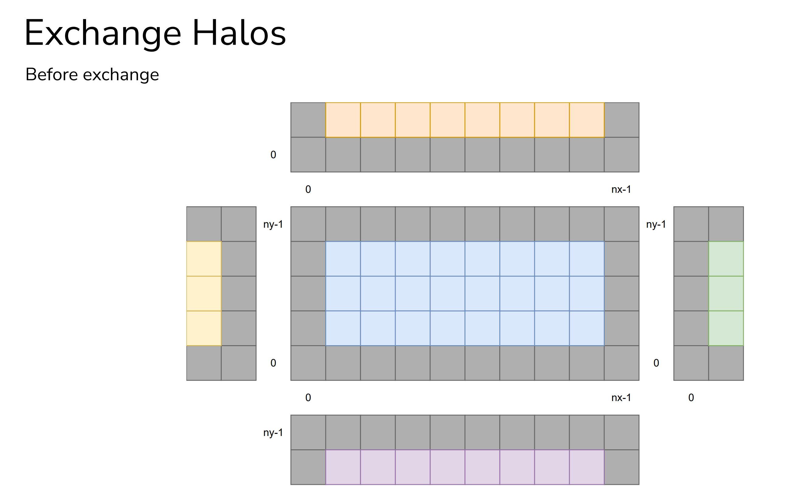

##### Halo-Austausch - Sende nach oben, empfange von unten

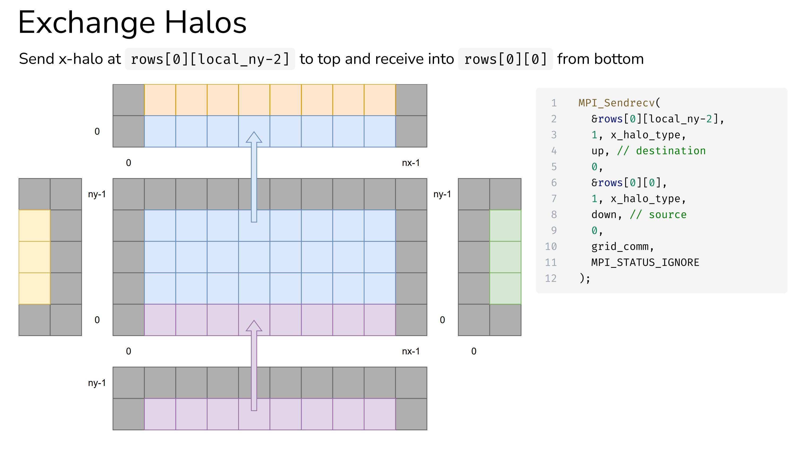

```cpp
MPI_Sendrecv(
    &rows[0][local_ny-2],    // Sendeadresse: vorletzte Zeile
    1, x_halo_type,          // Sende 1 x-Halo (eine Zeile)
    up,                      // Ziel: Nachbar oben
    0,                       // Tag
    &rows[0][0],             // Empfangsadresse: erste Zeile (Halo)
    1, x_halo_type,          // Empfange 1 x-Halo
    down,                    // Quelle: Nachbar unten
    0,                       // Tag
    grid_comm,
    MPI_STATUS_IGNORE
);
```

- `rows[0]` ist die erste Spalte
- `[local_ny-2]` ist die **vorletzte** Zeile (die letzte eigene Datenzeile)
- Die **letzte** Zeile `[local_ny-1]` ist das Halo (für Daten von unten)

##### Halo-Austausch - Sende nach unten, empfange von oben


```cpp
MPI_Sendrecv(
    &rows[0][1],             // Sendeadresse: zweite Zeile (erste eigene)
    1, x_halo_type,
    down,                    // Ziel: Nachbar unten
    0,
    &rows[0][local_ny-1],    // Empfangsadresse: letzte Zeile (Halo)
    1, x_halo_type,
    up,                      // Quelle: Nachbar oben
    0,
    grid_comm,
    MPI_STATUS_IGNORE
);
```

- Zeile `[0]` ist das Halo (für Daten von oben)
- Zeile `[1]` ist die **erste eigene Datenzeile**

##### Halo-Austausch - Sende nach rechts, empfange von links

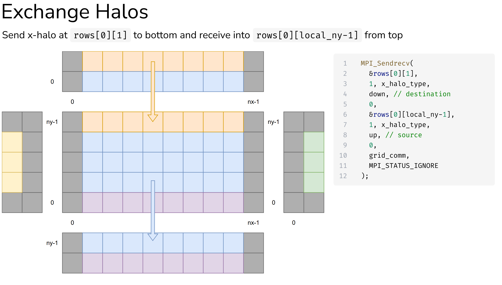

```cpp
MPI_Sendrecv(
    &rows[local_nx-2][0],    // Sendeadresse: vorletzte Spalte
    1, y_halo_type,          // Sende 1 y-Halo (eine Spalte)
    right,                   // Ziel: Nachbar rechts
    0,
    &rows[0][0],             // Empfangsadresse: erste Spalte (Halo)
    1, y_halo_type,
    left,                    // Quelle: Nachbar links
    0,
    grid_comm,
    MPI_STATUS_IGNORE
);
```

##### Halo-Austausch - Sende nach links, empfange von rechts

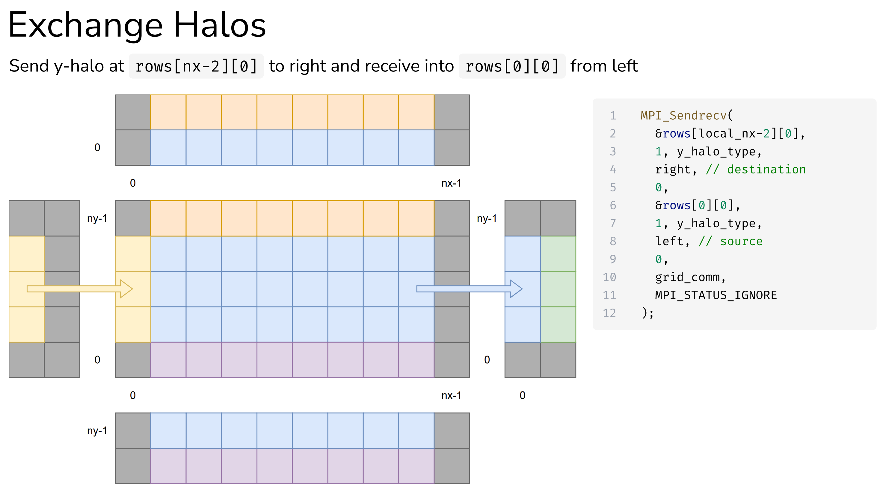

```cpp
MPI_Sendrecv(
    &rows[1][0],             // Sendeadresse: zweite Spalte (erste eigene)
    1, y_halo_type,
    left,                    // Ziel: Nachbar links
    0,
    &rows[local_nx-1][0],    // Empfangsadresse: letzte Spalte (Halo)
    1, y_halo_type,
    right,                   // Quelle: Nachbar rechts
    0,
    grid_comm,
    MPI_STATUS_IGNORE
);
```

##### Halo-Austausch - Ergebnis

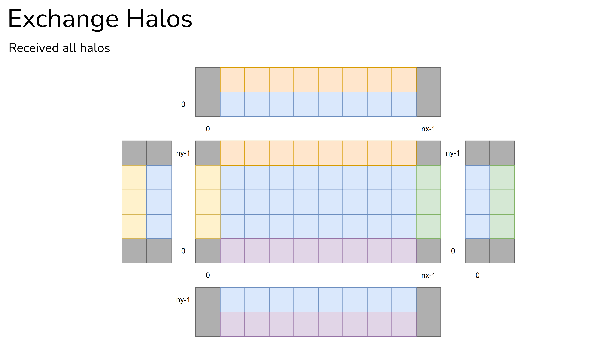

Jetzt kann der Stencil-Operator lokal berechnet werden.

```cpp
// Stencil-Update (5-Punkte-Stencil)
for (int x = 1; x < local_nx - 1; x++) {
    for (int y = 1; y < local_ny - 1; y++) {
        new_rows[x][y] = 0.25 * (
            rows[x-1][y] +    // links
            rows[x+1][y] +    // rechts
            rows[x][y-1] +    // oben
            rows[x][y+1]      // unten
        );
    }
}
```

Alle Nachbarn sind lokal verfügbar - keine weitere Kommunikation nötig.

#### Halo Zusammenfassung

```cpp
// 1. Sende nach oben, empfange von unten
MPI_Sendrecv(
    &rows[0][local_ny-2], 1, x_halo_type, up, 0,
    &rows[0][0], 1, x_halo_type, down, 0,
    grid_comm, MPI_STATUS_IGNORE);

// 2. Sende nach unten, empfange von oben
MPI_Sendrecv(
    &rows[0][1], 1, x_halo_type, down, 0,
    &rows[0][local_ny-1], 1, x_halo_type, up, 0,
    grid_comm, MPI_STATUS_IGNORE);

// 3. Sende nach rechts, empfange von links
MPI_Sendrecv(
    &rows[local_nx-2][0], 1, y_halo_type, right, 0,
    &rows[0][0], 1, y_halo_type, left, 0,
    grid_comm, MPI_STATUS_IGNORE);

// 4. Sende nach links, empfange von rechts
MPI_Sendrecv(
    &rows[1][0], 1, y_halo_type, left, 0,
    &rows[local_nx-1][0], 1, y_halo_type, right, 0,
    grid_comm, MPI_STATUS_IGNORE);
```

| Richtung | Senden von | Empfangen in |
|----------|------------|--------------|
| Nach oben | `rows[0][local_ny-2]` (vorletzte Zeile) | `rows[0][0]` (erste Zeile) |
| Nach unten | `rows[0][1]` (zweite Zeile) | `rows[0][local_ny-1]` (letzte Zeile) |
| Nach rechts | `rows[local_nx-2][0]` (vorletzte Spalte) | `rows[0][0]` (erste Spalte) |
| Nach links | `rows[1][0]` (zweite Spalte) | `rows[local_nx-1][0]` (letzte Spalte)  |

##### Wie mit fehlenden Nachbarn umgehen?

Am Rand des globalen Grids gibt es nicht in alle Richtungen Nachbarn.

Wenn `MPI_Cart_shift` keinen Nachbarn findet, gibt es `MPI_PROC_NULL` zurück.

- Senden an `MPI_PROC_NULL` hat **keine Wirkung** (kein Fehler, nice)
- Empfangen von `MPI_PROC_NULL` hat **keine Wirkung** (kein Fehler, noice)

```cpp
// Dieser Code funktioniert auch am Rand
MPI_Sendrecv(
    &rows[0][local_ny-2], 1, x_halo_type,
    up,    // Könnte MPI_PROC_NULL sein → kein Send
    0,
    &rows[0][0], 1, x_halo_type,
    down,  // Könnte MPI_PROC_NULL sein → kein Recv
    0,
    grid_comm, MPI_STATUS_IGNORE
);
```

Es ist keine spezielle Behandlung notwendig. Der gleiche Code funktioniert für alle Prozesse - egal ob sie am Rand sind oder nicht. Das macht den Code viel einfacher.
