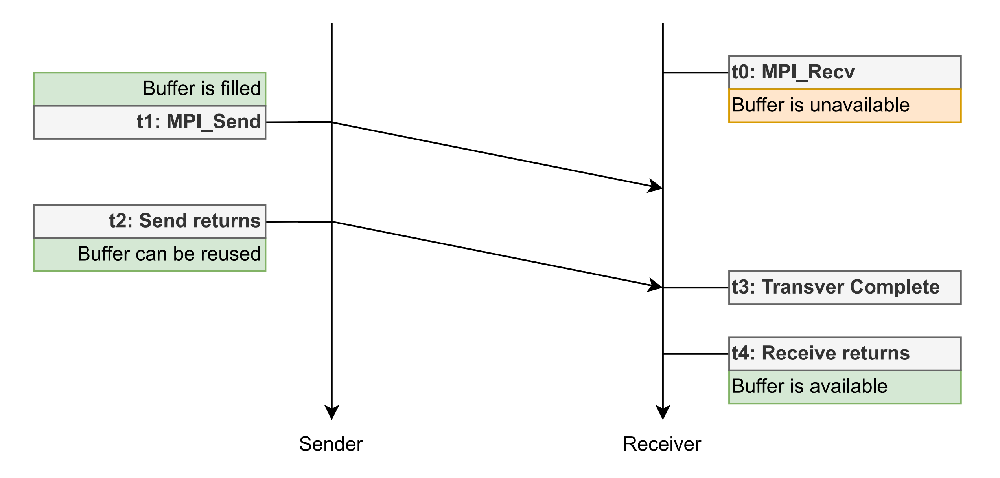
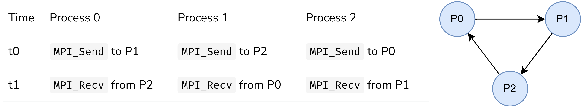
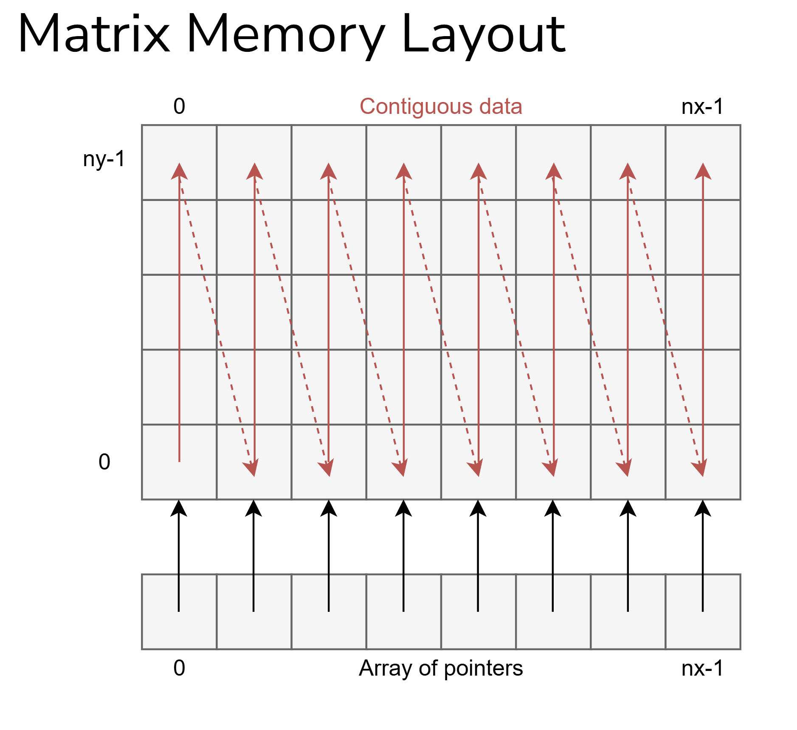

# MPI für Fortgeschrittene (und die, die es noch werden wollen)

## Fortgeschrittene Punkt-zu-Punkt-Kommunikation in MPI

Hier geht es um fortgeschrittene Punkt-zu-Punkt-Kommunikation in MPI, insbesondere verschiedene Kommunikationsmodi, kombiniertes Senden/Empfangen und nicht-blockierende Kommunikation.

### Sicherheit in MPI-Programmen

**Das Problem:** Betrachte folgenden Code:

| Zeit | Prozess 0 | Prozess 1 |
| --- | --- | --- |
| t0 | Send an P1, tag = 0 | - |
| t1 | Send an P1, tag = 1 | - |
| t2 | - | Recv von P0, tag = 1 |
| t3 | - | Recv von P0, tag = 0 |

**Erklärung:** P0 sendet zwei Nachrichten, aber P1 empfängt sie in umgekehrter Reihenfolge. Das System muss die erste Nachricht zwischenspeichern (puffern), bis P1 bereit ist, sie zu empfangen.

- Wenn kein Puffer verfügbar ist → Deadlock 
- Programme, die sich auf Systempufferung verlassen, sind unsicher

### Blockierende Kommunikation

Blockierend heißt in dem Kontext: Die Funktion kehrt erst zurück, wenn eine bestimmte Bedingung erfüllt ist.
- `MPI_Send` blockiert bis: Der Sendepuffer wiederverwendet werden kann
- `MPI_Recv` blockiert bis: Die Nachricht vollständig empfangen wurde



Wichtiger Unterschied: 
"Sendepuffer kann wiederverwendet werden" bedeutet nicht zwangsläufig, dass die Nachricht schon angekommen ist!

```
Dein Puffer → [MPI interner Puffer] → Netzwerk → Empfänger
              ↑
              Nach dieser Kopie kehrt Send zurück, auch wenn die Nachricht noch unterwegs ist
```

### Buffered Send mit `MPI_Bsend`


Statt sich auf den internen MPI-Puffer zu verlassen (der vielleicht nicht existiert), stellt man explizit einen Puffer bereit.

```cpp
// 1. Berechne die Puffergröße
//    Für jede Nachricht: Nachrichtengröße + Overhead
int bufsize = 2 * (100 + MPI_BSEND_OVERHEAD);
//            ↑     ↑           ↑
//            |     |           MPI braucht etwas Platz für Verwaltungsdaten
//            |     Nachrichtengröße (100 chars)
//            Anzahl der Nachrichten

// 2. Puffer anlegen
char* buffer = new char[bufsize];

// 3. Puffer bei MPI registrieren
MPI_Buffer_attach(buffer, bufsize);

// 4. Jetzt kann gepuffert gesendet werden
MPI_Bsend(data0, 100, MPI_CHAR, 1, 0, MPI_COMM_WORLD);
MPI_Bsend(data1, 100, MPI_CHAR, 1, 1, MPI_COMM_WORLD);
// Diese Aufrufe kehren SOFORT zurück, nachdem die Daten
// in den Puffer kopiert wurden

// 5. Am Ende: Puffer freigeben
//    Dies blockiert, bis alle Sends abgeschlossen sind!
MPI_Buffer_detach(&detached, &size);
delete[] detached;
```

Das bringt Vorteile:
- Explizite Kontrolle über Buffering
- Vermeidet Deadlocks, die durch fehlende interne Buffer entstehen
- Send kehrt schnell zurück (gut für kleine Nachrichten)

Wo viel Licht ist, ist viel Schatten:
- Man muss den Buffer selbst verwalten (fehleranfällig!)
- Extra Kopiervorgang: Deine Daten → Buffer → Netzwerk
- Bei großen Nachrichten wird die zusätzliche Kopie zum Bottleneck

Fleck Philiip sagt: **"Nicht verwenden"**
1. Kompliziert und fehleranfällig
2. Es gibt bessere Alternativen (nicht-blockierende Kommunikation)
3. Die Performance-Vorteile sind meist marginal

### Die vier Kommunikationsmodi im Detail

MPI bietet vier verschiedene Arten, eine Nachricht zu senden.

#### Standard-Modus: `MPI_Send`
```cpp
MPI_Send(buf, count, type, dest, tag, comm);
```

Verhalten: MPI entscheidet selbst, was am besten ist
- Kleine Nachrichten: Werden meist gepuffert (schnelle Rückkehr)
- Große Nachrichten: Werden synchron gesendet (wartet auf Empfänger)

**Vorteil:** Einfach zu benutzen, MPI optimiert automatisch

**Nachteil:** Verhalten ist nicht vorhersagbar (implementierungsabhängig)

#### Synchroner Modus: `MPI_Ssend`
```cpp
MPI_Ssend(buf, count, type, dest, tag, comm);
```
Verhalten: Wartet, bis der Empfänger sein `MPI_Recv` aufgerufen hat.

```
Sender                              Empfänger
   |                                    |
MPI_Ssend()                             |
   | (wartet...)                        |
   |                              MPI_Recv()
   | ←-- "Empfänger ist bereit" ---     |
   |                                    |
   | ------ Daten übertragen -----→     |
   |                                    |
kehrt zurück                      kehrt zurück
```

Wenn du sicherstellen willst, dass Sender und Empfänger synchronisiert sind

#### Gepufferter Modus: `MPI_Bsend`
```cpp
MPI_Bsend(buf, count, type, dest, tag, comm);
```
Funktionsweise wurde schon erklärt. Verwendet den manuell definierten Buffer und kehrt nach dem Kopieren der Daten in den Buffer zurück. Am besten nicht verwenden. 

#### Ready-Modus: `MPI_Rsend`
```cpp
MPI_Rsend(buf, count, type, dest, tag, comm);
```

Verhalten: Der Sender **nimmt an**, dass der Empfänger bereits wartet.
Wenn der Empfänger noch nicht bereit ist → **undefiniertes Verhalten!**

#### Allgemein gültig.
All diese (blocking) Modi garantieren, das nach dem Retounieren des Send-Calls der Send-Buffer sicher wiederverwendet werden kann. Verwende `MPI_Ssend` für Synchronisation und sonst `MPI_Send` (MPI soll entscheiden ob buffern oder nicht.) Verwende nicht `MPI_Bsend` oder `MPI_Rsend`. Programmiere so, als wären alle Sends synchron.

### Das Ring-Deadlock-Problem



Jeder Prozess will an seinen Nachbarn senden und von seinem anderen Nachbarn empfangen:
Nehmen wir an, alle Sends sind synchron (warten auf den Empfänger):

1. **P0** ruft `Send` an P1 auf → wartet, bis P1 empfängt
2. **P1** ruft `Send` an P2 auf → wartet, bis P2 empfängt
3. **P2** ruft `Send` an P0 auf → wartet, bis P0 empfängt

**Aber:** Keiner ruft je `Recv` auf, weil alle beim `Send` festhängen!

```
P0: "Ich warte auf P1..."
P1: "Ich warte auf P2..."
P2: "Ich warte auf P0..."
```

→ Zyklische Abhängigkeit = Deadlock

Es gibt 2 Lösungen:

1. Lösung mit `MPI_Sendrecv`
- Kombiniert Send und Receive in einem Aufruf
- MPI kümmert sich intern um die richtige Reihenfolge

2. Lösung mit nicht-blockierende Kommunikation
- Startet Send/Receive, ohne zu blockieren
- Wartet später auf Abschluss

### 1. Lösung mit `MPI_Sendrecv`
Statt getrennt zu senden und zu empfangen, macht man beides **gleichzeitig**.
Es ist wichtig zu begreifen, das beide Operationen "gleichzeitig" passieren. https://stackoverflow.com/questions/11018175/how-does-the-mpi-sendrecv-work


```cpp
MPI_Sendrecv(
    sendbuf, sendcount, sendtype, dest, sendtag,      // Was senden, wohin
    recvbuf, recvcount, recvtype, source, recvtag,    // Was empfangen, woher
    comm, &status
);
```
```cpp
int rank, comm_size;
MPI_Comm_rank(MPI_COMM_WORLD, &rank);
MPI_Comm_size(MPI_COMM_WORLD, &comm_size);

int send_data = rank;        // Jeder sendet seinen eigenen Rang
int recv_data;

// Berechne Nachbarn im Ring
int right_neighbor = (rank + 1) % comm_size;
int left_neighbor  = (rank - 1 + comm_size) % comm_size;
//                           ↑
//                   +comm_size verhindert negative Zahlen
//                   (z.B. wenn rank=0)

// Sende nach rechts, empfange von links
MPI_Sendrecv(
    &send_data, 1, MPI_INT, right_neighbor, 0,    // Senden
    &recv_data, 1, MPI_INT, left_neighbor, 0,     // Empfangen
    MPI_COMM_WORLD, MPI_STATUS_IGNORE
);
```

### Nicht-blockierende Kommunikation
Bei **blockierender** Kommunikation wartet der Prozess, bis die Operation abgeschlossen ist.
Bei **nicht-blockierender** Kommunikation kehrt die Funktion **sofort** zurück.

```
MPI_Isend() → kehrt sofort zurück
             |
             | Prozess kann andere Arbeit erledigen
             | (Berechnung, andere Kommunikation, ...)
             |
MPI_Wait() ──┘ Wartet auf Abschluss
```

Nicht-blockierende Operationen geben einen Request-Handle zurück – ein "Makerl", mit dem du später den Status abfragen kannst.

```cpp
MPI_Request request;  // Das "Makerl"

// Starte das Senden (kehrt sofort zurück)
MPI_Isend(buffer, count, type, dest, tag, comm, &request);

// ... hier kannst du andere Dinge tun ...

// Warte auf Abschluss
MPI_Wait(&request, &status);

// Jetzt ist das Senden garantiert abgeschlossen
```

**Wichtig:** Zwischen `MPI_Isend` und `MPI_Wait` darf man den Sendepuffer NICHT verändern.

```
MPI_Isend(buffer, ...);

buffer[0] = 67;  // FEHLER! Undefiniertes Verhalten

MPI_Wait(&request, ...);

buffer[0] = 67;  // hier ist es sicher
```
```cpp
// Das hier...
MPI_Isend(buf, count, type, dest, tag, comm, &request);
MPI_Wait(&request, &status);

// ...ist funktional identisch zu:
MPI_Send(buf, count, type, dest, tag, comm);
```

Der Unterschied: Zwischen `Isend` und `Wait` kann man andere Arbeit erledigen.

### 2. Lösung für das Ringproblme mit nicht-blockierender Kommunikation
```cpp
MPI_Request send_request, recv_request;

// Starte beide Operationen (kehren sofort zurück)
MPI_Isend(&send_data, 1, MPI_INT, right_neighbor, 0, comm, &send_request);
MPI_Irecv(&recv_data, 1, MPI_INT, left_neighbor, 0, comm, &recv_request);

// Jetzt warte auf beide
MPI_Wait(&send_request, MPI_STATUS_IGNORE);
MPI_Wait(&recv_request, MPI_STATUS_IGNORE);
```
- `Isend` und `Irecv` blockieren nicht
- Beide Operationen werden initiiert
- Erst dann wird gewartet
- MPI kann die Operationen in beliebiger Reihenfolge abschließen → kein Deadlock

### Übersicht der nicht-blockierenden Funktionen

| Blockierend | Nicht-blockierend | Beschreibung |
| --- | --- | --- |
| `MPI_Send` | `MPI_Isend` | Standard-Senden |
| `MPI_Ssend` | `MPI_Issend` | Synchrones Senden |
| `MPI_Bsend` | `MPI_Ibsend` | Gepuffertes Senden |
| `MPI_Rsend` | `MPI_Irsend` | Ready-Senden |
| `MPI_Recv` | `MPI_Irecv` |  Empfangen|

Auch kollektive Operationen haben nicht-blockierende Versionen:
- `MPI_Ibcast` (Broadcast)
- `MPI_Ireduce` (Reduce)
- `MPI_Ialltoall` (All-to-All)
- usw. 

#### Funktionen zum Warten und Testen

Warten = **blockierend**

| Funktion | Beschreibung |
| --- | --- |
| `MPI_Wait(&request, &status)` | Wartet auf EINEN Request |
| `MPI_Waitall(count, requests[], statuses[])` | Wartet auf ALLE Requests |
| `MPI_Waitany(count, requests[], &index, &status)` | Wartet auf IRGENDEINEN Request |
| `MPI_Waitsome(count, requests[], &outcount, indices[], statuses[])` |  Wartet auf MINDESTENS EINEN |

Beispiel mit mehren Requests:

```cpp
MPI_Request requests[4];
MPI_Status statuses[4];

// Starte 4 nicht-blockierende Operationen
MPI_Isend(buf0, ..., &requests[0]);
MPI_Isend(buf1, ..., &requests[1]);
MPI_Irecv(buf2, ..., &requests[2]);
MPI_Irecv(buf3, ..., &requests[3]);

// Warte auf alle 4
MPI_Waitall(4, requests, statuses);
```

Testen = **nicht blockierend**

| Funktion | Beschreibung |
| --- | --- |
| `MPI_Test(&request, &flag, &status)` | Prüft EINEN Request  |
| `MPI_Testall(...)` | Prüft, ob ALLE fertig sind |
| `MPI_Testany(...)` | Prüft, ob IRGENDEINER fertig ist  |
| `MPI_Testsome(...)` | Gibt zurück, welche fertig sind |

### Maxls Empfehlung

1. Safety first
- Nimm immer an, dass Sends synchron sind
- Verlasse dich nie auf interne Pufferung
2. Vermeide Deadlocks durch
- `MPI_Sendrecv` für einfache Austausch-Muster
- icht-blockierende Kommunikation für komplexere Fälle
3. Wähle den richtigen Modus
- `MPI_Send`: Standardfall, MPI optimiert
- `MPI_Ssend`: Wenn Synchronisation gewünscht ist
- `MPI_Bsend`/`MPI_Rsend`: Hau weg den Dreck
4. Nutze nicht-blockierende Kommunikation für
- Überlappung von Berechnung und Kommunikation
- Komplexe Kommunikationsmuster
- Bessere Performance

## Abgeleitete Datentypen

Hier geht es um abgeleitete Datentypen (Derived Datatypes) – ein mächtiges Werkzeug in MPI, um komplexere Datenstrukturen effizient zu übertragen.

### Eingebaute Datentypen

MPI kennt viele grundlegende Datentypen, die direkt den C/C++-Typen entsprechen.

| MPI-Typ | C/C++-Typ |
| --- | --- |
| `MPI_INT` | `int` |
| `MPI_FLOAT` | `float` |
| `MPI_DOUBLE` | `double` |
| `MPI_CHAR` | `char` |
| `MPI_LONG` | `long` |
| `MPI_UNSIGNED` | `unsigned int` |
| ... | ... |

Diese Standardtypen funktionieren gut, wenn die Daten zusammenhängend (contiguous) im Speicher liegen.

```cpp
// Einfaches Array - zusammenhängend im Speicher
double data[100];
MPI_Send(data, 100, MPI_DOUBLE, dest, tag, comm);  // Funktioniert perfekt!
```

#### Das Problem

Komplizierter wird es jedoch bei:
- Strukturen (Structs) mit verschiedenen Datentypen:
```cpp
struct Particle {
    double x, y, z;      // Position
    double vx, vy, vz;   // Geschwindigkeit
    int id;              // Identifikator
};
```
- **Nicht-zusammenhängende Daten** wie Spalten einer Matrix:
```
Matrix im Speicher (zeilenweise):
[a00][a01][a02][a10][a11][a12][a20][a21][a22]

Spalte 0: a00, a10, a20 - also nicht zusammenhängend
```

- Generell Teile von Arrays mit regelmäßigen Abständen:
```cpp
// Jedes zweite Element
array[0], array[2], array[4], ...
```

#### Die Lösung Abgeleitete Datentypen

MPI erlaubt es, **eigene Datentypen zu definieren**, die beschreiben:
- Welche Basistypen enthalten sind
- Wo sie im Speicher liegen (Abstände/Offsets)
- Wie viele Elemente es gibt

### Typemaps – Die Beschreibung abgeleiteter Typen

Eine **Typemap** ist eine Sequenz von Paaren, die einen abgeleiteten Typ vollständig beschreibt.

Pseudocode:
```
Typemap = [ (Basistyp₁, Offset₁), (Basistyp₂, Offset₂), ... ]
```

Jedes Paar enthält:
- Basistyp: Ein MPI-Datentyp (z.B. `MPI_DOUBLE`, `MPI_INT`)
- Displacement (Offset): Position in Bytes relativ zum Anfang

```cpp
struct MyStruct {
    double value;   // 8 Bytes, beginnt bei Offset 0
    char flag;      // 1 Byte, beginnt bei Offset 8
};
```

Die Typemap dafür:
```
[
    (MPI_DOUBLE, 0),   // double bei Byte 0
    (MPI_CHAR, 8)      // char bei Byte 8
]
```

Wenn man ein Array von Structs hat, wird es komplizierter.

```cpp
MyStruct array[10];
```

**Problem:** Wegen **Padding** (Auffüllung) kann die Struktur größer sein als die Summe ihrer Teile. Der Compiler fügt Padding ein, damit das nächste Element wieder an einer 8-Byte-Grenze beginnt (Alignment). 

```
Byte:    0  1  2  3  4  5  6  7  8  9 10 11 12 13 14 15 16 ...
         ├──────────────────────┼──┼─────────────────────┤
         │      double          │c │      Padding        │
         └──────────────────────┴──┴─────────────────────┘
         ←-------------- 16 Bytes (sizeof) --------------→
```

Fleck Philipp empfiehlt:
- Berechne echte Offsets mit `MPI_Get_address`
- Erstelle den Typ mit `MPI_Type_create_struct`
- Setze das Extent korrekt mit `MPI_Type_create_resized` auf `sizeof(struct)`

Dadurch werden Arrays von Structs korrekt behandelt.

### Hilfsfunktionen für abgeleitete Datentypen
MPI bietet verschiedene Funktionen, um abgeleitete Typen zu erstellen.

| Funktion | Verwendung |
| --- | --- |
| `MPI_Type_contiguous` | Zusammenhängende Blöcke gleicher Elemente  |
| `MPI_Type_vector` | Regelmäßig verteilte Blöcke (mit konstantem Abstand)  |
| `MPI_Type_indexed` | Blöcke mit beliebigen Abständen  |
| `MPI_Type_create_struct` | Kombination verschiedener Datentypen  |

Jeder abgeleitete Datentyp muss in vier Schritten erstellt werden.

```cpp
// 1. DEFINIEREN: Beschreibe den neuen Typ
MPI_Datatype my_type;
MPI_Type_vector(..., &my_type);  // oder andere Konstruktor-Funktion

// 2. COMMITTEN: Mache den Typ für MPI nutzbar
MPI_Type_commit(&my_type);

// 3. VERWENDEN: Nutze den Typ in Kommunikation
MPI_Send(data, 1, my_type, dest, tag, comm);

// 4. FREIGEBEN: Wenn nicht mehr benötigt
MPI_Type_free(&my_type);
```
Ein Typ kann erst nach dem Commit verwendet werden

#### Contiguous Type – Zusammenhängende Elemente

```cpp
int MPI_Type_contiguous(
    int count,              // Anzahl der Elemente
    MPI_Datatype oldtype,   // Basis-Datentyp
    MPI_Datatype* newtype   // Neuer abgeleiteter Typ (Ausgabe)
);
```


Erstellt einen Typ, der `count` aufeinanderfolgende Elemente des Basistyps beschreibt.

```cpp
MPI_Datatype row_type;
MPI_Type_contiguous(10, MPI_DOUBLE, &row_type);
MPI_Type_commit(&row_type);

// Jetzt sind diese beiden Aufrufe äquivalent:
MPI_Send(data, 10, MPI_DOUBLE, dest, tag, MPI_COMM_WORLD);
MPI_Send(data, 1, row_type, dest, tag, MPI_COMM_WORLD);
```
```
Speicher: [d0][d1][d2][d3][d4][d5][d6][d7][d8][d9]
           ←------------- row_type --------------→
           
           10 zusammenhängende MPI_DOUBLEs
```
Auf den ersten Blick scheint `MPI_Type_contiguous` überflüssig – man könnte ja einfach `count=10` verwenden. Aber es ist nützlich:
- **Klarerer Code:** Der Typ hat einen sprechenden Namen
- **Kombinierbar:** Als Basis für komplexere Typen
- **Wiederverwendbarkeit:** Einmal definieren, überall nutzen

#### Vector Type – Regelmäßig verteilte Elemente
```cpp
int MPI_Type_vector(
    int count,              // Anzahl der Blöcke
    int blocklength,        // Elemente pro Block
    int stride,             // Abstand zwischen Blockstarts (in Elementen, nicht bytes)
    MPI_Datatype oldtype,   // Basis-Datentyp
    MPI_Datatype* newtype   // Neuer Typ (Ausgabe)
);
```
Erstellt einen Typ für **regelmäßig verteilte** Daten – Hey, perfekt für Zeilen/Spalten von Matrizen.


```
count = 4 (Anzahl Blöcke)
blocklength = 2 (Elemente pro Block)
stride = 5 (Abstand zwischen Blockstarts)

Speicher:  [X][X][ ][ ][ ][X][X][ ][ ][ ][X][X][ ][ ][ ][X][X]
            ←--→           ←--→           ←--→           ←--→
           Block 0       Block 1       Block 2       Block 3
           
           ←-------5-----→   (stride)
```

#### Beispiel: 2D-Array mit Layout `data[x][y]`

Betrachte ein Array mit `nx` Spalten und `ny` Zeilen, gespeichert als `data[x * ny + y]`.
```
Logische Ansicht:          Speicher (linear):
    y=0  y=1  y=2          Index: 0  1  2  3  4  5  6  7  8
x=0  A    B    C                 [A][B][C][D][E][F][G][H][I]
x=1  D    E    F                  ↑        ↑        ↑
x=2  G    H    I                 x=0      x=1      x=2
```
Der zweite Index (y) ist zusammenhängend im Speicher.

Man kann also zwei Slice-Typen erstellen.
```cpp
int nx = 3;  // Anzahl Spalten
int ny = 3;  // Anzahl Zeilen

MPI_Datatype x_slice_type, y_slice_type;

// X-Slice (eine Zeile): Elemente mit Abstand ny
MPI_Type_vector(nx, 1, ny, MPI_DOUBLE, &x_slice_type);

// Y-Slice (eine Spalte): Zusammenhängende Elemente
MPI_Type_vector(ny, 1, 1, MPI_DOUBLE, &y_slice_type);

MPI_Type_commit(&x_slice_type);
MPI_Type_commit(&y_slice_type);
```
Ein gestrideter Sendetyp kann in einen anderen Empfangstyp empfangen werden.

```cpp
// Sender: Jedes zweite Element senden
MPI_Type_vector(5, 1, 2, MPI_INT, &send_type);

// Empfänger: Zusammenhängend empfangen
// Die 5 Elemente landen direkt hintereinander
MPI_Recv(buffer, 5, MPI_INT, source, tag, comm, &status);
```

#### Vector Type Beispiel – X-Slice (eine Zeile)
Im Grunde eine Wiederholung zu oben.

```
Logische 2D-Ansicht:
     y →
    ┌───┬───┬───┬───┐
  x │   │   │   │   │  x=0
  ↓ ├───┼───┼───┼───┤
    │ ● │ ● │ ● │ ● │  x=1  ← Diese Zeile wollen wir
    ├───┼───┼───┼───┤
    │   │   │   │   │  x=2
    └───┴───┴───┴───┘
     y=0 y=1 y=2 y=3
```
Das Array ist als `data[x * ny + y]` gespeichert:

```
Index:    0   1   2   3   4   5   6   7   8   9  10  11
        ┌───┬───┬───┬───┬───┬───┬───┬───┬───┬───┬───┬───┐
Wert:   │0,0│0,1│0,2│0,3│1,0│1,1│1,2│1,3│2,0│2,1│2,2│2,3│
        └───┴───┴───┴───┴───┴───┴───┴───┴───┴───┴───┴───┘
        │ ● │   │   │   │ ● │   │   │   │ ●
        x=1,y=0          x=1,y=1          x=1,y=2 ...
        
        ←---- ny=4 ----→ (Abstand zwischen Elementen derselben Zeile)
```
Die Elemente einer Zeile (gleiches `x`, verschiedene `y`) liegen `ny` Elemente auseinander.

```cpp
MPI_Type_vector(
    nx,          // Anzahl Elemente in der Zeile
    1,           // Ein Element pro "Block"
    ny,          // Abstand zum nächsten Element = ny
    MPI_DOUBLE,
    &x_slice_type
);
```

#### Vector Type Beispiel – Y-Slice (eine Spalte) 

```
Logische 2D-Ansicht:
        y →
    ┌───┬───┬───┬───┐
  x │ ● │   │   │   │  x=0
  ↓ ├───┼───┼───┼───┤       ↑
    │ ● │   │   │   │  x=1  │ Diese Spalte wollen wir (y=1)
    ├───┼───┼───┼───┤       ↓
    │ ● │   │   │   │  x=2
    └───┴───┴───┴───┘
     y=0 y=1 y=2 y=3
```
Memory-Layout
```
Index:    0   1   2   3   4   5   6   7   8   9  10  11
        ┌───┬───┬───┬───┬───┬───┬───┬───┬───┬───┬───┬───┐
Wert:   │0,0│0,1│0,2│0,3│1,0│1,1│1,2│1,3│2,0│2,1│2,2│2,3│
        └───┴───┴───┴───┴───┴───┴───┴───┴───┴───┴───┴───┘
        │ ● │ ● │ ● │
        y=0 bei x=0,1,2 - zusammenhängend
```

Die Elemente einer Spalte (gleiches y, verschiedene x) liegen direkt hintereinander.

```cpp
MPI_Type_vector(
    ny,          // Anzahl Elemente in der Spalte
    1,           // Ein Element pro Block
    1,           // Stride = 1 (zusammenhängend)
    MPI_DOUBLE,
    &y_slice_type
);
```

**Alternative:** `MPI_Type_contiguous`

Da die Elemente zusammenhängend sind, könnten wir auch schreiben
```cpp
MPI_Type_contiguous(ny, MPI_DOUBLE, &y_slice_type);
```

### Matrix-Speicherlayout

Man unterscheidet 2 Ansichten einer Matrix.

**Logische Ansicht**
```
          Spalte 0 Spalte 1  Spalte 2  ...  Spalte nx-1
             ↓        ↓        ↓                ↓
Zeile 0 →  [0,0]    [1,0]    [2,0]    ...    [nx-1,0]
Zeile 1 →  [0,1]    [1,1]    [2,1]    ...    [nx-1,1]
  ...       ...      ...      ...             ...
Zeile ny-1→[0,ny-1] [1,ny-1] [2,ny-1] ...   [nx-1,ny-1]
```

**Physische Ansicht** (wie sie im Speicher liegt)

```
┌─────────────────────────────────────────────────────────┐
│ [0,0][0,1]...[0,ny-1] │ [1,0][1,1]...[1,ny-1] │ ... │
└─────────────────────────────────────────────────────────┘
  ←----- Spalte 0 -----→ ←----- Spalte 1 -------→
     (zusammenhängend)     (zusammenhängend)
```



Spalten (festes x, variierendes y) sind zusammenhängend
- Elemente liegen direkt hintereinander
- Einfach zu übertragen

Zeilen (festes y, variierendes x) sind gestridet
- Elemente haben Abstand `ny`
- Benötigen `MPI_Type_vector`

Um auf die Daten zuzugreifen kann man
- den Index manuell berechnen
```cpp
double* data = new double[nx * ny];
// Zugriff auf Element (x, y):
double value = data[x * ny + y];
```
- oder mit einem Array von Pointern (Doppelindizierung) arbeiten
```cpp
// Zusammenhängender Datenblock
double* data = new double[nx * ny];

// Array von Zeigern auf jede Spalte
double** u = new double*[nx];
for (int x = 0; x < nx; x++) {
    u[x] = &data[x * ny];
}

// Jetzt können wir schreiben:
double value = u[x][y];  // lesbarer
```

## Kommunikatoren und Topologien

