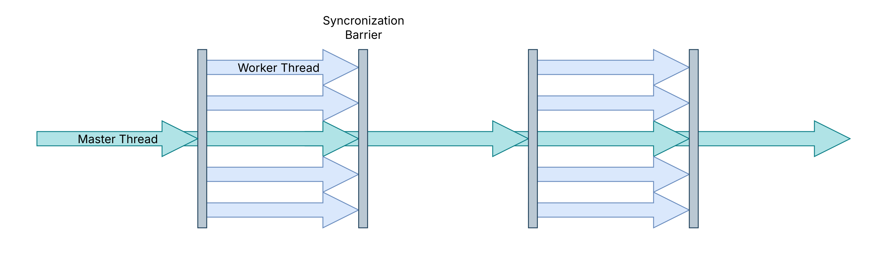
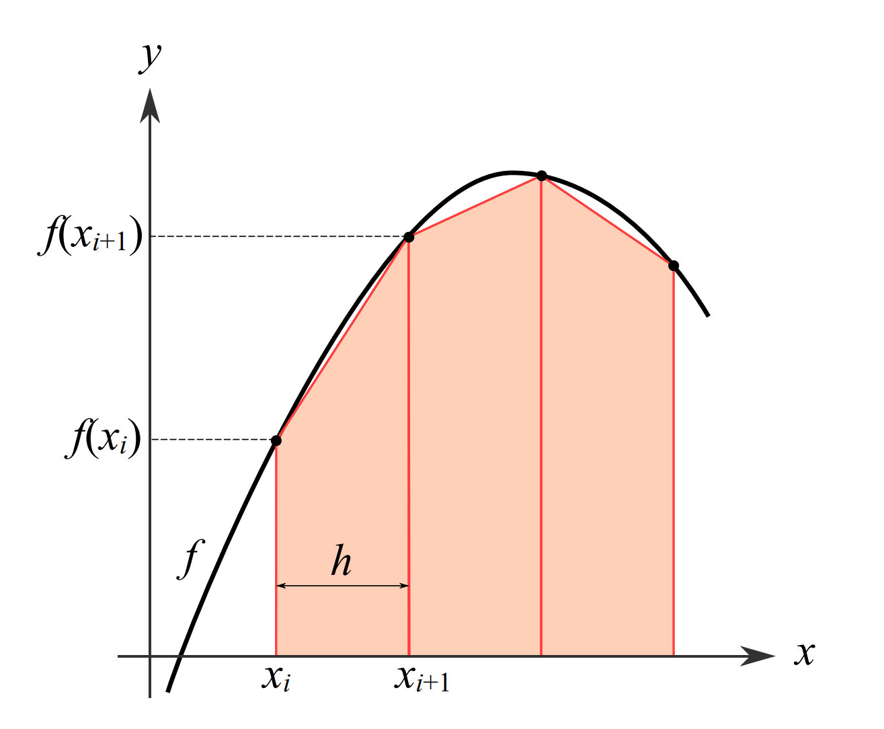
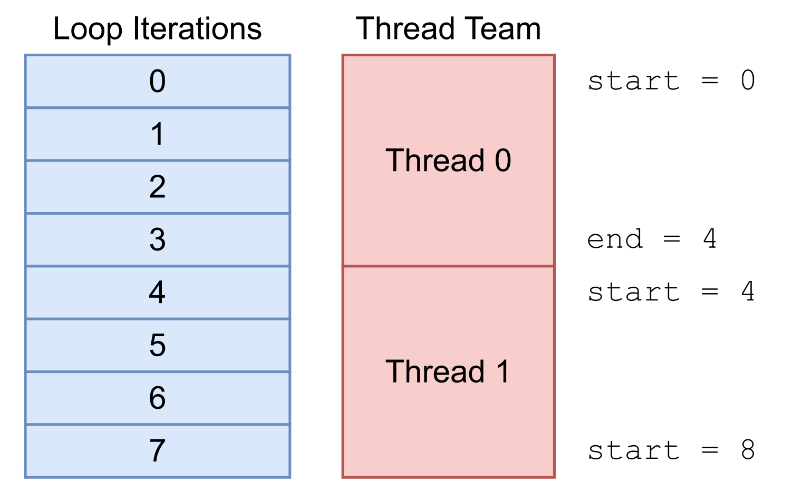
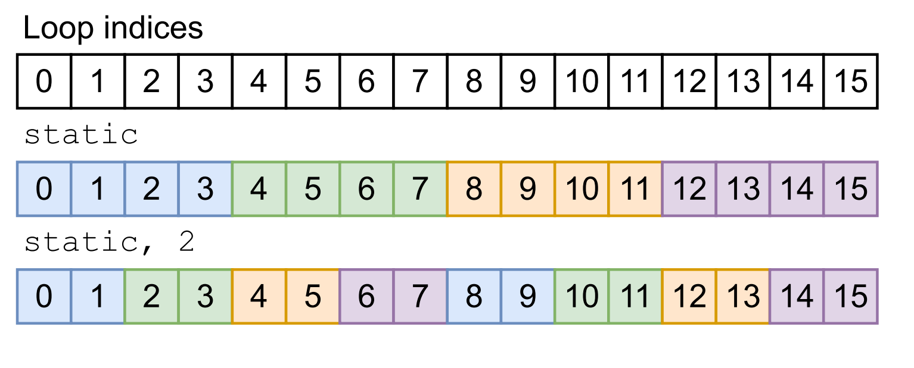
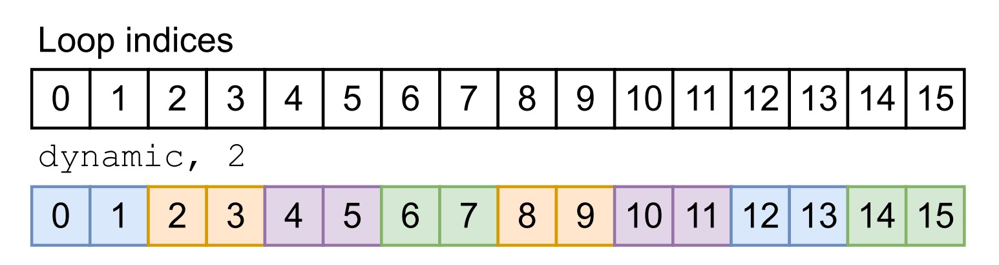
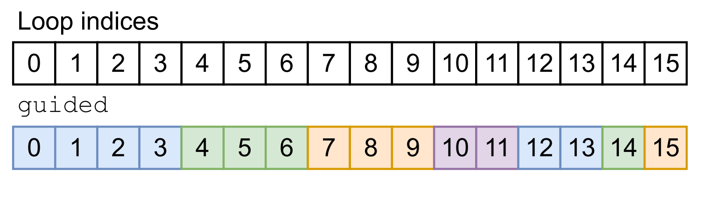
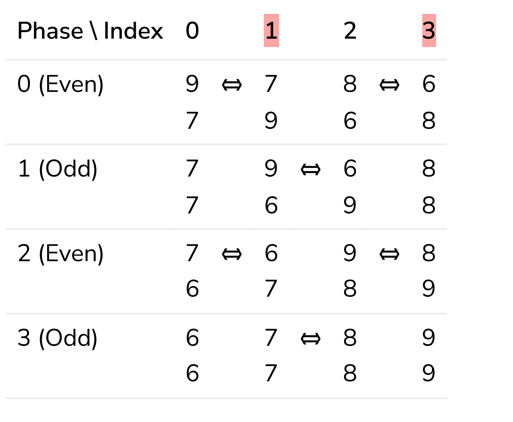

# OpenMP

## Einleitung 
OpenMP = Open Multi-Processing

- API für parallele Programmierung im Shared-Memory-Modell
- Verwendet Compiler-Direktiven (Pragmas)
- Unterstützt C/C++ und Fortran

Beispielprogramm:

```cpp
#include <iostream>
#include <omp.h>

int main()
{
    #pragma omp parallel num_threads(4)
    {
        int thread_id = omp_get_thread_num();
        std::cout << "Hallo Welt von Thread " << thread_id << std::endl;
    }
    return 0;
}
```
Das Programm erstellt 4 parallele Threads, wobei jeder Thread seine eigene ID abfragt und ausgibt. Die Ausgabe erfolgt dabei in zufälliger Reihenfolge, da alle Threads gleichzeitig laufen.

**Wichtige Begriffe**

Die Direktive `#pragma omp parallel` forked ein **Team** von Threads.
- **Team** sind alle Threads die von der `parallel` Region erstellt wurden
- **Master Thread** ist jener Thread, der in die `parallel` Region eintritt
- **Worker Thread(s)** sind alle anderen Threads im **Team**



## OpenMP Direktive

- Benötigen Compiler-Unterstützung
- Direktiven beginnen mit `#pragma omp`
- Direktiven werden ignoriert, wenn OpenMP nicht aktiviert ist → sequentielle Ausführung

OpenMP benötigt einen "structured Block", d.h. entweder eine einzelne C/C++-Anweisung oder einen zusammengesetzten Block `{ ... }` mit genau einem Eintrittspunkt und einem Austrittspunkt
> Im "Structured Block" darf man nicht  mitten im parallelen Bereich mit `goto` oder `return` herausspringen – es muss einen klaren Anfang und ein klares Ende geben.

## OpenMP Clauses

Clauses sind Zusatzoptionen, die man an eine Direktive anhängt. 

```cpp
#pragma omp parallel num_threads(4) // ← huhu, hier ist eine Clause
{
    // Paralleler Bereich
}
```

**Beispiel** `num_threads(n)`
`num_threads(n)` modifiziert die Direktive, um die Anzahl der Threads im Team festzulegen. Falls nicht angegeben, wird die Thread-Anzahl wie folgt bestimmt (von hoher zu niedriger Priorität)
- Funktionsaufruf `omp_set_num_threads(int)`
- Umgebungsvariable `OMP_NUM_THREADS`
- Standardwert (implementierungsabhängig, typischerweise `omp_get_max_threads()` ≈ Anzahl der CPU-Kerne)

## OpenMP Funktionen

- `omp_get_num_threads()` – Gibt die Anzahl der Threads im aktuellen ***Team*** zurück
- `omp_get_thread_num()` – Gibt die Thread-ID des aufrufenden Threads zurück (0 bis `omp_get_num_threads()` - 1), auch _"Rang"_ genannt

Diese Funktionen lassen sich nur kompilieren, wenn OpenMP aktiviert ist. Für portable Programme kann man sie bedingt deaktivieren:

```cpp
#ifdef _OPENMP
    int num_threads = omp_get_num_threads();
    int rank = omp_get_thread_num();
#else
    int num_threads = 1;
    int rank = 0;
#endif
```
So kann man Code schreiben, der sowohl mit als auch ohne OpenMP funktioniert – ohne OpenMP gibt es nur einen Thread mit der ID 0.

## 1. Beispiel Trapezregel

```math
h \left( \frac{f(a) + f(b)}{2} + \sum_{i=1}^{N-1} f(x_i) \right)
```



### Sequentielle Implementierung

```cpp
double f(double x);  // Die zu integrierende Funktion

double trapezoidal_rule(double a, double b, int N) {
    double h = (b - a) / N;                      // Schrittweite
    double integral = (f(a) + f(b)) / 2.0;       // Anfangs- und Endwert

    for (int i = 1; i < N; i++) {
        double x_i = a + i * h;                  // Aktueller x-Wert
        integral += f(x_i);                      // Aufsummieren
    }

    integral *= h;                               // Mit Schrittweite multiplizieren
    return integral;
}
```

Die Trapezregel ist ein numerisches Verfahren, um Integrale näherungsweise zu berechnen. Man unterteilt das Intervall [a, b] in N gleich große Abschnitte und approximiert die Fläche unter der Kurve durch Trapeze.

### Paralleler Code mit Race Condition

**Idee:**
1. Erstelle ein Team von Threads
2. Jeder Thread bearbeitet ein Teilintervall [aᵢ, bᵢ]:
    1. Bestimme Rang und Anzahl der Threads
    2. Berechne lokales Intervall / lokale Indizes
    3. Akkumuliere zur globalen Summe

```cpp
#include <omp.h>

double trap(double a, double b, int N, int n_thr) {
    double g_sum = 0.0;                          // Globale Summe
    
    #pragma omp parallel num_threads(n_thr)
    {
        local_trap(a, b, N, &g_sum);             // Jeder Thread ruft local_trap auf
    }
    
    double h = (b - a) / N;
    return g_sum * h;
}
```
❗Mehrere Threads greifen gleichzeitig auf `g_sum` zu und schreiben, es entsteht eine Race Condition.

### Lösungsversuch mit Work-Partitioning

### Work-Partitioning allgemein

Bei N Elementen und `n_threads` Threads bekommt jeder Thread einen zusammenhängenden Block.

- **Start** = rank × (N / `n_threads`)
- **Ende** = (rank + 1) × (N / `n_threads`)

Beispiel mit N=8 und 2 Threads:
Thread 0 bearbeitet Indizes `[0,1,2,3]`, Thread 1 bearbeitet `[4,5,6,7]`.



### Work-Partitioning für Trapezregel

Hier wird das Intervall [a, b] aufgeteilt statt Array-Indizes.

- **Start** = `a + rank * (b - a) / n_threads`
- **Ende** =  `a + (rank + 1) * (b - a) / n_threads`

Beispiel mit `a=2.0`, `b=6.0`, `n_threads=2` und `N=100``

Die Breite pro Thread ist also: `(6.0 - 2.0) / 2 = 2.0`
- Thread 0 berechnet das Integral im Bereich:
Start = `2.0 + 0 * 2.0 = 2.0`
Ende =  `2.0 + (0 + 1) * 2.0 = 4.0` 
**`[2.0, 4.0]`**
- Thread 1 berechnet das Integral im Bereich:
Start = `2.0 + 1 * 2.0 = 4.0`
Ende = `2.0 + (1 + 1) * 2.0 = 6.0`
**`[4.0, 6.0]`**

Jeder Thread muss `N / n_threads` Iterationen berechnen, im Beispiel `N / n_threads = 100 / 2 = 50`.

Implementierung:
```cpp
void local_trap(double a, double b, int N, 
                double* g_sum) {
  int rank = omp_get_thread_num();
  int n_threads = omp_get_num_threads();
  
  double l_a = a + rank * (b - a) / n_threads;
  double l_b = a + (rank + 1) * (b - a) / n_threads;

  double h = (b - a) / N;
  int local_N = N / n_threads;

  *g_sum += (f(l_a) + f(l_b)) / 2.0;

  for (int i = 1; i < local_N; i++) {
    double x_i = l_a + i * h;
    *g_sum += f(x_i);
  }
}
```

❗ Mehrere Threads greifen gleichzeitig auf `*g_sum += ...` zu, es entsteht eine Race Condition.

### Lösung 1 mit Critical Section

```cpp
// ...
#pragma omp critical
*g_sum += f(x_i);
// ...
```


Mit `#pragma omp critical` wird sichergestellt, dass immer nur **ein Thread gleichzeitig** den geschützten Code ausführt.

Critical Sections können auch benannt werden (`#pragma omp critical(name)`), um verschiedene kritische Bereiche unabhängig voneinander zu locken.

**Problem:** Das ist langsam! Wenn die Critical Section in der Schleife liegt, müssen die Threads ständig aufeinander warten.

### OMP Scopes von Variablen

In OpenMP bestimmt der Scope einer Variable, welche Threads darauf zugreifen können.

#### Shared

Alle Threads greifen auf **dieselbe** Variable zu. Standard für Variablen, die _vor_ der parallelen Region definiert wurden.

```cpp
int counter = 0;
#pragma omp parallel shared(counter)
{
    counter++;  // Race Condition! (get wrecked sucker)
}
```

#### Private

Jeder Thread hat seine **eigene Kopie**. Standard für Variablen innerhalb der parallelen Region. Die Kopie ist **uninitialisiert**, der Originalwert bleibt unverändert.

```cpp
int x = 5;
#pragma omp parallel private(x)
{
    // x ist hier undefiniert (nicht 5!)
    x = omp_get_thread_num();
}
// x ist immer noch 5
```

#### Firstprivate
Wie private, aber mit dem **Originalwert initialisiert**.

```cpp
int x = 5;
#pragma omp parallel firstprivate(x)
{
    // x startet als 5 für jeden Thread
    x += omp_get_thread_num();
}
// x ist immer noch 5
```

#### Lastprivate

```cpp
int last;
#pragma omp parallel for lastprivate(last)
for (int i = 0; i < 100; i++) {
    last = i;
}
// last ist jetzt 99
```

`firstprivate` und `lastprivate` können kombiniert werden.

### Lösung 1.1 mit private Sums

Die verbesserte Variante: Jeder Thread berechnet sein Ergebnis in einer lokalen Variable (`l_result`), die automatisch `private` ist, weil sie innerhalb der parallelen Region deklariert wird.
Erst ganz am Ende wird mit `#pragma omp critical` die lokale Summe zur globalen addiert. So blockieren sich die Threads nur **einmal** statt bei jeder Iteration.

```cpp
double trap(double a, double b, int N, int n_thr) {
  double g_sum = 0.0;

  #pragma omp parallel num_threads(n_thr) \
    shared(g_sum)
  {
    double l_result = l_trap(a, b, N); // private, jeder Thread rechnet
    #pragma omp critical
    g_sum += l_result; // nur einmal pro Thread (yay)
  }

  return g_sum ;
}
```

### Lösung 2 mit `reduction`-Clause

Vermutlich die eleganteste Lösung. Die `reduction`-Clause macht 2 Schritte:
1. Eine private Kopie für jeden Thread (initialisiert mit dem neutralen Element, z.B. 0 bei Addition)
2. Am Ende: Kombination aller Teilergebnisse mit dem angegebenen Operator

```cpp
double trap(double a, double b, int N, int n_thr) {
  double g_sum = 0.0;

  #pragma omp parallel num_threads(n_thr) \
    reduction(+:g_sum)
  {
    g_sum += l_trap(a, b, N); // jeder Thread addiert zu seiner Kopie
  } 
  // g_sum enthält die Summe aller Teilergebnisse

  return g_sum;
}
```

Eine Reduction definiert man mit `reduction(<operator>:<variable list>)`.


| Operator | Neutrales Element | Bedeutung      |
|----------|-------------------|----------------|
| `+`      |        0          | Addition       |
| `*`      |        1          | Multiplikation |
| `-`      |        0          | Addition (!)   |
| `&&`     |        `true`     | logisches UND  |
| `\|\|`     |        `false`  | logisches ODER |

_... auch bitwise Operationen werden unterstützt (black magic fuckery)_


### Worksplitting mit OpenMP - `omp parallel for`

OpenMP kann das Aufteilen der Arbeit übernehmen.

```cpp
#pragma omp parallel for
for (int i = 0; i < N; i++) {
    // OpenMP verteilt die Iterationen automatisch auf mehrere Threads
}
```

**Voraussetzung**: Die Schleife muss in **kanonischer** Form sein:
- Ganzzahliger oder Pointer-Index
- Start, Ende und Inkrement dürfen sich während der Ausführung nicht ändern
- unterstützte Vergleichsoperatoren sind `<`, `<=`, `>` und `>=`
Die Schleifenvariabe (`i`) ist `private`.


### Lösung 3 mit `parallel for` und Reduktion

```cpp
double trap(double a, double b, int N) {
  double h = (b - a) / N;
  double sum = (f(a) + f(b)) / 2.0;

  #pragma omp parallel for reduction(+:sum)
  for (int i = 1; i < N; i++) {
    double x_i = a + i * h;
    sum += f(x_i);
  }

  sum *= h;
  return sum;
}
```

Die Lösung punktet mit:
- Keine manuelle Arbeitsaufteilung nötig
- Keine expliziten Critical Sections
- Fast identisch zum sequentiellen Code – nur eine Zeile hinzugefügt

### Scheduling Strategien

Die `schedule`-Clause kontrolliert, wie Schleifeniterationen auf Threads verteilt werden.

#### Statisches Scheduling (default)
`static` teilt die Iterationen in zusammenhängende Blöcke ungefähr gleicher Größe auf.

```cpp
// Standard: Jeder Thread bekommt N/num_threads Iterationen am Stück
#pragma omp parallel for schedule(static)
for (int i = 0; i < 16; i++) { ... }
// Thread 0: [0,1,2,3], Thread 1: [4,5,6,7], Thread 2: [8,9,10,11], Thread 3: [12,13,14,15]
```

Evtl bekommt der letzte Thread weniger Iterationen. Die default Chunk-Size ist `N / num_threads`. Man kann die Chunk-Size aber auch explizit angeben.

```cpp
// Mit Chunk-Größe: Blöcke von 2 Iterationen werden reihum verteilt
#pragma omp parallel for schedule(static, 2)
for (int i = 0; i < 16; i++) { ... }
// Thread 0: [0,1], Thread 1: [2,3], Thread 2: [4,5], Thread 3: [6,7]
// Thread 0: [8,9], Thread 1: [10,11], Thread 2: [12,13], Thread 3: [14,15]
```



#### Dynamisches Scheduling 

`dynamic` Iterationen werden zur Laufzeit an Threads vergeben, sobald diese frei werden. Ideal bei **ungleichmäßiger Arbeitslast** pro Iteration.

```cpp
// Chunk-Größe 2: Jeder freie Thread holt sich die nächsten 2 Iterationen
#pragma omp parallel for schedule(dynamic, 2)
for (int i = 0; i < 16; i++) { 
    // Iterationen mit unterschiedlicher Laufzeit
    expensive_computation(i);
}
```
**Trade-off**: Kleinere Chunks = bessere Lastverteilung, aber mehr Synchronisations-Overhead.
```cpp
// Chunk-Größe 1: Beste Lastverteilung, aber höchster Overhead
#pragma omp parallel for schedule(dynamic, 1)
for (int i = 0; i < N; i++) { ... }
```



#### Guided Scheduling

Bei `guided` ist das Verhalten wie bei `dynamic`, aber die Chunk-Größe startet groß und schrumpft exponentiell. Kombiniert die Vorteile beider Welten: wenig Overhead am Anfang, gute Lastverteilung am Ende.

```cpp
// Chunk-Größe nimmt ab: erst große Blöcke, dann kleinere
#pragma omp parallel for schedule(guided)
for (int i = 0; i < 16; i++) { ... }
// Mögliche Verteilung: Thread 0 bekommt [0-3], Thread 1 [4-6], Thread 2 [7-8], ...
```



Man kann auch die minimale Chunk-Größe angeben.

```cpp
// Minimale Chunk-Größe festlegen (nie kleiner als 4)
#pragma omp parallel for schedule(guided, 4)
for (int i = 0; i < 1000; i++) { ... }
```

**Formel für nächste Chunk-Größe** ≈ Verbleibende Iterationen​ / Anzahl an Threads
_natürlich nie kleiner wie die minimal Chunk-Size_


#### Faustregeln zur Auswahl

| Situation | Empfehlung |
Gleichmäßige Arbeit pro Iteration | `static` |
Arbeit nimmt zu oder ab | `static, chunk` (kleiner Chunk) |
Stark variierende Arbeit | `dynamic` oder `guided` |
Noch unsicher / Experimentieren | `runtime` und Profiling |

```cpp
#pragma omp parallel for schedule(static)       // Gleichmäßige Blöcke, vorhersagbar
#pragma omp parallel for schedule(static, 2)    // Kleinere Blöcke, Round-Robin
#pragma omp parallel for schedule(dynamic, 2)   // flexibel
#pragma omp parallel for schedule(guided)       // Abnehmende Chunk-Größe
#pragma omp parallel for schedule(runtime)      // Zur Laufzeit aus Umgebungsvariable
```
```bash
# Bei schedule(runtime): Konfiguration über Umgebungsvariable
export OMP_SCHEDULE="dynamic,4"
```

## 2. Beispiel Bubble Sort

### Nicht alles ist parallelisierbar
Das Problem sind sogenannte Loop-Carried Dependencies :(

> Loop-Carried Dependencies entstehen, wenn eine Schleifeniteration das Ergebnis einer vorherigen Iteration benötigt. Das bedeutet, Iteration i+1 kann erst ausgeführt werden, nachdem Iteration i abgeschlossen ist. Solche Schleifen lassen sich nicht parallelisieren, weil die Reihenfolge der Ausführung das Ergebnis beeinflusst.

Beispiel: klassischer Bubble-Sort

```cpp
// NICHT parallelisierbar!
for (int length = n; length >= 2; length--) {
    for (int i = 0; i < length - 1; i++) {
        if (a[i] > a[i + 1]) {
            std::swap(a[i], a[i + 1]);
        }
    }
}
```
1. Äußere Schleife: Jeder Durchgang braucht das Ergebnis des vorherigen (das Array wurde verändert)
2. Innere Schleife: Wenn wir a[1] und a[2] gleichzeitig mit a[0] und a[1] vergleichen, entsteht Chaos :D

```cpp
// Beispiel: Array [3, 1, 2]
// Thread 0 will a[0] und a[1] vergleichen: 3 > 1 → swap
// Thread 1 will a[1] und a[2] vergleichen: 1 > 2? Nein
// Aber wenn Thread 0 zuerst swappt, ist a[1] plötzlich 3! -> nixe gut
```

Lösung: Man braucht einen anderen Algorithmus, der für Parallelisierung geeignet ist, z.Bsp. den Odd-Even Transposition Sort.

### Odd-even Transposition Sort

Der Odd-Even Transposition Sort ist ein paralleler Sortieralgorithmus, der das Problem der Loop-Carried Dependencies umgeht.

Der Algorithmus wechselt zwischen zwei Phasen:

- **Gerade** Phase (even): Vergleiche Paare an ungeraden Indizes mit ihrem linken Nachbarn (Index 1 mit 0, Index 3 mit 2, ...)
- **Ungerade** Phase (odd): Vergleiche Paare an geraden Indizes mit ihrem rechten Nachbarn (Index 0 mit 1, Index 2 mit 3, ...)

Beispiel Array `[9, 7, 8, 6]` 



Nach `n` Phasen ist das Array sortiert.

#### Sequentielle Implementierung:

```cpp
for (int phase = 0; phase < n; phase++) {
    if (phase % 2 == 0) {  // Gerade Phase
        for (int i = 1; i < n; i += 2) {
            if (a[i - 1] > a[i]) {
                std::swap(a[i - 1], a[i]);
            }
        }
    } else {  // Ungerade Phase
        for (int i = 0; i < n - 1; i += 2) {
            if (a[i] > a[i + 1]) {
                std::swap(a[i], a[i + 1]);
            }
        }
    }
}
```

Das ist parallelisierbar, denn die Vergleichsparre sind innerhalb einer Phase disjunkt - sie überlappen sich nicht:
- Gerade Phase: (0,1), (2,3), (4,5), ... → kein Element wird zweimal angefasst
- Ungerade Phase: (1,2), (3,4), (5,6), ... → kein Element wird zweimal angefasst

#### Naive Version

```cpp
for (int phase = 0; phase < n; phase++) {
    if (phase % 2 == 0) {
        #pragma omp parallel for  // Erzeugt jedes Mal neue Threads!
        for (int i = 1; i < n; i += 2) { ... }
    } else {
        #pragma omp parallel for  // Schon wieder neue Threads!
        for (int i = 0; i < n - 1; i += 2) { ... }
    }
}
```

**Problem:** In jeder Phase werden Threads neu erzeugt und wieder zerstört – Overhead!

#### Threads erneut verwenden

```cpp
#pragma omp parallel num_threads(thread_count) \
        default(none) shared(a, n)
for (int phase = 0; phase < n; phase++) {
    if (phase % 2 == 0) {
        #pragma omp for  // Nur Arbeit verteilen, keine neuen Threads
        for (int i = 1; i < n; i += 2) {
            if (a[i - 1] > a[i]) {
                std::swap(a[i - 1], a[i]);
            }
        }
    } else {
        #pragma omp for  // Nur Arbeit verteilen, keine neuen Threads
        for (int i = 0; i < n - 1; i += 2) {
            if (a[i] > a[i + 1]) {
                std::swap(a[i], a[i + 1]);
            }
        }
    }
}
```

- `#pragma omp parallel` erzeugt ein Team von Threads (einmalig)
- `#pragma omp for` Verteilt Schleifeniterationen auf bestehende Threads
- `#pragma omp parallel for` ist die  Kombination aus beiden

Die `default(none)`-Clause erzwingt, dass alle Variablen explizit als shared oder private deklariert werden müssen. Das ist gute Praxis, weil es versehentliche Fehler durch falsche Annahmen über den Scope verhindert.

## Weitere OpenMP-Konstrukte

Manchmal soll innerhalb einer parallelen Region nur ein **einzelner** Thread bestimmten Code ausführen.

### `#pragma omp single`

Wird von **irgendeinem** Thread ausgeführt (wer zuerst kommt). Alle anderen Threads warten am Ende (implizite Barrier).

```cpp
#pragma omp parallel
{
    // Alle Threads führen das aus
    do_parallel_work();
    
    #pragma omp single
    {
        // Nur EIN Thread führt das aus (egal welcher)
        printf("Zwischenergebnis ausgeben\n");
    }
    // Implizite Barrier: Alle warten hier
    
    // Alle Threads machen weiter
    do_more_parallel_work();
}
```

**mögliche Anwendungsfälle:** I/O-Operationen, Initialisierung von gemeinsamen Datenstrukturen, Fortschrittsanzeige.


### `#pragma omp master`

Wird nur vom **Master-Thread** (Thread 0) ausgeführt. Wichtig: Keine implizite Barrier – andere Threads warten nicht.

```cpp
#pragma omp parallel
{
    do_parallel_work();
    
    #pragma omp master
    {
        // Nur Thread 0 führt das aus
        printf("Der allmächtige Master meldet: Arbeit läuft\n");
    }
    // KEINE Barrier! Andere Threads laufen einfach weiter
    
    do_more_parallel_work();
}
```

**mögliche Anwendungsfälle:**  Logging, Debugging

### Parallele `sections`


Mit `sections` kann man unterschiedliche Aufgaben parallel ausführen – nicht dieselbe Schleife aufteilen, sondern komplett verschiedene Code-Blöcke.

```cpp
#pragma omp parallel sections
{
    #pragma omp section
    {
        // Aufgabe 1: z.B. Daten aus Datei A laden
        load_data_a();
    }
    
    #pragma omp section
    {
        // Aufgabe 2: z.B. Daten aus Datei B laden
        load_data_b();
    }
    
    #pragma omp section
    {
        // Aufgabe 3: z.B. Netzwerkverbindung aufbauen
        init_network();
    }
}
// Implizite Barrier: Alle Sections müssen fertig sein
use_results();
```
- Anzahl der Sections ist zur Compile-Zeit bekannt und fix
- Jede Section wird von einem Thread ausgeführt
- Sections sind unabhängig voneinander
- Am Ende gibt es eine implizite Barrier

### OpenMP Tasks
Tasks sind flexibler als Sections – sie ermöglichen eine dynamische Anzahl von Aufgaben, die zur Laufzeit erstellt werden.

```cpp
#pragma omp parallel
{
    #pragma omp single  // Nur ein Thread erstellt die Tasks
    {
        for (int i = 0; i < N; i++) {
            #pragma omp task
            {
                // Dieser Code wird als Task "verpackt"
                // und von irgendeinem freien Thread ausgeführt
                process(i);
            }
        }
        
        #pragma omp taskwait  // Warten bis alle Tasks fertig sind
        printf("Alle Tasks abgeschlossen\n");
    }
}
```
Ohne `single` würde jeder Thread die Schleife ausführen und Tasks erstellen, d.h. N × Anzahl_Threads Tasks statt nur N!

```cpp
// FALSCH: Jeder Thread erstellt alle Tasks
#pragma omp parallel
{
    for (int i = 0; i < N; i++) {
        #pragma omp task
        { process(i); }
    }
}
// Bei 4 Threads: 4*N Tasks statt N!

// RICHTIG: Nur ein Thread erstellt die Tasks
#pragma omp parallel
{
    #pragma omp single
    {
        for (int i = 0; i < N; i++) {
            #pragma omp task
            { process(i); }
        }
    }
}
```

### Synchronisations-Primitive
OpenMP bietet verschiedene Mechanismen, um Threads zu koordinieren.

#### Barriers (Schranken)

Alle Threads warten, bis **jeder** Thread die Barrier erreicht hat – erst dann geht es weiter.

Implizite Barriers gibt es automatisch am Ende von:
- `#pragma omp parallel`
- `#pragma omp for`
- `#pragma omp section`
- `#pragma omp single`

Explizite Barrier:
```cpp
#pragma omp parallel
{
    phase1();  // Alle Threads arbeiten
    
    #pragma omp barrier  // Alle warten aufeinander
    
    phase2();  // Erst wenn ALLE phase1 fertig sind
}
```

Mit der `nowait`-Clause unterdrückt man implizite Barriers, die Threads warten nicht aufeinander.

```cpp
#pragma omp parallel
{
    #pragma omp for nowait  // Keine Barrier am Ende
    for (int i = 0; i < N; i++) {
        independent_work(i);
    }
    // Schnelle Threads machen sofort hier weiter!
    
    more_independent_work();
}
```

Das kann man nur sinnvoll verwenden, wenn der nachfolgende Code nicht vom Ergebnis der Schleife abhängt.


### erzwungene Reihenfolge mit `ordered`

`#pragma omp ordered` erzwingt, dass bestimmte Abschnitte in der ursprünglichen Schleifenreihenfolge ausgeführt werden.

```cpp
#pragma omp parallel for ordered
for (int i = 0; i < N; i++) {
    expensive_computation(i);  // Parallel
    
    #pragma omp ordered
    {
        // Dieser Block wird sequentiell in Reihenfolge ausgeführt:
        // erst i=0, dann i=1, dann i=2, ...
        printf("Ergebnis %d: %f\n", i, result[i]);
    }
}
```

Das ist langsam :( Threads müssen aufeinander warten. Nur verwenden, wenn die Reihenfolge wirklich wichtig ist (z.B. geordnete Ausgabe).

### Critical Section

Nur ein Thread gleichzeitig darf den kritischen Bereich "betreten".

```cpp
#pragma omp parallel
{
    double local_result = compute();
    
    #pragma omp critical
    {
        global_sum += local_result;  // Thread-sicher
    }
}
```

Benannte Critical Sections – verschiedene Bereiche blockieren sich nicht gegenseitig:

```cpp
#pragma omp parallel
{
    #pragma omp critical(sum_lock)
    { sum += value; }
    
    #pragma omp critical(list_lock)
    { list.push_back(item); }  // Unabhängig von sum_lock
}
```

### Atomic

Für einfache Operationen effizienter als `critical`, denn es nutzt Hardware-Unterstützung.

```cpp
#pragma omp parallel for
for (int i = 0; i < N; i++) {
    #pragma omp atomic
    counter++;  // Atomar, schneller als critical (swoosh)
}
```
Verschiedene atomic-Varianten:
```cpp
#pragma omp atomic read
x = shared_var;

#pragma omp atomic write
shared_var = expr;

#pragma omp atomic update  // Standard
shared_var += value;

#pragma omp atomic capture  // Lesen und Updaten in einem
old_value = shared_var++;
```

### Explizite Locks

Für komplexere Szenarien, wenn `critical` nicht ausreicht.

```cpp
#include <omp.h>

omp_lock_t my_lock;
omp_init_lock(&my_lock);  // Initialisieren

#pragma omp parallel
{
    omp_set_lock(&my_lock);    // Sperre anfordern (blockiert)
    
    // Kritischer Bereich
    modify_shared_data();
    
    omp_unset_lock(&my_lock);  // Sperre freigeben
}

omp_destroy_lock(&my_lock);  // Aufräumen
```

Nicht-blockierendes Testen:
```cpp
if (omp_test_lock(&my_lock)) {
    // Lock erfolgreich erhalten
    do_work();
    omp_unset_lock(&my_lock);
} else {
    // Lock nicht verfügbar, mach was anderes
    do_alternative_work();
}
```

Maxls Empfehlung:

Immer das einfachste Konstrukt wählen, das ausreicht.

| Mechanismus | Anwendungsfall | Performance |
|-------------|----------------|-------------|
| `reduction` | Einfache Akkumulation (+, *, etc.) | ⭐⭐⭐ Sehr schnell |
| `atomic` | Einfache Updates einer Variable | ⭐⭐⭐ Schnell |
| `critical` | Komplexere kritische Bereiche | ⭐⭐ Mittel |
| Locks | Maximale Kontrolle | ⭐ Langsam, fehleranfällig |
| `ordered` | Reihenfolge erzwingen | ⭐ evtl sehr langsam |


### `collapse`

`collapse(n)` ermöglicht es, verschachtelte Schleifen zusammenfassen. 

```cpp
// OHNE collapse: Nur äußere Schleife (M Iterationen) wird verteilt
#pragma omp parallel for
for (int i = 0; i < M; i++)
    for (int j = 0; j < N; j++)
        body(i, j);

// MIT collapse(2): M*N Iterationen werden verteilt
#pragma omp parallel for collapse(2)
for (int i = 0; i < M; i++)
    for (int j = 0; j < N; j++)
        body(i, j);
```

Beispiel mit konkreten Zahlen:
```cpp
// Problem: M=4 Threads, aber nur M=4 äußere Iterationen
// → Jeder Thread bekommt genau 1 Iteration, keine Flexibilität

#pragma omp parallel for  // Nur 4 Work-Units
for (int i = 0; i < 4; i++)
    for (int j = 0; j < 1000; j++)
        process(i, j);

// Besser: 4*1000 = 4000 Work-Units, bessere Lastverteilung
#pragma omp parallel for collapse(2)
for (int i = 0; i < 4; i++)
    for (int j = 0; j < 1000; j++)
        process(i, j);
```

Voraussetzung: Die Schleifen müssen "perfectly nested" sein – kein Code zwischen den Schleifenköpfen.

```cpp
// ERLAUBT:
#pragma omp parallel for collapse(2)
for (int i = 0; i < M; i++)
    for (int j = 0; j < N; j++)
        body(i, j);

// NICHT ERLAUBT:
#pragma omp parallel for collapse(2)
for (int i = 0; i < M; i++) {
    setup(i);  // ← Code zwischen den Schleifen!
    for (int j = 0; j < N; j++)
        body(i, j);
}
```


## Checkliste

Wenn man diese Konstrukte begreift, ist man gut dabei:

| Kategorie | Konstrukte |
|-----------|------------|
| **Parallelisierung** | `parallel`, `for`, `parallel for`, `sections`, `task` |
| **Daten-Scoping** | `shared`, `private`, `firstprivate`, `lastprivate`, `reduction` |
| **Scheduling** | `static`, `dynamic`, `guided`, `runtime` |
| **Synchronisation** | `barrier`, `critical`, `atomic`, `ordered`, Locks |
| **Steuerung** | `single`, `master`, `nowait`, `collapse`, `num_threads` |


